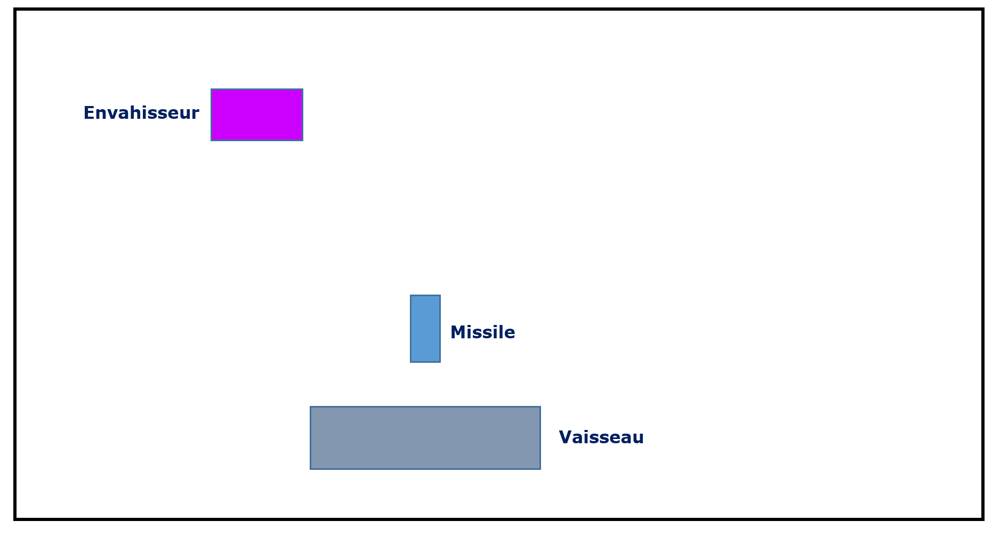
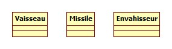

# Space Invaders - Sprint 0 : Rapide analyse du problème

Avant de se lancer dans une quelconque phase d'**implémentation**, même si celle-ci fait partie d'une approche de développement dirigés par les **tests** (**T**est **D**riven **D**evelopment), il est nécessaire de réfléchir au préalable  :  

* à [une rapide **analyse des besoins**](#analyse)  permettant d'identifier les principales fonctionnalités à développer pour atteindre simplement et rapidement le comportement souhaité de l'application (liste non exhaustive et non figée des fonctionnalités puisque dans un développement agile, la liste des fonctionnalités est ouverte pour permettre l'***adaptation au changement***)
* et à [une réflexion rapide autour de la **conception**](#conception) permettant d'identifier les premières classes de l'application et définir la terminologie métier (autour d'un langage commun).    

## Analyse des besoins rapide : Recherche des principales fonctionnalités 

Quand on développe un mini-projet autour d'un jeu, on a forcément envie de jouer le plus rapidement possible, même si le jeu proposé n'est pas encore très abouti.
C'est notre valeur métier : **pouvoir jouer le plus rapidement possible** c'est-à-dire pouvoir disposer le plus rapidement possible d'un logiciel opérationnel assimilable à un space invader.

Pour cela il faut rester SIMPLE : pour commencer à jouer, un seul envahisseur suffit et l'envahisseur n'a pas besoin de savoir tirer.
Se focaliser uniquement sur les fonctionnalités essentielles et ne pas ajouter de fonctionnalité à un logiciel tant que celle-ci n'est pas absolument nécessaire est une bonne pratique du développement logiciel agile que l'on appelle [principe YAGNI](https://fr.wikipedia.org/wiki/YAGNI) (**Y**ou **A**ren't **G**onna **I**t) !!!

Le MVP (minimum Viable product) de ce mini-projet consistera donc à livrer une première version d'un jeu de type Space Invader qui offrira juste de quoi commencer à jouer, à savoir :
- un vaisseau qui puisse tirer un missile
- un seul envahisseur qui se déplace automatiquement de droite à gauche (pour le moment, le vaisseau reste sur la même ligne et ne descend pas à chaque aller-retour : restons simple !) 

A partir de ce MVP, une première maquette du jeu peut être esquissée :

En imaginant un scénario de jeu à partir de cette maquette, les premières fonctionnalités nécessaire au *bon* déroulement d'une partie apparaissent :

- **créer un espace de jeu d'une certaine taille**
- **positionner un nouveau vaisseau dans l'espace de jeu**  
- **pouvoir déplacer le vaisseau vers la droite dans l'espace de jeu**
- **pouvoir déplacer le vaisseau vers la gauche dans l'espace de jeu**
- **faire apparaître un envahisseur en haut à gauche de l'écran**
- **faire déplacer automatiquement l'envahisseur de droite à gauche**     
- **pouvoir tirer un missile depuis le vaisseau**  
- **faire monter le missile**  
- **détecter la collision entre le missile et l'envahisseur** 
- **gérer la collision entre un missile et un envahisseur**
- **détecter la fin de la partie**  

Ce sont les fonctionnalités sur lesquelles nous nous concentrerons pour développer une première version opérationnelle de notre jeu.

Remarque : Une fois que vous disposerez d'un jeu minimal fonctionnel, vous pourrez envisager d'autres fonctionnalités pour améliorer votre jeu, comme par exemple :  
- faire tirer un envahisseur   
- gérer la collision entre un missile et le vaisseau  
- faire apparaître une horde d'envahisseurs  
- gérer le déplacement automatiquement de la horde d'envahisseurs de droite à gauche  
- gérer le déplacement automatiquement de la horde d'envahisseurs de haut en bas  
- faire tirer aléatoirement un missile depuis un envahisseur  
- gérer le score  
- gérer un nombre de vies  
- gérer la vitesse des missiles  
- proposer des niveaux
- ajouter un *boss* en fin de partie
- ajouter des protections  
- gérer le son  
- proposer une pause  
- etc ....

Le moment venu, pour proposer de nouvelles fonctionnalités et faire évoluer votre jeu, n'hésitez pas à vous inspirer de la [description de Space Invaders dans Wikipédia](https://fr.wikipedia.org/wiki/Space_Invaders), le [*Vocabulaire du jeu vidéo* de Yolande Perron](https://www.oqlf.gouv.qc.ca/ressources/bibliotheque/dictionnaires/20120701_jeu_video.pdf) et le site [http://www.classicgaming.cc/classics/space-invaders](http://www.classicgaming.cc/classics/space-invaders).

<!-- ### Représentation des fonctionnalités dans un backlog de produit visuel de type story map

Rq : Ce type de représentation est appelé Story Map (lien institut agile) dans la terminologie agile.
L'objectif de ce mini-projet n'est pas de travailler autour de la spécification agile. L'année prochaine, vous aurez un autre [module d'initiation au développement agile](https://github.com/iblasquez/enseignement-developpement-logiciel-agile) qui vous permettra de comprendre comment, au travers de différents ateliers collaboratifs, il est possible d'obtenir ce type d'artefact. 
 
Remarque : Si nous avions été dans un développement clasique, au lieu de lister les fonctionnalités nous aurions également très bien pu modéliser les besoins de l'application à l'aide d'un diagramme de US qui aurait pu ressembler au diagramme suivant.... mais le TDD étant une démarche agile, la première repésentation sous forme de backlog produit est plus adapté à notre approche de développement dans le cadre de ce mini-projet !!! -->

## Réflexion rapide autour de la conception : Ebauche des premières classes principales de l'application 

La description du jeu [space invader (et les copies d'écran de jeux déjà existants)](https://fr.wikipedia.org/wiki/Space_Invaders) nous amène dans un premier temps à identifier 3 principaux objets dans ce jeu :  
	- un vaisseau (qui est l'objet commandé par le jouer qui se déplacera et tirera)
	- un missile (lancé par le joueur depuis le vaisseau)  
	- un envahisseur à détruire  

### 1. Vers un langage commun ...
Pour favoriser une compréhension commune entre tous les membres du projet, il est indispensable de définir un langage commun autour de ces termes métier (on parle d'**ubiquitous langage**). 

#### Un vaisseau
En effet, en lisant la [présentation de Space invader sur Wikipédia](https://fr.wikipedia.org/wiki/Space_Invaders) ou [la description du jeu de tir  le *Vocabulaire du jeu vidéo*](https://www.oqlf.gouv.qc.ca/ressources/bibliotheque/dictionnaires/20120701_jeu_video.pdf), on trouve plusieurs termes pour désigner cet objet : véhicule spatial, char d'assaut, tank, vaisseau, .... 

Il faut donc choisir un seul terme qu'on utilisera par la suite dans le projet et en donner une définition dans un glossaire.

Pour ce mini-projet, nous choisirons le terme de **vaisseau** pour désigner l'objet du joueur qui se déplace et qui tire, ce choix a été fait en référence au nom du jeu **Space Invaders** qui laisse sous-entendre que le jeu se passe dans l'espace, quand on parle de vaisseau on pense souvent à un vaisseau spatial...

La définition que nous donnons à vaisseau dans notre projet est donc la suivante : 

**Vaisseau** : véhicule commandé par le joueur, pouvant se déplacer de droite à gauche et ayant la possibilité de lancer des missiles destinés à détruire le(s) envahisseurs.

Remarque : Cette définition sera notée dans un glossaire et pourra (devra?) être complétée au fur est à mesure de l'avancée du projet.

	
#### Un envahisseur
De nombreuses termes pourraient également être employé pour désigner l'ennemi, l'envahisseur, l'alien.
Pour ce projet, nous nous choisirons le terme d' **envahisseur** pour faire référence au nom du jeu (Space Invader) et une première définition de ce terme pourrait être :

**Envahisseur** : Ennemi qui apparaît à l'écran, se déplace automatiquement et qui doit être détruit par un missile lancé depuis le vaisseau du joueur.

#### Un missile
Entre tir et missile, nous choisirons de garder le terme de **missile**.

**Missile** : projectile envoyé à la verticale par le vaisseau vers l'envahisseur dans le but de le détruire.

Remarque : Pour l'instant, la définition de missile se limite à cette mission.
Lorsque vous proposerez une version plus évoluée du jeu (et que les envahisseurs auront aussi la possibilitté de tirer), vous n'oublierez pas de faire évoluer la définition de missile.

Une fois ces termes discutés et définis dans un glossaire (wiki,...) on peut considérer qu'ils sont compris de la même manière par tous les membres du projet, qu'ils constituent un *langage commun* et qu'ils pourront ainsi être repris par les développeurs pour bien montrer l'intention de leur code...

Revenons donc à la conception de notre application ...

### 2. ... Et une identification de 3 classes métier essentielle à la mise en place de l'application.

Les 3 objets principaux du jeu (vaisseau, missile, envahisseur) devront être créés du point de vue informatique par trois classes : Vaisseau Missile, Envhaisseur.
Nous retrouverons donc dans notre application, au minimum les trois classes suivantes :

Quelles seront les attributs de ces classes ? Quelles seront leurs opérations ? Quelles seront leurs relations entre ces classes ? Y aura-t-il d'autres classes ? ...

C'est ce que nous allons découvrir pas en pas en faisant émerger la conception au travers d'une approche de développement dirigée par les tests (**TDD**).

En TDD, la conception est *émergente*, elle évolue donc au fil des tests et des itérations, mais il faut bien avoir un point de départ, c'est ce que nous a amener cette rapide réflexion autour de la conception qui s'appelle dans la littérature agile une **[quick design session](http://referentiel.institut-agile.fr/quickdesign.html)**. Ce type de session peut se faire dès que le besoin se fait sentir : elle permet *[de prendre les décisions de conception "juste à temps", les développeurs au sein de l'équipe guettent certains moments critiques où un choix se pose parmi plusieurs alternatives qui peut avoir une influence durable sur la suite du projet.](http://referentiel.institut-agile.fr/quickdesign.html)*.

Allez, let's go !

### Continuez par le [Sprint 1 : Déplacer un vaisseau dans l'espace de Jeu](SpaceInvaders_S1_DeplacerVaisseau.md)