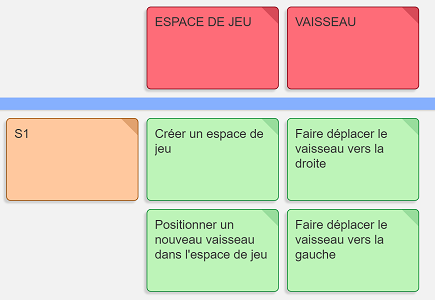
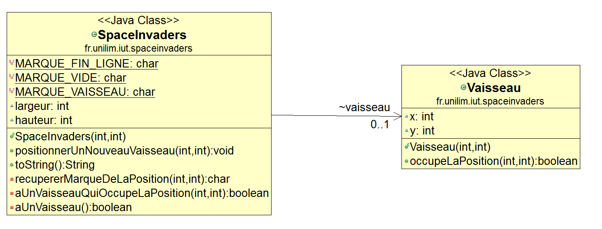
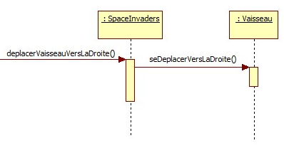
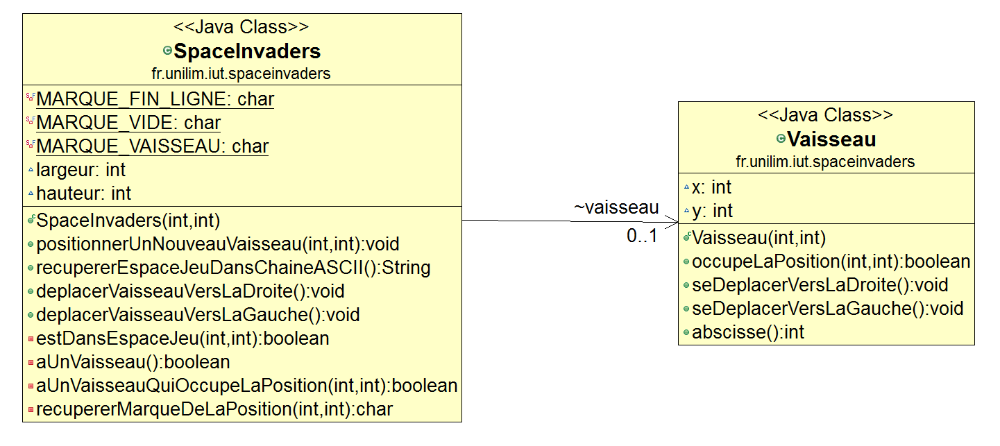

# Space Invaders - Fonctionnalité n°1 : Déplacer un vaisseau dans l'espace de Jeu

**L'objectif** de cette première *grosse* fonctionnalité est de pouvoir **déplacer un vaisseau dans l'espace de jeu**.

Pour réaliser cet objectif, d'après notre rapide analyse, nous devons implémenter les *stories* suivantes (considérez pour le moment que les *stories* sont des fonctionnalités de granularité plus fine) :  
- [créer un espace de jeu](#creerEspaceJeu)  
- [positionner un nouveau vaisseau dans l'espace de jeu](#positionnerVaisseau)  
- [déplacer le vaisseau vers la droite dans l'espace de jeu](#déplacerVaisseauDroite)    
- [déplacer le vaisseau vers la gauche dans l'espace de jeu](#déplacerVaisseauGauche)  
   
La figure suivante représente de manière plus visuelle la liste des stories précédentes, celles que nous prévoyons de développer pour cette première fonctionnalité :  c'est un *backlog* (une liste de choses à faire...)   




*Remarque :* *[**Backlog**](http://referentiel.institut-agile.fr/backlog.html) est un terme agile utilisé pour désigner une liste de fonctionnalités/stories, de tâches jugées nécessaires et suffisantes pour la réalisation satisfaisante du projet.* Ce backlog a été réalisé avec [cardboardit](https://cardboardit.com/).

*Dans ce sprint, vous allez être guidé pas à pas pour vous familiariser avec l'approche TDD. Au fil des fonctionnalités, vous aurez de plus en plus d'autonomie pour développer votre mini-projet*


## Story n°1 : Créer un espace de jeu <a id="creerEspaceJeu"></a>

### 1. Le(s) critère(s) d'acceptance de la story

Pour chaque story, vous devrez commencer par rechercher et lister les critères qui permettront de vérifier que la story réponde correctement aux besoins qu'elle est censée couvrir (cas normaux et cas particuliers).  
Ces critères sont appelés des **critères d'acceptance.**

Par exemple, **un critere d'acceptance** pour la story **créer un espace jeu** est de proposer, une fois la story exécutée : **un espace de jeu vide aux dimensions données (2D)**. C'est d'ailleurs le seul critère que nous retiendrons pour cette story.

Rechercher et lister les critères d'acceptance nous permettra :  
- d'une part, d'écrire les tests plus facilement  
- d'autre part, de valider la story c-a-d de déterminer si la story est correctement implémentée et *finie* : dans notre mini-projet, ce sera le cas, dès lors que tous les critères d'acceptance seront pris en compte dans l'implémentation (se retrouvant ainsi dans les tests :simple_smile).

Une fois, la liste des critères d'acceptance établie, il est temps de se lancer dans le développement.

### 2. Développement en mode TDD

 

#### 2.1 La première itération : Un premier test pour créer un espace de jeu vide ...

Le TDD, étant un développement dirigé par les tests, la première ligne de code doit donc s'écrire dans un fichier de tests !

##### 2.1.1 Etape n°1 : Ecrire un premier test qui échoue (Red) 

Pour respecter la première étape d'une itération TDD, nous devons commencer par écrire du code de tests. Avant tout, il est donc nécessaire de créer la classe **`SpaceInvadersTest`**  dans un package `fr.unilim.iut.spaceinvaders` de **`src\test\java`**.

Le premier test va consister à tester que **lors de sa création, notre jeu de Space Invader dispose d'espace de jeu 2D vide.**  
Pour vérifier qu'un espace de jeu en 2D est bien créé et qu'il est vide, un test automatisé illustrant ce comportement peut être écrit de la manière suivante, en prenant comme exemple un espace de jeu dont les dimensions pourraient être 15 par 10 et en représentant cet espace de manière visuelle dans une chaine au format ASCII.

```JAVA 
    
    package fr.unilim.iut.spaceinvaders;

    import static org.junit.Assert.assertEquals;
    import org.junit.Test;

    public class SpaceInvadersTest {
	
	   @Test
	   public void test_AuDebut_JeuSpaceInvaderEstVide() {
		    SpaceInvaders spaceinvaders = new SpaceInvaders(15, 10);
		    assertEquals("" + 
		    "...............\n" + 
		    "...............\n" +
		    "...............\n" + 
		    "...............\n" + 
		    "...............\n" + 
		    "...............\n" + 
		    "...............\n" + 
		    "...............\n" + 
		    "...............\n" + 
		    "...............\n" , spaceinvaders.toString());
	        }

       }

```

Remarques :  
   
* Le test est écrit de la manière la plus explicite possible, le nom de la méthode de test décrit le comportement à tester.
 
* Le jeu se jouant dans un espace 2D limité, il est nécessaire de s'interroger sur les dimensions de cet espace. Pour nos tests, les dimensions du jeu testé doivent être raisonnable pour pouvoir facilement simuler le positionnement des objets dans cet espace. De manière arbitraire, nous avons choisi une longueur de 15 points et une hauteur de 10 points : c'est un exemple (parmi d'autres) qui permet, de par le choix de dimensions raisonnables, de faciliter l'écriture et la lisibilité du test (notamment celles l'étape d'assertion).
 
* De la même manière, pour faciliter l'écriture, la lisibilité et l'exécution de l'étape d'assertion, nous avons choisi, de manière arbitraire, de représenter (dans notre test) une position "vide" à l'aide du caractère `.`.


Recopier ce test dans votre classe `SpaceInvadersTest`.  
Ce test doit échouer, puisqu'en l'état actuel du projet, il n'est pas compilable (aucun code de production n'existe pour le moment dans `src\main\java`).  


Dans un premier temps, nous allons donc rendre ce code compilable en corrigeant les deux erreurs de compilation soulevées par l'IDE :

* **Créer la classe `SpaceInvaders`** dans le package `fr.unilim.iut.spaceinvaders` de **`src\main\java`** (par exemple en vous aidant de l'IDE et en cliquant sur l'erreur de compilation. Veillez bien à créer la classe dans **`main`** et non dans **`test`**).


* **Créer un constructeur à 2 paramètres dans la classe `SpaceInvaders`** qui va permettre de personnaliser les dimensions du jeu (longueur et hauteur). Cette étape implique de déclarer deux attributs dans la classe **`SpaceInvaders`** nommés *`longueur`* et *`hauteur`* pour bien montrer l'intention du code et le rendre explicite.

```JAVA   

    package fr.unilim.iut.spaceinvaders;
  
    public class SpaceInvaders {

	    int longueur;
	    int hauteur;

	    public SpaceInvaders(int longueur, int hauteur) {
		   this.longueur = longueur;
		   this.hauteur = hauteur;
	   }

   }
```

Désormais le test est bien compilable.  
Exécuter le test (ou utiliser [Infinitest](https://infinitest.github.io/) pour avoir un retour en continu de l'état d'exécution de vos tests...). Que constatez-vous ? ... Votre test échoue !
Normal, puisque la méthode `toString` n'a pas encore été implémentée. C'est ce que nous allons faire dans l'étape suivante pour faire passer le test au vert.

##### 2.2 Etape n°2 :  Ecrire le code qui permet de faire passer ce test le plus rapidement possible (Green)

**Pour redéfinir le plus rapidement possible la méthode `toString`** et faire passer le test au vert, une implémentation de `toString` pourrait être :

``` JAVA  

    @Override
    public String toString() {
        String s = "";
        for (int i = 0; i < hauteur; i++) {
            for (int j = 0; j < longueur; j++) {
                s += ".";
            }
            s += "\n";
        }
        return s;
    }
````

Exécuter le test.   
Que constatez-vous ? ... Le test passe, la barre est AU VERT !  

Rappel : `toString` étant une méthode de la classe `Object`, l'annotation `@Override` indique que, dans `SpaceInvaders`, cette méthode est une méthode redéfinie.

##### 2.3 Etape n° 3 :  Refactorer (éventuellement)
Vient ensuite la troisième (et dernière étape) de l'itération qui est une étape de refactoring, à mettre en place si nécessaire.

###### 2.3.a Quelques mots sur le le refactoring

> **[Un refactoring (remaniement) consiste à changer la structure interne d’un logiciel 
> sans en changer son comportement observable](http://refactoring.com/)** *(M. Fowler)*

Une étape de refactoring doit toujours être effectuée sur *barre verte* (c-a-d quand tous les tests passent) pour garantir le comportement du système. L'étape de refactoring va permettre d'améliorer la qualité du code, elle pourra avoir, entre autres, un impact sur :

- **la conception** : en encourageant le découpage et le découplage des classes pour tendre vers une [conception simple](http://referentiel.institut-agile.fr/yagni.html) qui respectera au mieux [les critères de simplicité](http://referentiel.institut-agile.fr/simplicite.html).
	
- **la lisibilité du code** : les noms que vous utilisez doivent être explicites pour révéler l'intention de votre code (son but). ***Bien nommer*** (variables, méthodes, classes, packages, ...) est d'ailleurs l'une des premières *bonnes* pratiques de conception à respecter pour favoriser la lisibilité du code. Et ce n'est pas par hasard si [Robert C. Martin](https://twitter.com/unclebobmartin) a fait de *Meaningful Names* le premier chapitre de son livren[Clean Code](www.amazon.fr/Clean-Code-Handbook-Software-Craftsmanship/dp/0132350882) et que Martin Fowler aime à rappeller dans [Refactoring, Improving the Design of Existing Code](http://martinfowler.com/books/refactoring.html) la citation suivante : 
> **Any fool can write code that a computer can understand. Good programmers write code that humans can understand.**

- **l'optimisation des performances du programme:** lorsque cela s'avère vraiment nécessaire.


###### 2.3.b Le refactoring dans notre itération

Une étape de refactoring n'est pas forcément réalisée à la fin de chaque itération.  
 
***Par contre, à la fin de chaque itération, vous devez vous poser la question "Est-ce que mon code peut être refactoré (aussi bien le code de test que le code de production) ?" Le refactoring sera réalisé à chaque fois que vous jugerez que la qualité de votre code peut (doit) être améliorée et toujours sur barre verte !!!***

Dans cette première itération, nous avons choisi de procéder à deux types de refactoring sur la méthode `toString` :

- **Tout d'abord, un renommage sur la variable `s`**.  Que signifie `s` ?  `espaceDeJeu` ne serait-il pas plus explicite ?   
**Pour effectuer un refactoring, il est conseillé d'utiliser autant que possible votre IDE.**   
Le renommage est probablement le refactorig le plus utilisé. Les IDE proposent tous une fonction de refactoring de type **`Rename`**. Sous Eclipse, cette fonction est accessible depuis le menu **`Refactor`** ou via le raccourci (**`ALT+SHIFT+R`**).     
Pour renommer, la variable `s` en `espaceDeJeu` il suffit de sélectionner un `s` dans la méthode `toString`, d'appeler **`Rename`** (via **`ALT+SHIFT+R`** par exemple), et de saisir le nouveau nom `espaceDeJeu` : toutes les variables `s` de la méthode `toString` seront alors simultanément renommer en `espaceDeJeu`.
 
> **Vous venez de faire des modifications dans votre code...**  
> ***N'oubliez pas de relancer les tests pour vérifier que le comportement de votre code n'a pas changé et que tout est encore bien AU VERT !***


- **Ensuite une petite optimisation du code pour utiliser un `StringBuilder` à la place du `String`** lors de la concaténation.  
(Vous pourrez jeter plus tard un petit coup d'oeil sur [String concatenation with Java 8](http://www.pellegrino.link/2015/08/22/string-concatenation-with-java-8.html)).  
Pour cela, modifiez votre code de la sorte :

```JAVA    

	@Override
	public String toString() {
		StringBuilder espaceDeJeu = new StringBuilder();
		for (int i = 0; i < hauteur; i++) {
			for (int j = 0; j < longueur; j++) {
				espaceDeJeu.append('.');
			}
			espaceDeJeu.append('\n');
		}
		return espaceDeJeu.toString();
	}
``` 

> **Vous venez de faire des modifications dans votre code...**  
> ***N'oubliez pas de relancer les tests pour vérifier que le comportement de votre code n'a pas changé et que tout est encore bien AU VERT !***


**Remarques :** 

- Il est important de retenir que le refactoring doit se faire par petits pas en vérifiant constamment le comportement par les tests.   
Comme le dit Martin Fowler :

> **Refactoring changes the programs in small steps. If you make a mistake it is easy to find the bug**


**Une fois, le refactoring terminé et les tests relancés AU VERT, vous pouvez vous lancer dans une nouvelle itération.    
Chaque itération commence par un test qui échoue c-a-d qu'un test devra être écrit uniquement s'il apporte un nouveau comportement au système. En fin d'itération, la question à se poser est donc *Quel est le test suivant?***

Nous considérons que pour cette première story le test écrit précédemment permet de *bien* vérifier la story et que cette story est désormais *terminée*.  
Nous passons donc maintenant à la deuxième story de notre backlog à savoir : **positionner un nouveau vaisseau dans l'espace de jeu** et le prochain test à écrire sera donc en lien avec cette nouvelle story. 


***Remarque : Votre story étant terminée et fonctionnelle, il est temps de committer ce nouveau changement dans votre gestionnaire de version*** avec un message de commit qui reprend le but de la story, par exemple ***créer un espace de jeu***    
Si vous êtes sous Eclipse, vérifier une fois le commit effectué, que les deux fichiers `SpaceInvaders.java` et `SpaceInvadersTest.java` sont bien précédés d'une icône en forme de **cylindre orange**, c-a-d qu'ils sont désormais bien soumis au contrôle du gestionnaire de version.  

## Story n°2 : Positionner un nouveau vaisseau dans l'espace de jeu <a id="positionnerVaisseau"></a>

### Les critères d'acceptance de la story :

* Un nouveau vaisseau est créé
* Le vaisseau est positionné aux coordonnées transmises

A cette liste de critères d'acceptance peut venir s'ajouter une liste de contrainte permettant de mettre en oeuvre et de vérifier les différents critères...

***Contraintes :***  

* La position souhaitée est transmise par ses coordonnées x et y.
* On considère que le coin supérieur gauche de l'espace jeu (point en haut à gauche) a pour coordonnées (0,0)
* On considère que la taille du vaisseau est réduite pour l'instant à son minimum (1 seul point) c-a-d que pour le moment le vaisseau n'a pas de vraiment de dimension. Nous posons cette hypothèse en vertu du principe **YAGNI** (**Y**ou **A**ren't **G**onna **N**eed **I**t), une *bonne pratique* issue de l'[e**X**treme **P**rogramming](https://fr.wikipedia.org/wiki/Extreme_programming).

> **[YAGNI (anglicisme, acronyme anglais de You Ain't Gonna Need It, qui peut se traduire par "vous n'en aurez pas besoin") est un principe d'extreme programming qui déclare que les programmeurs ne devraient pas ajouter de fonctionnalité à un logiciel tant que celle-ci n'est pas absolument nécessaire. Ron Jeffries recommande par ailleurs : "mettez toujours en œuvre les choses quand vous en avez effectivement besoin, pas lorsque vous prévoyez simplement que vous en aurez besoin"]((https://fr.wikipedia.org/wiki/YAGNI))** *(Extrait wikipédia)*

Le principe YAGNI incite donc le développeur à commencer son implémentation par quelque chose de simple qui marche...  
Si, plus tard, il juge qu'il est nécessaire de donner une dimension au vaisseau, il la lui donnera. Mais pour l'instant cela n'est pas utile : contentons-nous juste de positionner simplement le vaisseau et n'essayons pas d'en faire plus pour le moment :smile:


### Test : Le nouveau vaisseau est *bien* placé à la position souhaitée


#### Etape RED : un test (compilable) qui échoue...

##### 1. Commençons par **écrire un test** ...

Le premier test que nous choisissons d'écrire est celui qui illustre le comportement *normal* de la story c-a-d que le vaisseau devrait bien être positionné aux coordonnées *x* et *y* transmises puisque ces coordonnées se situent bien dans l'espace jeu.

Arbitrairement, nous choisissons d'écrire notre test à l'aide des données suivantes :  
- un jeu Space Invader de longueur 15 et de hauteur de 10   
- un nouveau vaisseau à positionner aux coordonnées x=8 et y=9 de l'espace de jeu.  
- le caractère `V` pour marquer la présence d'un vaisseau dans l'espace de jeu lorsque celui-ci est affiché sous forme de chaine de caractères ASCII. 

Implémenter le test suivant dans la classe `SpaceInvadersTest`:

```JAVA

	@Test
	public void test_unNouveauVaisseauEstCorrectementPositionneDansEspaceJeu() {
		SpaceInvaders spaceinvaders = new SpaceInvaders(15, 10);
		spaceinvaders.positionnerUnNouveauVaisseau(7,9);
		assertEquals("" + 
		"...............\n" + 
		"...............\n" +
		"...............\n" + 
		"...............\n" + 
		"...............\n" + 
		"...............\n" + 
		"...............\n" + 
		"...............\n" + 
		"...............\n" + 
		".......V.......\n" , spaceinvaders.toString());
	}
```


**Remarque sur l'écriture d'un test :**  
Pour formater et structurer au mieux un test, le [pattern ***AAA***](http://c2.com/cgi/wiki?ArrangeActAssert) (**A**rrange **A**ct **A**ssert) est préconisé pour l'écriture d'un test. Ce patron décompose le test en trois étapes distinctes :
 
* **A**rrange : l'**initialisation** de l'acteur sous test c-a-d l'initialisation des objets nécessaires à l'exécution de la méthode à tester.  
Dans notre test : `SpaceInvaders spaceinvaders = new SpaceInvaders(15, 10);`

* **A**ct : l'exécution de l'**action** à tester c-a-d l'appel de la méthode à tester.  
Dans notre test : `spaceinvaders.positionnerUnNouveauVaisseau(8,9);`
 
* **A**ssert : l'**assertion** sur la réaction de l'acteur c-a-d la vérification entre le comportement attendu et le comportement réel de la méthode à tester.  
Dans notre test : `assertEquals(...)`


##### 2. ... rendre ensuite le code de test compilable...
Pour rendre ce code compilable, il suffit juste de s'aider de l'IDE et de cliquer sur l'erreur de compilation pour créer la méthode `positionnerUnNouveauVaisseau` dans la classe `SpaceInvaders`.

##### 3. ... pour pouvoir lancer l'exécution des tests

Une fois l(es) erreur(s) de compilation corrigée(s), cette première étape se termine par l'**exécution des tests** pour constater que le nouveau **test échoue** et que la barre de tests est désormais ROUGE (**RED**) : un nouveau comportement a donc bel et bien été bien ajouté ! ... 


#### Etape GREEN : écrire le code de production au plus vite

... Il ne reste donc plus maintenant qu'à implémenter au plus vite la méthode `positionnerUnNouveauVaisseau`.

##### 1. Créer un nouveau vaisseau dans l'espace de jeu
Créer un nouveau vaisseau avec sa position dans l'espace de jeu revient, dans un premier temps, à faire appel au constructeur de la classe `Vaisseau` de la manière suivante (remarquez au passage que j'ai renommé les paramètres `i` et `j` en `x` et `y` pour nommer dans le code les coordonnées de manière un peu plus explicite) :

``` JAVA

    public void positionnerUnNouveauVaisseau(int x, int y) {
        Vaisseau vaisseau = new Vaisseau (x,y);
	}
```

L'instanciation d'un nouvel objet de type Vaisseau dans l'espace de jeu nous amène inévitablement à nous **poser la question de la durée de vie de cet objet ...**
Le vaisseau est un objet dont la durée de vie doit être égale à celle du jeu (puisque dans une première livraison, nous avons choisi de ne pas pouvoir détruire le vaisseau : seul le vaisseau peut tirer et pas l'envahisseur...)      
Or si nous déclarons `vaisseau` dans la méthode `positionnerUnNouveauVaisseau`, `vaisseau` sera considéré comme un objet local à la méthode `positionnerUnNouveauVaisseau` et sa durée de vie sera liée à celle de la méthode.  
**L'objet `vaisseau`** ne doit donc pas être déclaré dans `positionnerUnNouveauVaisseau`, mais  directement comme **attribut de la classe `SpaceInvaders`**. Son instanciation aura, par contre, bien lieu dans la méthode `positionnerUnNouveauVaisseau`. Ainsi la création d'un nouveau vaisseau dans l'espace de jeu nous amène à modifier la classe `SpaceInvaders` de la manière suivante :

```JAVA
    public class SpaceInvaders {

	int longueur;
	int hauteur;
	Vaisseau vaisseau;

	//... Code déjà écrit

	public void positionnerUnNouveauVaisseau(int x, int y) {
        this.vaisseau = new Vaisseau(x, y);

	}
	
}

```

L'instancation de `vaisseau` soulève alors une erreur de compilation puisque la classe `Vaisseau` n'existe pas encore. A l'aide de l'IDE, créer la classe `Vaisseau` et son constructeur à deux paramètres pour permettre au code de la classe `SpaceInvaders` de compiler.

```JAVA

public class Vaisseau {

	int x;
	int y;

	public Vaisseau(int x, int y) {
		this.x = x;
		this.y = y;
	}

}
```

Lancez les tests... Ils sont au ROUGE ce qui est tout à fait normal puisque nous n'avons pas encore modifié la méthode `toString` pour qu'elle prenne en compte la nouvelle marque du vaisseau `V` qui indiquera sa présence à une position donnée de l'espace de jeu.


##### 2. Modifier `toString` pour marquer la présence d'un vaisseau dans l'espace jeu à l'aide du caractère `V`

Actuellement la méthode `toString` se présente de la manière suivante :

```JAVA   

    @Override
	public String toString() {
		StringBuilder espaceDeJeu = new StringBuilder();
		for (int i = 0; i < hauteur; i++) {
			for (int j = 0; j < longueur; j++) {
				espaceDeJeu.append('.');
			}
			espaceDeJeu.append('\n');
		}
		return espaceDeJeu.toString();
	}

```

Nous souhaitons qu'un caractère `V` soit affiché  à une position donnée si le vaisseau est censé occuper cette position, sinon le `.` continuera à être affiché en guise de position vide.  
Pour exprimer cette intention dans le code, nous allons remplacer l'instruction  `espaceDeJeu.append('.');` par la condition suivante :

```JAVA

    if (vaisseau.occupeLaPosition(x, y))
	     espaceDeJeu.append('V');
	else
		espaceDeJeu.append('.');
```

Pour que ce code compile, il est nécessaire :

* de renommer `i` en `y` (**`ALT+SHIFT+R`**)  
* de renommer `j` en `x` (**`ALT+SHIFT+R`**)  
* puis de créer (automatiquement via l'IDE) la méthode `occupeLaPosition` dans la classe `Vaisseau`et de l'implémenter de la manière suivante par exemple :

```JAVA

    public boolean occupeLaPosition(int x, int y) {
		return (this.x==x) && (this.y==y);
	}
```

Que se passe-t-il si on relance les tests ? ...
Le premier test ne passe plus en raison d'une `NullPointerException`, ce qui est normal puisqu'aucun vaisseau n'a été instancié lors de ce premier test.  
Il faut donc corriger le code de la méthode `toString` afin d'éviter cette `NullPointerException`, ce qui nous amène à ajouter un test de type `vaisseau!=null`, pour arriver au code suivant :


```JAVA  

	@Override
	public String toString() {
		StringBuilder espaceDeJeu = new StringBuilder();
		for (int y = 0; y < hauteur; y++) {
			for (int x = 0; x < longueur; x++) {
				if (vaisseau!=null && vaisseau.occupeLaPosition(x, y))
					espaceDeJeu.append('V');
				else
					espaceDeJeu.append('.');
			}
			espaceDeJeu.append('\n');
		}
		return espaceDeJeu.toString();
	}
```

**Lancez les tests ... Cette fois-ci les tests devraient être AU VERT !**   
Il est donc temps de s'intéresser à une évenutelle étape de refactoring.

#### Etape REFACTOR : améliorer la qualité du code 

En regardant de plus près le code que nous venons d'écrire, il semblerait que la qualité de code de la méthode `toString` puisse être améliorée aussi bien en terme de lisiblité que de reponsabilité : l'étape de refactoring va donc aller dans ce sens.

##### 1 Améliorer la lisibilité en décomposant les méthodes (*Extract Method*)

###### 1.1 L'espace jeu a un vaisseau

Dans la méthode `toString`, l'instruction `vaisseau!=null` ne pourrait-elle pas être un peu plus expressive ? En effet, cette instruction permet de savoir s'il existe actuellement un objet de type vaisseau dans l'espace de jeu c-a-d si l'espace de jeu `aUnVaisseau`.
  
L'**Extract Method** va nous permettre de remplacer rapidement l'instruction `vaisseau!=null` par un appel à la méthode `this.aUnVaisseau()`.  

L'**Extract Method** est un des patterns les plus utilisés dans les phases de refactoring.
Il permet d'améliorer la lisibilité du code, de réduire la duplication en isolant une partie du code.  

Pour mettre en place un **Extract Method** sous Eclipse, vous devez procéder de la manière suivante

* **sélectionner le code concerné par l'extraction** : `vaisseau!=null`
* **appeler la fonction de refactoring Extract Method** : deux possibilités une fois que votre code est sélectionné :
	* soit un clic droit pour ouvrir le menu contextuel puis (**`Refactor -> Extract Method`**)
	* soit directement à l'aide du raccourci  clavier (**`ALT+SHIFT+M`**)
* **paramétrer votre Extract Method** en renseignant le nom de la méthode : `aUnVaisseau` et cliquer sur OK.

Une méthode privée `aUnVaisseau` est alors automatiquement générée avec le bout de code sélectionné qui est lui-même automatiquement remplacé dans la méthode `toString` par un appel à la méthode `aUnVaisseau`.

Pour une meilleure lisibilité, rajouter `this` devant l'appel à `aUnVaisseau` de manière à obtenir : `if (this.aUnVaisseau() && vaisseau.occupeLaPosition(x, y))`
 
> **Vous venez de faire des modifications dans votre code...**  
> ***N'oubliez pas de relancer les tests pour vérifier que le comportement de votre code n'a pas changé !***

Si les tests sont au VERT (et c'est certainement le cas puisque nous avons effectué ce refactoring de manière sûre à partir de l'IDE), vous pouvez continuer...


###### 1.2 L'espace jeu a un vaisseau à une position donnée

Il est encore possible d'améliorer la lisibilité de l'instruction `if (this.aUnVaisseau() && vaisseau.occupeLaPosition(x, y))` en proposant une instruction du type `if (this.aUnVaisseauQuiOccupeLaPosition(x, y))`

Pour cela, nous devons procéder à un nouvel **Extract Method** :  
   
* sélectionner le code concerné par l'extraction : `this.aUnVaisseau() && vaisseau.occupeLaPosition(x, y)` (le code à l'intérieur de la parenthèse du `if`).
* appeler la fonction de refactoring **Extract Method** (**`Refactor -> Extract Method`** ou **`ALT+SHIFT+M`**)  
* paramétrer votre **Extract Method** en renseignant le nom de la méthode : `aUnVaisseauQuiOccupeLaPosition`  
* et en vérifiant dans la rubrique **Method signature preview** que les paramètres de cette méthode sont bien dans l'ordre `(x,y)` ... ce qui n'est surement pas le cas pour le moment... Pour inverser l'ordre des paramètres, placez-vous dans la rubrique **Parameters** sur le paramètre **`y`** et cliquez sur **`Down`** pour inverser l'ordre des paramètres. Visualisez le résultat dans la rubrique **Method signature preview** afin de valider par **OK**.

Rajoutez le `this` devant l'appel à la méthode `aUnVaisseauQuiOccupeLaPosition` de manière à obtenir : `if (this.aUnVaisseauQuiOccupeLaPosition(x, y))`     
  

> **Vous venez de faire des modifications dans votre code...**  
> ***N'oubliez pas de relancer les tests pour vérifier que le comportement de votre code n'a pas changé !***


##### 2 Améliorer la qualité du code en isolant les opérations de lecture et d'écriture (*Command Query*)

Nous allons maintenant nous intéresser au bout de code suivant et le refactorer par petit pas :

```JAVA  

    if (this.aUnVaisseauQuiOccupeLaPosition(x, y))
        espaceDeJeu.append('V');
    else
	    espaceDeJeu.append('.');
```


Dans ce bout de code, nous voyons clairement apparaître une **opération d'écriture** qui consiste à concaténer un caractère ASCII à une chaine existante. Cette action est réalisée grâce à la méthode native `append` du `StringBuilder`. Le caractère ASCII concaténé n'est autre que la **`marque`** qui correspond à l'objet qui occupe (ou pas) la position en cours de traitement.

En amont de cette opération d'écriture et pour factoriser et découpler ce bout de code, il pourrait être intéressant de mettre en place une **opération de lecture** qui viserait à récuperer en fonction de l'état de l'espace jeu, la marque attendue pour une position donnée.

Dans un premier temps, nous allons donc refactorer un peu ce code pour isoler l'opération d'écriture de l'opération de lecture.
Pour cela, nous allons ajouter une variable `marque` et supprimer la duplication autour de l'écriture en la simplifiant par un simple appel à `espaceDeJeu.append(marque)`.

Modifiez votre code précédent de la sorte :

```JAVA  

    char marque;
    if (this.aUnVaisseauQuiOccupeLaPosition(x, y))
	      marque='V';
    else
	      marque='.';
	
    espaceDeJeu.append(marque);
```

> **Vous venez de faire des modifications dans votre code...**  
> ***N'oubliez pas de relancer les tests pour vérifier que le comportement de votre code n'a pas changé !***

En ce qui concerne l'**opération d'écriture**, nous conserverons pour le moment l'appel à la méthode native **`append`** du `StringBuilder` et nous ne toucherons donc pas à ce code.

En ce qui concerne l'**opération de lecture**, nous allons maintenant procéder à un **Extract Method** pour améliorer la qualité de notre code.

Sélectionnez le bout de code relatif à la lecture c-a-d depuis `char marque;` jusqu'à `marque='.';` et faites appel au Refactoring **Extract Method** de l'IDE  :  		
- en renseignant le nom de la méthode `recupererMarqueDeLaPosition`   
- et en vérifiant dans la rubrique **Method signature preview** que les paramètres de cette méthode sont bien dans l'ordre `(x,y)` (Si ce n'est pas le cas, placez-vous dans la rubrique **Parameters** sur **`y`** et cliquez sur **`Down`** pour inverser l'ordre des paramètres et visualisez le résultat dans la rubrique **Method signature preview** afin de valider par **OK**.).

Le code dans le double `for` devient alors :

```JAVA
   
    char marque = recupererMarqueDeLaPosition(x, y);
    espaceDeJeu.append(marque);

````

> **Vous venez de faire des modifications dans votre code...**  
> ***N'oubliez pas de relancer les tests pour vérifier que le comportement de votre code n'a pas changé !***

Vous pouvez maintenant simplifier ce code en une seule ligne en supprimant la variable temporaire *`marque`* et la remplacer directement par l'appel de la méthode.  
Ce type de refactoring s'appelle [**Inline Temp**](https://refactoring.com/catalog/inlineTemp.html). Il peut être effectué directement à la main, ou mieux via l'IDE en sélectionnant `marque` dans l'instruction `espaceDeJeu.append(marque);` et en faisant appel à **Inline...** via le menu de Refactoring de l'IDE.   
 
Votre méthode `toString` devrait donc maintenant ressembler à :

```JAVA  

	@Override
	public String toString() {
		StringBuilder espaceDeJeu = new StringBuilder();
		for (int y = 0; y < hauteur; y++) {
			for (int x = 0; x < longueur; x++) {
				espaceDeJeu.append(recupererMarqueDeLaPosition(x, y));
			}
			espaceDeJeu.append('\n');
		}
		return espaceDeJeu.toString();
	}
```

**Remarque sur les précautions de mise en oeuvre du refactoring Inline Temp :** *Le refactoring **Inline Temp** n'est possible que si la variable temporaire n'est soumise qu'à une seule affectation dans le bloc de code à refactorer et qu'elle ne cause aucun effet de bords (c-a-d que l'appel de la méthode ne modifie l'état d'aucun objet).*  


> **Vous venez de faire des modifications dans votre code...**  
> ***N'oubliez pas de relancer les tests pour vérifier que le comportement de votre code n'a pas changé !***


Tiens et si nous nous intéressions maintenant à la méthode fraichement générée `recupererMarqueDeLaPosition`.  
Est-il possible de refactorer quelque chose dans cette nouvelle méthode ?  

##### 3 Améliorer la qualité du code en éliminant les nombres magiques  (*code smells*)

Actuellement, la méthode `recupererMarqueDeLaPosition` se présente de la manière suivante :

```JAVA  
 
    private char recupererMarqueDeLaPosition(int x, int y) {
        char marque;
        if (this.aUnVaisseauQuiOccupeLaPosition(x, y))
           marque='V';
        else
           marque='.';
        return marque;
	}

```


Mais quelle intention se cache derrière `V` et `.` ? Pourquoi ne pas avoir choisi `X` au mieu de `V` ?  D'où viennent `V` et `.` : ne seraient-ils pas apparus dans notre programme un peu comme par ***magie*** ?    
Le terme de **Nombre Magique** (ou ***magic number***) est employé en informatique [pour désigner, entre autres, l'utilisation de constantes numériques non nommées dans le code source d'un programme](https://fr.wikipedia.org/wiki/Nombre_magique_(programmation)). 

`V` et `.` sont typiquement des **nombres magiques** que l'on va s'attacher à remplacer par des constantes symboliques en suivant le pattern de refactoring **Replace Magic Number with Symbolic Constant** décrit par exemple [ici](https://refactoring.com/catalog/replaceMagicNumberWithSymbolicConstant.html) sur le site [refactoring.com](https://refactoring.com/catalog/)

Pour créer une constante symbolique à partir d'un nombre magique, il est bien sûr possible d'utiliser l'IDE.

Commençons par la marque du vaisseau. Sélectionnez  **`'V'`** dans votre code, puis à partir du menu **`Refactor`**, sélectionnez **`Extract Constant`** et renseignez le nom de la constante de la manière suivante : `MARQUE_VAISSEAU`.  
Cliquez sur `OK` et vérifiez que l'IDE vient bien de vous créer la constante symbolique suivante :  
`private static final char MARQUE_VAISSEAU = 'V';`

*Remarque :* Pour nommer la constante, nous avons utilisé la [convention java classique](http://www.oracle.com/technetwork/java/codeconventions-150003.pdf), à savoir utiliser des majuscules et  séparer les mots par des *underscore* (tiret bas).

De la même manière, remplacez dans votre code, le nombre magique  **`'.'`** par une constante symbolique `MARQUE_VIDE`.

Voyez-vous dans votre code un autre nombre magique ?  
Effectivement, on pourrait remplacer **`'\n'`** par une constante symbolique `MARQUE_FIN_LIGNE`.

> **Vous venez de faire des modifications dans votre code...**  
> ***N'oubliez pas de relancer les tests pour vérifier que le comportement de votre code n'a pas changé !***


**Remarque sur les mauvaises odeurs dans le code (code smells):**  
Les nombres magiques font partie des *mauvaises odeurs dans le code* appelées aussi ***code smells***.  
Les ***code smells*** sont de mauvaises pratiques de conception que l'on cherche à éliminer durant les phases de refactoring pour tendre vers une conception simple et *rendre le code plus propre* (clean code).    
Pour information, vous pouvez consulter des listes non exhaustives de *code smells* : [ici]( http://blog.codinghorror.com/code-smells/) et [là](http://badcodesmellstaxonomy.mikamantyla.eu/).  
Un aide mémoire donnant une correspondance entre des *code smells* et des pratiques de refactoring est consultable [ici](http://www.industriallogic.com/wp-content/uploads/2005/09/smellstorefactorings.pdf) puisque ***le refactoring contribue à améliorer la qualité de code en éliminant les mauvaises odeurs***...

Mais revenons à la conception de notre application et jetons un petit coup d'oeil au diagramme de classes suivant qui reflète l'état actuel de notre code :  
Rappel : Pour générer le diagramme de classes de votre projet, utilisez sous Eclipse [Object Aid](http://www.objectaid.com/) UML Explorer (un tutoriel est disponible [ici](https://github.com/iblasquez/tuto_ModelisationUML/tree/master/ObjectAid)).




Est-ce qu'en visualisant ce diagramme de classes, vous voyez encore des points de conception à améliorer ? ...

Personnellement, il y a encore quelques petits points que je souhaiterais améliorer :

* Comme tout est en français, la méthode `toString` pourrait être renommée pour montrer l'intention du code qu'elle contient, par exemple en `recupererEspaceJeuDansChaineASCII`... Qu'à cela ne tienne, d'après ce qui précède, nous devrions pouvoir la renommer rapidement. Rendez-vous dans la classe `SpaceInvaders`, sélectionnez `toString` et faites appel à l'option **Rename** du menu **Refactor**. Et là, que constatez-vous ? Bing, il n'est pas possible de renommer via l'IDE `toString` car c'est une méthode de la classe `Object` (classe mère de tous les objets en Java)...  Pour générer automatiquement via l'IDE la méthode `recupererEspaceJeuDansChaineASCII`, il faut donc sélectionner uniquement tout le code de la méthode `toString` et procéder à un **Extract Method** qui permet cette fois-ci d'obtenir sans problème la méthode `recupererEspaceJeuDansChaineASCII`, améliorant même au passage la lisibilité de la méthode `toString`. Comme c'est une méthode de la classe `Object`, nous choisissons de garder la méthode `toString` qui pourra être compléter ultérieurement...  

> **Vous venez de faire des modifications dans votre code...**  
> ***N'oubliez pas de relancer les tests pour vérifier que le comportement de votre code n'a pas changé !***


* **Il est à  noter que le refactoring n'est pas limité au code de production et que le code de test peut également être amélioré lors des phases de refactoring**. Pour l'instant, nous n'avons que deux tests dans la classe `SpaceInvadersTest`, donc pas vraiment de duplication. Par contre comme nous disposons désormais d'une méthode `recupererEspaceJeuDansChaineASCII`, plus explicite que `toString`, nous pouvons renommer dans le fichier test `SpaceInvadersTest` les `toString` en `recupererEspaceJeuDansChaineASCII` (comme précédemment, comme on essaye de renommer `toString`, il faut faire ce renommage à la main dans les deux méthodes de test, l'IDE ne le permet pas).  
Et bien sûr pour que le code compile, il faut rendre `public` la méthode `recupererEspaceJeuDansChaineASCII` car par défaut elle a été générée `private` par l'IDE.

> **Vous venez de faire des modifications dans votre code...**  
> ***N'oubliez pas de relancer les tests pour vérifier que le comportement de votre code n'a pas changé !***


##### 4 Retour sur cette (longue) étape de refactoring

Et voilà où le refactoring nous a mené...


Le diagramme de classes précédent illustre l'état de la conception de notre système à l'issue de cette itération (jetez un petit coup d'oeil sur votre fichier `.ucls` si vous utilisez Object Aid UML Explorer afin de vérifier que vous avez bien le même diagramme :smile: )

Nous estimons que le refactoring de cette itération est maintenant terminé : c'est subjectif.
 
Rassurez-vous les phases de refactoring sont d'habitude moins longue et plus rapide et le but n'est pas de refactoré tout d'un coup, mais bien petit à petit pour faire émerger la conception.  
C'est vous qui décidez ce que vous souhaitez refactorer : **avec les tests vous serez en confiance et vous aurez envie de jouer avec votre code pour en améliorer sa qualité !**

Nous avons consacré à cette itération une *longue* étape de refactoring afin de présenter les pistes de refactoring couramment explorées pour améliorer la qualité de code, à savoir :  
- **travailler sur la lisibilité du code**       
- **décomposer le système en petites méthodes**  
- **isoler les opérations de lecture et d'écriture**   
- **éliminer les mauvaises odeurs dans le code** 
- ...  
Dans vos prochains refactoring, il faudra aussi penser à **répartir au mieux les responsabilités** (en s'interrogeant notamment sur le [principe de responsabilité unique](https://fr.wikipedia.org/wiki/Principe_de_responsabilit%C3%A9_unique))     

Les techniques refactoring que nous avons mises en oeuvre via l'IDE font partie des techniques de refactoring de base à connaître à savoir : **Rename**, **Extract Method**, **Inline**, **Magic Number**.  
Vous pouvez retrouver des explications détaillés sur ces techniques de refactoring et sur bien d'autres dans les catalogues de refactoring en ligne **[refactoring.com](https://refactoring.com/catalog)** et **[sourcemaking.com](https://sourcemaking.com/refactoring/refactorings)**.


**Et après tout ça, on fait quoi ? ...**
Bon c'est pas tout, mais une fois l'itération terminée, il faut passer à la suivante...
... en se posant la fameuse question **Quel est donc le prochain test  à écrire ?**
Mais, au fait, en-a-t-on vraiment terminé avec les tests de cette fonctionnalité ? A-t-on pensé à tout ?
Ah non, on n'a pas encore examiné les cas limites : comme par exemple, celui où on essaierait de positionner un vaisseau en dehors de l'espace de jeu... Ce sera donc notre prochain test !!!


### Test : Le nouveau vaisseau ne peut pas être positionné (trop à droite) en dehors de l'espace jeu 

#### Etape RED : un test (compilable) qui échoue...

Pour écrire le test, et notamment l'étape **A**ssert, il faut décider de ce qui va se passer si on essaye de positionner le vaisseau en dehors de l'espace de jeu. Comme le test se situe au niveau unitaire (et qu'il faut laisser la possibilité de réutiliser ce code comme on le souhaite par la suite et qu'on souhaite commencer par quelque chose de simple), on décide, pour le moment que, que *Si un nouveau vaisseau essaye d'être positionné en dehors des limites de l'espace jeu alors une exception devra être levée.*

Il existe différentes solutions pour écrire des assertions sur les exceptions.
Nous choisissons la solution suivante pour commencer qui semble bien adaptée à notre test.    
Remarque: Pour en savoir plus sur d'autres façons d'écrire des assertions sur les exceptions, jetez un petit coup d'oeil [ici](https://jeanchristophegay.com/les-exceptions-dans-les-tests-unitaires/).

Ajouter le code suivant en tant que troisième test dans le fichier de test `SpaceInvadersTest.java` :  


```JAVA  

    @Test(expected = HorsEspaceJeuException.class)
	public void test_unNouveauVaisseauEstPositionneHorsEspaceJeuTropADroite_UneExceptionEstLevee() throws Exception {
		SpaceInvaders spaceinvaders = new SpaceInvaders(15, 10);
		spaceinvaders.positionnerUnNouveauVaisseau(15,9);
	}
```

Remarque : Comme nous considérons que la position en haut à gauche de l'écran est `(0,0)` c-a-d 
que les abscisses commencent à *0*, la première abscisse qui sortira de l'écran de jeu aura donc comme valeur la longueur de l'écran c-a-d la valeur de `15` d'après l'instruction précédente.

Pour faire compiler ce code, il faut créer la classe `HorsEspaceJeuException` de la manière suivante par exemple : 

```JAVA  

    @SuppressWarnings("serial")
    class HorsEspaceJeuException extends RuntimeException {

	    public HorsEspaceJeuException(String message) {
		    super(message);
	    }

    }
```

Remarque : Nous avons choisi une `RuntimeException` qui caractérise une exception levée pour des erreurs de programmation qui peuvent survenir à de nombreux endroits dans le code (à l'image du `NullPointerException`). Vous pouvez choisir une `Exception` mais dans ce cas là, il ne faudra pas oublier de l'attraper ou de la déclarer dans la signaure de la méthode où elle est lancée...

Votre code compile, mais vos tests sont au ROUGE !
C'est normal puisque nous n'avons pas encore écrit le code de production lié au traitement de l'exception...

#### Etape GREEN : écrire le code de production au plus vite

Pour faire passer le test au VERT le plus vite possible, il suffit de compléter le code de la méthode `positionnerUnNouveauVaisseau` de la manière suivante c-a-d lever une exception de type `HorsEspaceJeuException` lorsque l'abscisse `x` se situe hors de l'espace jeu (*trop à droite*) :

	public void positionnerUnNouveauVaisseau(int x, int y) {
		
		if (x >= longueur)
			throw new HorsEspaceJeuException("Vous êtes en dehors de l'espace jeu");
		
		vaisseau = new Vaisseau(x, y);

	}

Excéutez vos tests afin de valider cette étape en faisant passer tous les tests au VERT !!!


#### Etape REFACTOR : améliorer la qualité du code 

Que refactorer dans cette itération ?
Pas grand chose à priori...Pour mieux organiser notre code, on pourrait cependant créer un nouveau package `utils` dans lequel nous regrouperons les exceptions.
Créer donc un nouveau package : `fr.unilim.iut.spaceinvaders.utils` et déplacer la classe `HorsEspaceJeuException` dans ce package.

> **Vous venez de faire des modifications dans votre code...**  
> ***N'oubliez pas de relancer les tests pour vérifier que le comportement de votre code n'a pas changé !***

Et voilà, nous nous limiterons à cette manipulation pour l'étape de refactoring de cette itération !

Mais **Quel est donc le prochain test à écrire ?**    


### Test : Le nouveau vaisseau ne peut pas être positionné en dehors de l'espace (quelle que soit la direction...)

#### Etape RED : un test (compilable) qui échoue...

Après une position trop à droite, on pourrait se dire qu'il serait maintenant judicieux de tester une position trop à gauche c-a-d de lancer une exception avec une ordonnée `y` de la même valeur que la hauteur de l'écran. Un tel test pourrait s'écrire de la sorte :

```JAVA  

    @Test(expected = HorsEspaceJeuException.class)
	public void test_unNouveauVaisseauEstPositionneHorsEspaceJeuTropEnBas_UneExceptionEstLevee() throws Exception {
		SpaceInvaders spaceinvaders = new SpaceInvaders(15, 10);
		spaceinvaders.positionnerUnNouveauVaisseau(14,10);
	}
```

Bon, et puis on se dit qu'il faudra ensuite surement écrire deux autres tests du genre :

```JAVA  

   	public void test_unNouveauVaisseauEstPositionneHorsEspaceJeuTropAGauche_UneExceptionEstLevee{...}

   	public void test_unNouveauVaisseauEstPositionneHorsEspaceJeuTropEnHaut_UneExceptionEstLevee{...}

```


Dans l'ouvrage de référence sur le TDD classique ([Test Driven Development: By Example](https://www.amazon.fr/Test-Driven-Development-Kent-Beck/dp/0321146530)), [Kent Beck](https://twitter.com/KentBeck) préconise de faire de petits pas à chaque itération (*baby steps*) voire de tous petits pas (*tiny steps*). **La taille du pas c-a-d le choix du test suivant va dépendre de la confiance qu'à le développeur en son code.** Le pas du test doit être choisi de manière à ce que l'étape GREEN puisse être réalisée **le plus rapidement possible.** Si vous passez trop de temps à faire passer votre test au VERT, c'est que votre pas était trop grand et donc qu'il faut revenir dans l'étape ROUGE et écrire un test qui permet de faire un pas plus petit...

Bien que les **bonnes pratiques de tests recommandent d'écrire une seule assertion par test**, on peut tout de même se demander si, dans le cas du test pour une position hors des limites de l'espace jeu, il ne serait pas possible d'écrire directement un test *généralisé* avec quatre assertions indépendantes au sein de ce test pour tester la *bonne* levée de l'exception `HorsEspaceJeuException` dans les quatre directions ? 
Si vous pensez avoir assez confiance pour pouvoir écrire le code de production correspondant rapidement, vous pouvez écrire un tel test. 
C'est ce que nous allons faire maintenant, mais en utilisant une solution différente pour l'étape d'assertions qui consiste à faire appel à la méthode `fail()` pour forcer le cas de tests à échouer si l'exception n'est pas levée, sinon elle serait attrapée dans un bloc  `try / catch` et le test restera au VERT.

Implémenter donc le nouveau test ` test_UnNouveauVaisseauPositionneHorsEspaceJeu_DoitLeverUneException` dans votre fichier test `SpaceInvadersTest` en reprenant le code suivant :

```JAVA

	@Test
	public void test_UnNouveauVaisseauPositionneHorsEspaceJeu_DoitLeverUneException() {
		SpaceInvaders spaceinvaders = new SpaceInvaders(15, 10);
		
		try {
			spaceinvaders.positionnerUnNouveauVaisseau(15,9);
			fail("Position trop à droite : devrait déclencher une exception HorsEspaceJeuException");
		} catch (final HorsEspaceJeuException e) {
		}
		
		
		try {
			spaceinvaders.positionnerUnNouveauVaisseau(-1,9);
			fail("Position trop à gauche : devrait déclencher une exception HorsEspaceJeuException");
		} catch (final HorsEspaceJeuException e) {
		}
		
		
		try {
			spaceinvaders.positionnerUnNouveauVaisseau(14,10);
			fail("Position trop en bas : devrait déclencher une exception HorsEspaceJeuException");
		} catch (final HorsEspaceJeuException e) {
		}
		
		
		try {
			spaceinvaders.positionnerUnNouveauVaisseau(14,-1);
			fail("Position trop à haut : devrait déclencher une exception HorsEspaceJeuException");
		} catch (final HorsEspaceJeuException e) {
		}
			
	}
```

Votre code compile (en ajoutant bien sûr un `import static org.junit.Assert.fail;`) ... mais vos tests sont au ROUGE !  
L'erreur de test détectée vient logiquement de la ligne de commande de la première assertion en échec à savoir : `fail("Position trop à gauche : devrait déclencher une exception HorsEspaceJeuException");`)
	
#### Etape GREEN : écrire le code de production au plus vite

Ecrivez donc maintenant le plus rapidement possible le code de production qui fait passer ce test.  

Par exemple, une implémentation pour faire passer ce test au plus vite pourrait être :


```JAVA

	public void positionnerUnNouveauVaisseau(int x, int y) {
		
		if ((x<0) || (x >= longueur))
			throw new HorsEspaceJeuException("Vous êtes en dehors de l'espace jeu");
		
		if ((y<0) || (y >= hauteur))
			throw new HorsEspaceJeuException("Vous êtes en dehors de l'espace jeu");
	
		vaisseau = new Vaisseau(x, y); 


	}

```


Exécutez les tests : ils passent au VERT !!! Très bien, vous pouvez maintenant éventuellement refactorer !


#### Etape REFACTOR : améliorer la qualité du code 

##### 1. Refactoring du code de production

Pouvons-nous améliorer la lisibilité du code que nous venons d'écrire : pourquoi pas ?


Tout d'abord, pourquoi pas regrouper ce code en une seule instruction pour éviter la duplication de code. En effet, comme nous n'avons pas personnalisé le message lancée par l'exception, nous avons une duplication de l'instruction : `throw new HorsEspaceJeuException("Vous êtes en dehors de l'espace jeu");`.  

Le code de la méthode `positionnerUnNouveauVaisseau` devient donc  :

```JAVA

	public void positionnerUnNouveauVaisseau(int x, int y) {
		
		if (  ((x<0) || (x >= longueur))  || ((y<0) || (y >= hauteur)) )
			throw new HorsEspaceJeuException("Vous êtes en dehors de l'espace jeu");
	
		vaisseau = new Vaisseau(x, y); 

	}
```

> **Vous venez de faire des modifications dans votre code...**  
> ***N'oubliez pas de relancer les tests pour vérifier que le comportement de votre code n'a pas changé !***

C'est VERT !!!  
Bon, je trouve maintenant que le `if` n'est pas très lisible et qu'il ne montre pas bien l'intention du code. Le but du `if` est de détecter si les coordonnées ne se trouvent pas dans l'espace de jeu. Pour montrer cette négation, je préférerais que mon `if` commence par `!`.  
Rajouter un `!` nécessite d'inverser l'expression booléene qui suit pour continuer à faire passer les tests au VERT c-a-d de remplacer les `||` par des `&&` et les `<` et `>` par des `>=` et `<=` (question de logique booléenne)

Pour modifier le code en ce sens, vous avez deux possibilités :  
- soit le faire à la main (avec tous les risques d'erreur que cela comporte...oui bien sûr, vous avez les tests pour faire les shadocks et réussir finalement à écrire la bonne expression).    
- soit utiliser l'IDE qui permettra de manipuler (sans trop de risque) votre code.

Nous allons bien sûr utiliser l'option *automatique* de l'IDE. Voici sous Eclipse comment vous pouvez procéder :   
- Sélectionnez le code de l'expression booléenne à l'intérieur des parenthèses du `if` à savoir : `((x<0) || (x >= longueur))  || ((y<0) || (y >= hauteur))`.  
- A l'aide d'un clic droit, sélectionnez le menu `QuickFix` : un certain nombres d'opérations applicables sur votre code vous sont proposées. Cliquez une seule fois sur `Pull negation up` pour prévisualiser le changement attendu dans la boîte jaune. Si ce résultat vous convient double-cliquez sur `Pull negation up` afin que ce changement soit effectif dans votre code. Et hop, en clic, le tour est joué, vous devriez avoir un code semblable au suivant :

```JAVA   

 public void positionnerUnNouveauVaisseau(int x, int y) {
		
		if (  !(((x >= 0) && (x < longueur)) && ((y >= 0) && (y < hauteur))) )
			throw new HorsEspaceJeuException("Vous êtes en dehors de l'espace jeu");
	
		vaisseau = new Vaisseau(x, y); 
	}

```

> **Vous venez de faire des modifications dans votre code...**  
> ***N'oubliez pas de relancer les tests pour vérifier que le comportement de votre code n'a pas changé !***

Bon, et si on rendait tout cela un peu plus explicite avec un **Extract Method** de manière à faire apparaître la méthode `estDansEspaceJeu` dans le code :

```JAVA  

	public void positionnerUnNouveauVaisseau(int x, int y) {
		
		if (  !estDansEspaceJeu(x, y) )
			throw new HorsEspaceJeuException("Vous êtes en dehors de l'espace jeu");
	
		vaisseau = new Vaisseau(x, y); 
	}

```

> **Vous venez de faire des modifications dans votre code...**  
> ***N'oubliez pas de relancer les tests pour vérifier que le comportement de votre code n'a pas changé !***

Pour terminer, nous allons modifié le message levé par l'exception et le rendre plus explicite en mentionnat les mots *vaisseau* et *position* de la manière suivante pour mieux identifier par la suite d'où vient l'exception lorsque celle-là sera levée :smile:

```JAVA  

	public void positionnerUnNouveauVaisseau(int x, int y) {
		
		if (  !estDansEspaceJeu(x, y) )
			throw new HorsEspaceJeuException("La position du vaisseau est en dehors de l'espace jeu");
	
		vaisseau = new Vaisseau(x, y); 
	}

```

> **Vous venez de faire des modifications dans votre code...**  
> ***N'oubliez pas de relancer les tests pour vérifier que le comportement de votre code n'a pas changé !***

**Remarques :**

* **Le menu `Quick Assist`** d'Eclipse propose des transformations locales autour de votre code. En fonction du code sélectionné, vous pouvez retrouver [ici](http://help.eclipse.org/mars/index.jsp) un aperçu des possibilités offertes par ce menu.


* **Bien connaître son IDE (refactoring, raccourcis)**   
Pour faciliter la tâche des développeurs, les IDE proposent de nombreuses fonctions de refactoring. Sous Eclipse, elles sont accessibles via le menu **`Refactor`**, obtenu à partir de la barre d'outils, ou simplement à partir d'un clic droit depuis la zone de code à modifier.  
Des exemples de refactoring de base sous Eclipse sont donnés [ici](http://www.journaldunet.com/developpeur/tutoriel/jav/051208-java-eclipse-4-refactoring.shtml). Pour être plus efficace lors d'un refactoring, il est conseillé d'utiliser les **raccourcis claviers**. Vous pouvez retrouver les plus courants dans [Eclipse : améliorer sa productivité grâce aux raccourcis clavier](http://blog.ippon.fr/2011/10/03/eclipse-ameliorer-sa-productivite-grace-aux-raccourcis-clavier/) et un mémento sur les raccourcis d'Eclipse : [ici](http://thierry-leriche-dessirier.developpez.com/tutoriels/eclipse/raccourcis/).   

* En effet, **maîtriser son IDE est indispensable** à tout développeur pour travailler de manière sûre et efficace, alors à l'occasion, jetez également un petit coup d'oeil sur [50 slides of IDE — Eclipse Con](http://batmat.github.io/presentations/50-slides-of-ide/prez.html).


##### 2. Refactoring du code de test

Le code de test est aussi important que le code de production : lui aussi doit être soigné, facilement lisible, expressif. Il est donc nécessaire de s'interroger aussi sur la nécessité de le refactorer ou pas... 

Prenons donc maintenant le temps d'examiner le code de la classe `SpaceInvadersTest`.  
  
Pour commencer, nous constations une redondance au niveau des tests puisque le scénario du test `test_unNouveauVaisseauEstPositionneHorsEspaceJeuTropADroite_UneExceptionEstLevee()` est aussi testé dans `test_UnNouveauVaisseauPositionneHorsEspaceJeu_DoitLeverUneException()`.  

Vous pouvez donc supprimer la méthode `test_unNouveauVaisseauEstPositionneHorsEspaceJeuTropADroite_UneExceptionEstLevee()` puisque ce test est couvert par l'autre méthode.

> **Vous venez de faire des modifications dans votre code...**  
> ***N'oubliez pas de relancer les tests pour vérifier que le comportement de votre code n'a pas changé !***


Si vous relisez les test écrits jusqu'à présent, vous constaterez une redondance au niveau de l'étape d'initialisation *A*rrange qui est la même pour les trois tests actuellement présents dans la classe `SpaceInvaders`, à savoir l'instruction : `SpaceInvaders spaceinvaders = new SpaceInvaders(15, 10);`   
Or, Junit permet grâce à l'annotation `@Before` de définir des traitements à exécuter systématiquement avant chaque test.

Pour procéder à la mise en place de `@Before` vous devez donc :

- dans un premier temps, créer une méthode d'initialisation correctement annotée avec l'instruction souhaitée et une déclaration de `SpaceInvaders` comme attribut de la classe :

```JAVA

    import org.junit.Before;

    public class SpaceInvadersTest {
	
	    private SpaceInvaders spaceinvaders;

	    @Before
	    public void initialisation() {
		    spaceinvaders = new SpaceInvaders(15, 10);
	    }

	    //...
    }

```

- dans un second temps, supprimer l'instruction `SpaceInvaders spaceinvaders = new SpaceInvaders(15, 10);` des trois méthodes de tests puisque qu'avec l'annotation `@Before` la méthode `initialisation` sera désormais appelée avant chaque méthode de test.
 

> **Vous venez de faire des modifications dans votre code...**  
> ***N'oubliez pas de relancer les tests pour vérifier que le comportement de votre code n'a pas changé !***  

		


Mais **Quel est donc le prochain test  à écrire ?**   
Il semblerait que nous ayons fait le tour pour le moment de la story *Positionner un nouveau vaisseau dans l'espace de jeu*.  
Maintenant que le vaisseau est en place dans notre espace de jeu, nous aimerions bien pouvoir jouer avec et donc les prochains tests vont concernés ce qui tourne autour du déplacement du vaisseau dans l'espace jeu, et si pour commencer on essayait de **déplacer le vaisseau vers la droite dans l'espace jeu**.


***Remarque : Votre story étant terminée et fonctionnelle, il est temps de committer ce nouveau changement dans votre gestionnaire de version*** :  
- avec un message de commit qui reprend le but de la story (***positionner un nouveau vaisseau***)   
- en prenant bien soin AVANT de cliquer sur le bouton **`Commit`** de cocher en plus le `Status` des deux nouveaux fichiers **`Vaisseau.java`** et **`HorsEspaceJeuException`**. Vérifiez une fois le commit effectué que ces deux fichiers sont bien précédés d'une icône en forme de **cylindre orange**.

## Story n°3 : Déplacer le vaisseau vers la droite dans l'espace de jeu <a id="déplacerVaisseauDroite"></a>

### Les critères d'acceptance de la story :

* Le vaisseau se déplace d'un pas vers la droite 
* Si le vaisseau se trouve sur la bordure droite de l'espace de jeu, le vaisseau doit rester immobile (aucun déplacement, aucune exception levée : le vaisseau reste juste à sa position actuelle).

Mais **Quel est donc le prochain test  à écrire ?**
D'après les critères précédents, nous allons devoir écrire au mimimun 2 tests :    
- un test où il sera possible de déplacer le vaisseau d'une position vers la droite (cas normal)  
- un test où le déplacement sera impossible puisque le vaisseau se trouvera sur la bordure droite de l'espace de jeu (cas limite)

### Test : Déplacement *possible* vers la droite du vaisseau dans l'espace jeu

#### Etape RED : un test (compilable) qui échoue...

On souhaite écrire un test qui illustrera l'exemple suivant :

	@Test
	public void test_VaisseauAvance_DeplacerVaisseauVersLaDroite() {
		spaceinvaders.positionnerUnNouveauVaisseau(7,9);

		// Etape Act : Comment appeler le déplacement vers la droite ???
		
		assertEquals("" + 
		"...............\n" + 
		"...............\n" +
		"...............\n" + 
		"...............\n" + 
		"...............\n" + 
		"...............\n" + 
		"...............\n" + 
		"...............\n" + 
		"...............\n" + 
		"........V......\n" , spaceinvaders.recupererEspaceJeuDansChaineASCII());
	}


A l'entrée de notre test, le vaisseau est à la position (7,9) (Etape *A*rrange).  
A la sortie de notre test, suite à une demande de déplacement vers la droite, le vaisseau devrait logiquement se trouver à la position (8,9) (résutat de l'étape *A*ssert représenté visuellement comme précédemment).  
Mais comment demander ce déplacement ? et à qui ? Qu'allons nous mettre dans *A*ct ? ...   
Une réflexion autour de la méthode à tester s'impose pour écrire ce test !


#### Une Réflexion préalable pour identifier la méthode à tester

Avant d'écrire la ligne de code correspond à l'étape *A*ct de ce test, nous devons comprendre et décider comment le déplacement du vaisseau dans l'espace jeu est géré : par qui et comment, ce qui revient à se demander : **quelle méthode de quelle classe doit-on appeler ?** : écrire le test avant le code revient donc à faire un premier choix de conception.

Pour l'instant, on a deux classes : `SpaceInvaders` et `Vaisseau`. 
La question que l'on se pose pour écrire ce test est **où doit être implémenté le déplacement ? Qui a la responsabilité de ce déplacement ?**

A priori, le `Vaisseau` devrait avoir la responsabilité de gérer son propre déplacement (vers la droite pour commencer) :  une méthode du genre `seDeplacerVersLaDroite` devrait donc être apparaître dans la classe `Vaisseau`.

Mais, pour que ce déplacement du vaisseau vers la droite puisse bien avoir lieu, il faut que le vaisseau se trouve dans l'espace de jeu (et non sur la bordure droite de cet espace). 
Qui est responsable de l'espace jeu ? c'est la classe `SpaceInvaders` qui connait les dimensions de l'espace de jeu. Donc si l'on souhaite faire déplacer le vaisseau vers la droite dans l'espace jeu il faut le demander à `SpaceInvaders`.  
`SpaceInvaders` devra donc proposer une méthode du type `deplacerVaisseauVersLaDroite` qui contrôlera la position du vaisseau dans l'espace jeu. Si cette position est correcte, elle enverra ensuite un message au vaisseau pour lui demander de se déplacer.

Vous avez tout compris ? Comme un petit dessin vaut mieux qu'un long discours modélisons tout ce que nous venons de dire à l'aide d'un diagramme de séquence pour montrer comment la classe `SpaceInvaders` délégue le déplacement au `Vaisseau` : 



**Remarque :** Une bonne pratique de conception recommande de **demander** directement à un objet de faire quelque chose **plutôt que de questionner** cet objet sur son état (genre appelé un getteur ou plusieurs). Cette *bonne* pratique est connu sous le nom du **principe [Tell don't ask](https://martinfowler.com/bliki/TellDontAsk.html)**.    
Pour notre exemple, cela signifie qu'il est plus approprié que l'espace jeu **demande directement au vaisseau de seDeplacer** plutôt que de récupérer l'abscisse `x` du vaisseau (de l'incrémenter et de remettre ensuite à jour l'état du vaisseau avec sa nouvelle valeur d'abscisse).

Bon ben voilà, nous sommes prêt à completer l'étape *A*ct du test par un appel à la méthode `deplacerVaisseauVersLaDroite` de la classe *`SpaceInvader`*. 

```JAVA

    @Test
	public void test_VaisseauAvance_DeplacerVaisseauVersLaDroite() {
		
		spaceinvaders.positionnerUnNouveauVaisseau(7,9);

		spaceinvaders.deplacerVaisseauVersLaDroite();
		
		assertEquals("" + 
		"...............\n" + 
		"...............\n" +
		"...............\n" + 
		"...............\n" + 
		"...............\n" + 
		"...............\n" + 
		"...............\n" + 
		"...............\n" + 
		"...............\n" + 
		"........V......\n" , spaceinvaders.recupererEspaceJeuDansChaineASCII());
	}
```

Ajouter ce test dans la classe `SpaceInvadersTest`.  

Faire compiler ce test en générant automatiquement via l'IDE la méthode `deplacerVaisseauVersLaDroite`.

Faire échouer ce test puisque la méthode `deplacerVaisseauVersLaDroite` n'est pas encore implémentée !  
L'étape RED est donc terminée, nous pouvons passer à l'étape GREEN...


**Remarque :** Cette réflexion autour de l'écriture de l'étape *A*ct du test montre bien en quoi **écrire un test unitaire en TDD peut être assimilé à un acte de conception**. [Robert. C. Martin](https://twitter.com/unclebobmartin?lang=fr), auteur du livre [Clean Code](www.amazon.fr/Clean-Code-Handbook-Software-Craftsmanship/dp/0132350882) a d'ailleurs dit à ce sujet :

> The act of writing a unit test is more an act of design than of verification.
> It is also more an act of documentation than of verification (Robert. C. Martin)

 * Effectivement, **nous venons de faire des choix de conception lors de l'écriture de notre test** puisque nous venons de décider que la classe `SpaceInvaders` disposerait d'un méthode de type `void deplacerVaisseauVersLaDroite` et que la classe `Vaisseau` allait également disposer d'une méthode de type `void seDeplacerVersLaDroite`.
 Pour l'instant, ce sont des choix de conception à petite échelle (locaux autour du déplacement), pertinents à l'instant t où on écrit ce test. Ils pourront (ou non) être remis en question lors d'itérations futures dans les étapes refactoring s'il s'avère nécessaire de faire évoluer la conception vers une conception plus simple lorsque de nouveaux tests seront ajoutés (et donc de la complexité ajoutée au niveau du code de production).  
On comprend mieux ainsi pourquoi l'acronyme TDD, avant d'être communément associé à *T*est *D*riven *D*evelopment (développement dirigé par les tests), avait initialement été utilisé pour *T*est *D*riven ***D*esign** (**conception** dirigée par les tests).

 * D'autre part, consulter le fichier de tests `SpaceInvadersTest` montre bien que **les tests peuvent aussi servir de documentation au code.** En effet, Si quelqu'un d'extérieur à votre projet devait reprendre votre code, il pourrait savoir exactement où vous en êtes dans votre développement juste en lisant les tests : ce que vous avez implémenté (comportement qui est couvert par les tests) et ce que nous n'avez pas encore implémenté (comportement qui n'apparaît pas à la lecture des tests).


#### Etape GREEN : écrire le code de production au plus vite

Pour faire passer le test au VERT le plus rapidement possible, il suffit de déléguer le déplacement au `Vaisseau` qui sera en charge d'incrémenter l'abscisse de 1.

```JAVA

    public class SpaceInvaders {
        //...
	    public void deplacerVaisseauVersLaDroite() {
		   vaisseau.seDeplacerVersLaDroite();
	    }
   }
```

et

```JAVA  

    public class Vaisseau {
        //...
	    public void seDeplacerVersLaDroite() {
		      this.x = this.x + 1 ;
	   }
    }
```

Exécuter les tests et vérifier qu'il passer bien AU VERT !!!

#### Etape REFACTOR : améliorer la qualité du code 

Dans cette itération, je ne vois pas vraiment d'amélioration à apporter au code pour le moment...alors continuons...

Mais **Quel est donc le prochain test  à écrire ?**  
Facile, ce sera celui où le déplacement est impossible puisque le vaisseau se trouve sur la bordure droite de l'espace de jeu.

### Test : Déplacement *impossible* vers la droite du vaisseau dans l'espace jeu

#### Etape RED : un test (compilable) qui échoue...

Ecrire un test qui échoue est très rapide pour ce cas limite puisque la méthode à tester est la même qu'au test précédent.
Ce qui change par rapport au test précédent est le contexte initial du test c-a-d les données en entrée de test qui seront désormais des coordonnées qui se situent sur la bordure droite de l'espace jeu comme par exemple `(14,9)`.

```JAVA

	@Test
	public void test_VaisseauImmobile_DeplacerVaisseauVersLaDroite() {
		
		spaceinvaders.positionnerUnNouveauVaisseau(14,9);

		spaceinvaders.deplacerVaisseauVersLaDroite();
		
		assertEquals("" + 
		"...............\n" + 
		"...............\n" +
		"...............\n" + 
		"...............\n" + 
		"...............\n" + 
		"...............\n" + 
		"...............\n" + 
		"...............\n" + 
		"...............\n" + 
		"..............V\n" , spaceinvaders.recupererEspaceJeuDansChaineASCII());
	}
```

Ajouter ce test dans la classe `SpaceInvadersTest`.  

Ce code devrait compiler (tout a déjà implémenté lors du test précédent).  
Exécuter ce code afin de vérifier qu'il échoue !

#### Etape GREEN : écrire le code de production au plus vite

Il ne reste plus qu'à implémenter le plus rapidement possible ce code :

La méthode `deplacerVaisseauVersLaDroite` de la classe `SpaceInvaders` doit être modifiée pour prendre en compte la valeur aux limites.

```JAVA

   	public void deplacerVaisseauVersLaDroite() {
        if (vaisseau.getX()< (longueur-1)) vaisseau.seDeplacerVersLaDroite();
	}

```


Ce code qui permet de tester la valeur limite en bordure de l'espace jeu implique d'ajouter la méthode `getX` dans la classe `Vaisseau` :  

```JAVA

   	public int getX() {
        return this.x;
	}
```

Exécuter les tests et vérifier qu'ils passent tous bien AU VERT !!!

#### Etape REFACTOR : améliorer la qualité du code 

Pour améliorer la lisibilité de ce code , il est possible de renommer la méthode `getX` de la classe `Vaisseau` en `abscisse` (c'est subjectif). Pour cela, nous utiliserons l'IDE et son raccourci **`ALT+SHIFT+R`** afin d'obtenir :  
 `if (vaisseau.abscisse()< (longueur-1)) vaisseau.seDeplacerVersLaDroite();`

> **Vous venez de faire des modifications dans votre code...**  
> ***N'oubliez pas de relancer les tests pour vérifier que le comportement de votre code n'a pas changé !***


Mais **Quel est donc le prochain test  à écrire ?**   
Il semblerait que nous ayons fait le tour pour le moment de la story qui permet de *déplacer le vaisseau vers la droite dans l'espace jeu*.  
Il ne reste donc plus maintenant qu'à s'intéresser à la story qui permet de **déplacer le vaisseau vers la gauche dans l'espace jeu**.


***Remarque : Votre story (déplacer le vaisseau vers la droite) étant terminée et fonctionnelle, il est temps de committer ce nouveau changement dans votre gestionnaire de version !***

## Story n°4 : Déplacer le vaisseau vers la  gauche dans l'espace de jeu <a id="déplacerVaisseauGauche"></a>

### Les critères d'acceptance de la story :

* Le vaisseau se déplace d'un pas vers la gauche 
* Si le vaisseau se trouve sur la bordure gauche de l'espace de jeu, le vaisseau doit rester immobile (aucun déplacement, aucune exception levée : le vaisseau reste juste à sa position actuelle).

Mais **Quel est donc le prochain test  à écrire ?**
D'après les critères précédents, nous allons devoir écrire au mimimun 2 tests :    
- un test où il sera possible de déplacer le vaisseau d'une position vers la gauche (cas normal)  
- un test où le déplacement sera impossible puisque le vaisseau se trouvera sur la bordure gauche de l'espace de jeu (cas limite)


### Test : Déplacement *possible* vers la gauche du vaisseau dans l'espace jeu


Le test pour vérifier le comportement normal s'écrit de la même manière que les tests précédents, mais en appelant cette fois-ci la méthode `deplacerVaisseauVersLaGauche` de la classe *`SpaceInvader`*. 

```JAVA

    @Test
	public void test_VaisseauAvance_DeplacerVaisseauVersLaGauche() {
		
		spaceinvaders.positionnerUnNouveauVaisseau(7,9);

		spaceinvaders.deplacerVaisseauVersLaGauche();
		
		assertEquals("" + 
		"...............\n" + 
		"...............\n" +
		"...............\n" + 
		"...............\n" + 
		"...............\n" + 
		"...............\n" + 
		"...............\n" + 
		"...............\n" + 
		"...............\n" + 
		"......V........\n" , spaceinvaders.recupererEspaceJeuDansChaineASCII());
	}

```

Ajouter ce test dans la classe `SpaceInvadersTest`.  

En vous inspirant de ce qui a été fait précédemment pour le déplacement sur la droite, faites compiler puis échouer ce test (**Etape RED**)

Puis, écrivez le code qui permet de faire passer le test au VERT le plus rapidement possible (**Etape GREEN**).

Avez-vous besoin de refactorer quelque chose dans votre code ? (**Etape REFACTOR**).

Mais **Quel est donc le prochain test  à écrire ?**  
Facile, ce sera celui où le déplacement est impossible puisque le vaisseau se trouve sur la bordure gauche de l'espace de jeu.

### Test : Déplacement *impossible* vers la gauche du vaisseau dans l'espace jeu

Voici un test qui permet de vérifier que le vaisseau reste bien immobile s'il se trouve sur la bordure gauche de l'espace de jeu :

```JAVA

	@Test
	public void test_VaisseauImmobile_DeplacerVaisseauVersLaGauche() {
		
		spaceinvaders.positionnerUnNouveauVaisseau(0,9);

		spaceinvaders.deplacerVaisseauVersLaGauche();
		
		assertEquals("" + 
		"...............\n" + 
		"...............\n" +
		"...............\n" + 
		"...............\n" + 
		"...............\n" + 
		"...............\n" + 
		"...............\n" + 
		"...............\n" + 
		"...............\n" + 
		"V..............\n" , spaceinvaders.recupererEspaceJeuDansChaineASCII());
	}

```

Faites échouer ce test (**Etape RED**)

Puis, écrivez le code qui permet de faire passer le test au VERT le plus rapidement possible (**Etape GREEN**).

Et terminons par nous intéresser à l'étape de refactoring...
Pour savoir si un refactoring doit être réalisé, nous devons rapidement relire le code des différentes classes (code de production et code de test) et nous nous poserons pour chaque classe la question suivante ***Y-a-t-il quelque chose à refactorer dans cette classe ?***
Qu'en pensez-vous ?

Une fois l'**étape de REFACTORING** terminée, n'oubliez pas de vous poser la question : **Quel est donc le prochain test  à écrire ?**   
Il semblerait que nous ayons fait le tour pour le moment des stories prévues dans le backlog de sprint...

***Remarque : Votre story (déplacer le vaisseau vers la gauche étant terminée et fonctionnelle, il est temps de committer ce nouveau changement dans votre gestionnaire de version !***


## Un petit coup d'oeil sur la couverture de code ...

Peut-être serait-il intéressant de jeter maintenant un petit coup d'oeil sur la **couverture de code par les tests**. 
  
Placez-vous sur le fichier de test `SpaceInvadersTest` et lancez Coverage via un clic droit suivi de **`Run As -> Coverage As -> Junit`**   
Rappel : le tutoriel sur la couverture de code par les tests se trouve [ici](https://github.com/iblasquez/Refactoring_PremierExempleFowler/blob/master/refactoring_Step0_miseEnPlaceTests.md).

Les taux de couverture s'affichent, de manière plus ou moins détaillée, dans la vue **`Coverage View`**.
Ouvrir `spaceInvaders` puis `src\main\java` puisque nous nous intéressons à la couverture de code. Que constatez-vous ?
La classe `Vaisseau` est pour l'instant à 100% de couverture.  
La classe `HorsEspaceJeuException` est pour l'instant à 100% de couverture.  
La classe `SpaceInvaders` est à 97,7% de couverture (dans mon projet).

Double cliquez sur `SpaceInvaders` depuis la vue `Coverage` pour l'ouvrir.  
Le surlignage **ROUGE** montre une absence de couverture de la ligne de code de la méthode `toString`. C'est normal puisque pour l'instant dans notre programme nous n'appelons pas (plus) la méthode `toString`. La méthode `toString` est donc devenu du *code mort*. Et si on essayait de la supprimer. Supprimer cette méthode et surtout...

> **Vous venez de faire des modifications dans votre code...**  
> ***N'oubliez pas de relancer les tests pour vérifier que le comportement de votre code n'a pas changé !***

Relancez la couverture. Cette fois-ci, on est la classe `SpaceInvaders` est à 100% de couverture. 

Comme l'indique le tutoriel sur la couverture de code, on ne cherche pas forcément à avoir un couverture de code de 100%, une couverture autour de 80% est déjà tout à fait raisonnable.  

Mais lorsque nous utilisons une approche TDD, nous sommes très proche du 100% puisque (normalement) aucun code ne devrait être écrit sans test.


## Un petit coup d'oeil au diagramme de classes...

Pour terminer, jetez un petit coup d'oeil, via Object Aid UML, au fichier (`ucls`) pour visualiser le diagramme de classes de vos classes métiers.
 




Le diagramme de classes illustre l'état de la conception de notre système à l'issue de cette itération.

Ce code est-il *simple* ? Comment répond-t-il aux [4 critères de simplicité](http://referentiel.institut-agile.fr/simplicite.html) :

* le code est doté de tests unitaires et tous ces tests passent :white_check_mark: OK 
* le code ne fait apparaître aucune duplication :white_check_mark: OK
* le code fait apparaître séparément chaque responsabilité distincte :white_check_mark: OK car pour l'instant nous n'avons que 2 classes : une qui a la responsabilité de l'espace de jeu et l'autre qui a la responsabilité du vaisseau ...comme la conception ne va cesser d'évoluer au fil des itérations et il sera important de bien s'interroger sur la responsabilité des classes par la suite).
* le code contient le nombre minimum d'éléments (classes, méthodes, lignes) compatibles avec les trois premiers critères :white_check_mark: OK car ce critère vise réduire la complexité et en  plus il semblerait que la complexité en nombre de lignes de code par méthode ait bien été réduite en décomposant en petites méthodes disctinctes (pas plus de 10 à 20 lignes par méthode). 


**Remarque** : *Nous nous sommes intéressés dans ce sprint uniquement à la logique métier, il n'y a pas encore d'interface graphique (elle fera à elle-seule l'objet d'une prochaine séance). Les tests unitaires automatisés sont donc, pour l'instant, les seuls garants du bon comportement du logiciel. Et oui, à la fin de ce sprint, il n'est donc pas encore possible de jouer : le produit n'est pas encore un livrable ... Pour procéder à votre première livraison, vous devrez attendre encore quelques sprints*

## Un petit coup d'oeil sur l'intention du code

A l'aide de [Source Code Word Cloud Generator](https://sourcecodecloud.codeplex.com/) et du contenu du fichier `JavaBlacklist.txt` disponible [ici](ressources/JavaBlacklist.txt), vous pouvez facilement générer le nuage de mots du code source de votre projet.  
Pour cela, une fois l'application du [Source Code Word Cloud Generator](https://sourcecodecloud.codeplex.com/) lancée, placez-vous dans l'explorateur sur le répertoire de votre workspace portant le nom du projet à analyser, dans notre cas ce devrait être `spacerinvaders` et cliquez sur le bouton `Generate` (comme expliqué dans le tutoriel sur la génération des nuages de mots du code source disponible **[ici](https://github.com/iblasquez/enseignement-iut-m2104/blob/master/TP/M2104_TP2_OutilsDeveloppement.md)**) 

Vous devriez obtenir un nuage de mots proche de celui-ci :


## A propos des commentaires dans le code
Vous avez remarqué que si le code est **explicite et montre bien son intention**, il n'y a *pas besoin de commentaire pour expliquer le COMMENT* c-a-d ce que fait votre code.... 
Et parce que des images valent mieux qu'un long discours, jetez un petit coup d'oeil [ici](https://github.com/iblasquez/Refactoring_PremierExempleFowler/blob/master/commentaires.md)


## Gestion de Version

En ce qui concerne la gestion de version, voici comment vous devrez procédez pour les séances suivantes :

* idéalement un commit doit être effectuée à chaque fois qu'une story est finie
* idéalement une fonctionnalité devrait être développée dans une branche dédiée et fusionner (merger) dans `master` lorsque la story est terminée de manière à ce que `master` soit toujours fonctionnel (avec des tests AU VERT). Toutefois, dans le cadre du module M2104, nous vous rappelons que pour commencer vous ne travaillerez uniquement sur `master` pour vous permettre de vous familiariser avec le gestionnaire de version.
* A la fin chaque séance, vous devez tager votre dernier commit (contenant du code fonctionnel) et pousser votre historique sur Github.

C'est d'ailleurs ce que vous devez faire maintenant, en vous aidant du tutoriel sur Git disponible [ici](https://github.com/iblasquez/tuto_git/blob/master/egit/git_egit_tutoriel.md) et/ou des instructions suivantes :
  
* **Committez** votre code une dernière fois avec un message du genre "refactoring du toString".  
* **Taggez** votre dernier commit. Pour cela, placez-vous dans la vue **`History`** sur ce dernier commit. A l'aide d'un **clic droit**, choisissez **`Create Tag`** à l'aide d'un clic droit. Dans **`Tag Name`**, donnez le nom du tag par exemple **`s1`**.
Vous pouvez aussi renseigner la partie **`Tag Message`** par exemple avec **`déplacer un vaisseau dans l'espace de jeu`**, puis cliquer sur **`Create Tag`**.
* et pour terminer **Pousser** (**`Push`**) votre code vers votre dépôt distant sur Github. (`Push`)


## Consignes relatives au module M2104

### Documentation

Précédemment, nous avons déjà évoqué le fait que **les tests font office de documentation de votre code...**

Toutefois, dans le cadre du module M2104, vous devrez rédiger un petit rapport reprenant et documentant le travail réalisé pendant la séance de TP.  Ce rapport devra être réalisée pour la séance de TP suivante c-a-d qu'il devra être commité, poussé (avec un message explicite du genre mise à jour du rapport de la semaine x) et disponible sur votre dépôt distant (github, gitlab, gitunilim) au début de la séance de TP suivante.  
Ce rapport se complétera de séance en séance.   

#### En ce qui concerne la forme de ce rapport

Ce rapport devra être directement écrit dans un fichier **`README` à la racine votre dépôt git**.  
Un **répertoire `images` devra également être ajouté à la racine de votre git** pour stocker les images que vous ferez apparaître dans le rapport.  

Le rapport devra être écrit au format [Markdown](https://help.github.com/en/github/writing-on-github/basic-writing-and-formatting-syntax) ***ou*** au format [Asciidoc](https://docs.gitlab.com/ee/user/asciidoc.html) qui sont des langages de balisage léger.    
- Un prototype de rapport en **[Markdown](https://help.github.com/en/github/writing-on-github/basic-writing-and-formatting-syntax)** (avec un **README.md**) est consultable [ici](rapport/README.md).  
- Un prototype de rapport en **[Asciidoc](https://docs.gitlab.com/ee/user/asciidoc.html)** (avec un **README.adoc**) est consultable [là](https://git.unilim.fr/M2104/rapport-spaceinvaders).


<!--  modèle inial avec Google Drive http://unil.im/210417 -->


#### En ce qui concerne le fond de ce rapport

Pour vous aider, un premier rapport est proposé [ici](rapport/README.md) avec les stories que nous venons d'implémenter dans ce sprint.

Dorénavant, vous allez donc rédiger votre rapport de manière itérative et incrémentale en ajoutant une fiche à chaque séance de TP.  
Ainsi à la fin de chaque séance, vous devrez :  
- lister les fonctionnalitées implémentées que vous aurez au préalable découpées en stories.   
- lister les critères d'acceptance des stories.   
- modéliser le diagramme de classes de votre application (en reverse-engineering à l'aide d'Object Aid UML par exemple)
- générer un nuage de mot  
- mentionner les difficultés que vous avez pu rencontrées au cours du TP (s'il y en a)
- ajouter toutes remarques ou commentaires que vous jugerez utile
- compléter le glossaire si nécessaire  
 

Durant la dernière séance de TP, vous devrez faire une démonstration de votre projet et montrer votre code à votre enseignant de TP. 
<!-- lui fournir un JAR de votre application --> 
Nous jugerons bien sûr la qualité de votre code avant la quantité.


### Récapitulatif sur la démarche à adopter pendant une séance de TP

Toutes vos séances se dérouleront désormais de la même manière.
Pour chaque nouvelle fonctionnalité, vous commencerez par décomposer cette fonctionnalité en stories. Pour chaque story, vous établirez une liste de critères d'acceptance.   
Vous implémenterez chaque story en adoptant une démarche TDD (Test Drive Development) c-a-d toujours en écrivant le Test avant le Code et en refactorant aussi souvent que nécessaire pour assurer une certaine qualité de code et rendre le code *plus propre*.  
Sur barre verte, vous vous poserez donc la question de la qualité de code et de la nécessité de mettre en place une étape de refactoring (responsabilité unique, mauvaises odeurs dans le code, bonnes pratiques respectées,..)  
Vous n'oublierez pas de commiter et de pousser un code fonctionnel taggé en fin de séance !!!  
et de rédiger pour la séance suivante la fiche documentant le travail réalisé pendant la séance.

Remarque : La liste des fonctionnalités/stories implémentées durant une séance de TP peut varier d'un binôme à l'autre. Il est important que chaque binôme avance à son rythme pendant une séance de TP.


<!-- ## Code fin de Sprint 1
***Comme ce sprint est un tutoriel, vous pouvez retrouver le code que vous devriez obtenir en fin de séance ici c-a-d dans le répertoire src ***-->


### Continuez par la [fonctionnalité n°2 : Dimensionner le vaisseau](SpaceInvaders_S2_DimensionnerVaisseau.md)