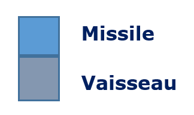
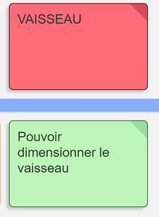

# Space Invaders - Sprint 2 : Dimensionner le vaiseau

Actuellement, nous disposons d'un espace de jeu et d'un vaisseau qui sait se déplacer vers la droite ou vers la gauche dans cet espace de jeu ... Il est temps de donner la possibilité au vaisseau de *tirer un missile* c-a-d de créer et positionner un objet missile au dessus de vaisseau. Dans l'état actuel du code, cela donnerait quelque chose de la sorte :
 ...

Hum, hum, tout cela n'est pas vraiment réaliste (un missile aussi grand qu'un vaisseau)  et nous préférerions avoir un rendu plus proche de cela :
 c-a-d pouvoir donner une dimension au vaisseau (et au missile)...

Avant d'ajouter la fonctionnalité *tirer un missile*, il est donc nécessaire de reprendre le code existant afin de rajouter la notion de *dimension* sur le vaisseau (sans casser le comportement existant bien sûr)... Un *petit* refactoring s'impose.

**L'objectif** de ce **S**print est donc de **pouvoir dimensionner le vaisseau** :




Pour réaliser cet objectif, d'après notre rapide analyse, nous devons ajouter la *dimension* du vaisseau au code existant en vérifiant que ce nouveau paramètre ne vienne pas perturber le comportement déjà implémenté. Notre travail reprendra les fonctionnalités implémentées en tenant compte de la dimensio, nous allons donc devoir mettre en place les points suivants :     
- [positionner un nouveau vanisseau avec une dimension donnée](#refactoPosition)   
- [faire en sorte qu'il soit impossible de positionner un nouveau vaisseau qui déborde de l'espace de jeu](#refactoDebordement)    
- [déplacer un vaisseau vers la droite en tenant compte de sa dimension](#refactoDimensionDeplacementDroite)     
- [déplacer un vaisseau vers la gauche en tenant compte de sa dimension](#refactoDimensionDeplacementGauche)     
- [refactorer la classe de test `SpaceInvadersTest`](#refactoClasseTests)   
- [refactorer la classe `Vaisseau`](#refactoVaisseau) 
 


## Etape n°1 : Positionner un nouveau vaisseau avec une dimension donnée <a id="refactoPosition"></a>

### RED: Ecrire un test qui échoue 
Donner une dimension au vaisseau lors de sa création reviend à ajouter un nouveau comportement à l'application existante.    
Ce nouveau comportement va se traduire par l'écriture d'un nouveau test (qui échoue) et qui pourrait être par exemple : postionner un nouveau vaisseau de dimension (3,2) à la position (7,9) afin de visualier une étape d'assertion similaire à :   

```JAVA  

        assertEquals("" + 
		"...............\n" + 
		"...............\n" +
		"...............\n" + 
		"...............\n" + 
		"...............\n" + 
		"...............\n" + 
		"...............\n" + 
		"...............\n" + 
		"........VVV....\n" + 
		"........VVV....\n" , spaceinvaders.recupererEspaceJeuDansChaineASCII());
	}
```

La question est *où écrire ce test ?*.  
Les puristes du TDD préconisent de n'écrire qu'un *Assert* par méthode de test. Ainsi quand le test *casse* (c-a-d qu'il est en échec : au ROUGE), il est très facile d'identifier d'où peut venir l'erreur juste en lisant le nom de la méthode de test (qui est censée expliciter l'intention du test).

Disposant déjà la méthode `public void test_unNouveauVaisseauEstCorrectementPositionneDansEspaceJeu()`,  
nous choisissons d'ajouter dans la classe `SpaceInvadersTest`, une nouvelle méthode `public void test_unNouveauVaisseauAvecDimensionEstCorrectementPositionneDansEspaceJeu()` destinée à contenir le code du nouveau test :  

```JAVA   

    @Test
	public void test_unNouveauVaisseauAvecDimensionEstCorrectementPositionneDansEspaceJeu() {
		spaceinvaders.positionnerUnNouveauVaisseau(3,2,7,9);
		assertEquals("" + 
		"...............\n" + 
		"...............\n" +
		"...............\n" + 
		"...............\n" + 
		"...............\n" + 
		"...............\n" + 
		"...............\n" + 
		"...............\n" + 
		".......VVV.....\n" + 
		".......VVV.....\n" , spaceinvaders.recupererEspaceJeuDansChaineASCII());
	}
```


A l'aide de l'IDE, créer une surcharge de la méthode : `positionnerUnNouveauVaisseau` (bien choisir **Create** et non **Change**) pour faire compiler ce test.

Exécuter les tests afin d'obtenir la barre ROUGE (le test échoue...).

### GREEN :  Ecrire le code qui permet de faire passer ce test AU PLUS VITE
 
Pour faire passer la barre AU VERT, le plus rapidement possible (et ne pas *casser* (ni toucher) le code déjà existant), il suffit de faire un *copier-coller* de la méthode que l'on est en train de surcharger c-a-d `positionnerUnNouveauVaisseau` à 2 paramètres et d'**appeler un constructeur de Vaisseau à 4 paramètres**.  
En effet pour faire compiler ce nouveau test, un objet de la classe Vaisseau doit maintenant disposer d'une `longueur` et d'une `hauteur`.

```JAVA  
   
	public void positionnerUnNouveauVaisseau(int longueur, int hauteur, int x, int y) {
			if (!estDansEspaceJeu(x, y))
			    throw new HorsEspaceJeuException("Vous êtes en dehors de l'espace jeu");

			vaisseau = new Vaisseau(longueur,hauteur,x,y);
	}
```

Compléter la classe **`Vaisseau`** pour qu'elle prenne en compte ces deux paramètres dans un nouveau constructeur (surcharge du constructeur pour ne pas casser le code existant), et que les deux nouveaux attributs `longueur` et `hauteur` apparaissent dans cette classe.

Après avoir ajoutés ces deux attributs, pour faire passer les tests AU VERT *le plus rapidement possible*, il est également nécessaire de :  

- modifier le code du constructeur existant en ajoutant une initialisation à `1` pour la `longueur` et `hauteur` (pour ne pas casser le code existant, puisque ce constructeur avait été écrit pour des tests vérifiant cette configuration (un vaisseau sans dimension ce qui signifie un vaisseau d'un point c-a-d longueur=hauteur=1)

- ajouter le nouveau constructeur à 4 paramètres.


```JAVA
 
    public class Vaisseau {

	    int x;
	    int y;
	    int longueur;
	    int hauteur;

	    public Vaisseau(int x, int y) {
		    this.longueur=1;
		    this.hauteur=1;
		    this.x = x;
		    this.y = y;
	    }
	
	    public Vaisseau(int longueur, int hauteur, int x, int y) {
		   this.longueur=longueur;
		   this.hauteur=hauteur;
		   this.x = x;
		   this.y = y;
	    }

    //... occupeLaPosition, seDeplacerVersLaDroite, seDeplacerVersLaGauche, abscisse ...
}
```

Mais avec, ces modifications, le test échoue toujours...  
En visualisant les **tableaux de comparaison des résultats attendus et réels** fournis par JUnit, on constate que :  
*Remarque : Pour obtenir les tableaux de comparaison vous devez lancer le test avec JUnit (clic droit sur le fichier de test puis `Run As -> JUnit Test`) et vous rendre dans la **vue JUnit** pour sélectionner le test qui échoue (`test_unNouveauVaisseauAvecDimensionEstCorrectementPositionneDansEspaceJeu`). Une fois le test sélectionné, rendez-vous dans la **vue Failure Trace** pour cliquer sur l'icône en haut à gauche qui permet de *`Compare Actual with Expected Test Results`*...)*

- le résultat **attendu** à la position (7,9) est :  
Remarque : nous représenterons ci-dessous que les deux dernières lignes c-a-d x=8 et x=9

```JAVA  

    .......VVV.....   
    .......VVV.....   
```

- le résultat **réel** à la position (7,9) est :

```JAVA   
  
    ...............  
    .......V.......   
```

Les coordonnées (`x`,`y`) du vaisseau correspondent aux coordonnées du coin inférieur gauche du vaisseau. Et pour l'instant, le vaisseau n'est représenté qu'en ce point :smile:

Pour visualiser *toute la place* que va occuper le vaisseau dans l'espace de jeu , il faut intervenir dans la méthode `occupeLaPosition` et faire en sorte que la position soit testée non seulement en fonction de la position du coin inférieur gauche du vaisseau (`x`,`y`), mais aussi en tenant compte de sa  `longueur` et de sa `hauteur`:  
Rappelons que :  
- le point en haut à gauche de l'espace jeu a pour coordonnées (0,0)  
- l'axe des `x` est croissant de la gauche vers la droite  
- l'axe des `y` est croissant du haut vers la bas  

```JAVA
 
    public class Vaisseau {

	    //...
	
	    public boolean occupeLaPosition(int x, int y) {
		     if ((this.x<=x) && (x<=this.x+this.longueur-1)) 
			      if ( (this.y-this.hauteur+1<=y) && (y<=this.y))
				  return true;
			
		     return false;
	     }
    //...
   }

```

Et avec une telle implémentation, les tests devraient maintenant passer au VERT !!! 


### REFACTOR (éventuellement) : code de production et code de test

Nous venons de faire passer le code AU VERT au plus vite et il est grand temps de refactorer tout ça !!!  ***Y-a-t-il quelque chose à refactorer (code de production et code de test) ?***  

Nous allons commencer par examiner le code de la classe `SpaceInvaders` et plus particulièrement la méthode `positionnerUnNouveauVaisseau`. 

#### Refactoring sur la classe `SpaceInvaders`

##### 1. Supprimer la surcharge inutile des méthodes `positionnerUnNouveauVaisseau` 
La surcharge des méthodes `positionnerUnNouveauVaisseau` n'est pas nécessaire : c'est de la duplication, d'ailleurs nous avions fait un copier-coller dans l'étape précédente pour faire passer le code au plus vite ! Il faut donc éliminer au plus vite cette duplication de notre code :smile:

Seule la méthode `positionnerUnNouveauVaisseau(int longueur, int hauteur, int x, int y)` semble nécessaire puisque `positionnerUnNouveauVaisseau(int x, int y)` revient à appeler `positionnerUnNouveauVaisseau(1, 1, x, y)`. 

Pour conserver dans la classe `SpaceInvaders` uniquement la méthode `positionnerUnNouveauVaisseau(int longueur, int hauteur, int x, int y)` nous devons d'abord modifier les appels à la méthode `positionnerUnNouveauVaisseau` dans la classe `SpaceInvadersTest` pour appeler toujours et uniquement cette méthode avec 4 paramètres.


Pour commencer, rendez-vous donc la classe `SpaceInvadersTest` pour modifier les appels à la méthode `positionnerUnNouveauVaisseau(x,  y)` en appel à la méthode `positionnerUnNouveauVaisseau(1, 1, x, y)`.

Par exemple dans la méthode `test_unNouveauVaisseauEstCorrectementPositionneDansEspaceJeu`, transformez l'appel à `spaceinvaders.positionnerUnNouveauVaisseau(7,9)` en `spaceinvaders.positionnerUnNouveauVaisseau(1,1,7,9)`.  

> **Vous venez de faire des modifications dans votre code...**  
> ***N'oubliez pas de relancer les tests pour vérifier que le comportement de votre code n'a pas changé !***

Procédez de même dans tous les autres méthodes de tests de manière à ne conserver que des appels à la méthode `positionnerUnNouveauVaisseau` à 4 paramètres. **A chaque changement n'oubliez pas de relancer les tests !**

Lorsqu'il n'y a plus d'appel à la méthode `positionnerUnNouveauVaisseau` à 2 paramètres, il est possible d'intervenir dans la classe `SpaceInvaders` et de supprimer la méthode `positionnerUnNouveauVaisseau(int x, int y)` . A vous de jouer !

> **Vous venez de faire des modifications dans votre code...**  
> ***N'oubliez pas de relancer les tests pour vérifier que le comportement de votre code n'a pas changé !***

Dans la classe `SpaceInvaders`, il ne reste donc plus maintenant que la méthode `positionnerUnNouveauVaisseau(int longueur, int hauteur, int x, int y)`.


##### 2. Remanier le code `positionnerUnNouveauVaisseau` pour mieux identifier les responsabilités

Outre le test de la position à l'intérieur du cadre du jeu, la méthode `positionnerUnNouveauVaisseau` n'est composée que d'une seule instruction, à savoir : 
`vaisseau = new Vaisseau(longueur, hauteur, x, y);` qui est censée à la fois créée un objet Vaisseau et le positionner.

N'améliorerait-on pas la lisibilité du code de cette méthode si on identifiait clairement les deux responsabilités (la création et le positionnement) qui relèvent toutes les deux du vaisseau, c-a-d si on remplaçait l'appel au constructeur à 4 paramètres par :  
- un appel à un constructeur de Vaisseau qui permettrait de **créer un Vaisseau avec une dimension donnée**.  
- un appel à une méthode qui permettrait de **positionner un vaisseau**.

Transformez donc la méthode de la sorte :

```JAVA

	public void positionnerUnNouveauVaisseau(int longueur, int hauteur, int x, int y) {
		if (!estDansEspaceJeu(x, y))
			throw new HorsEspaceJeuException("Vous êtes en dehors de l'espace jeu");

		vaisseau = new Vaisseau(longueur, hauteur);
		vaisseau.positionner(x, y);
	}
```

Avant toute chose, il faut corriger l'erreur de compilation. A l'aide de l'IDE, générer la méthode positionner dans la classe `Vaisseau` (renommez ces paramètres et implémentez-là) :

```JAVA  

    public class Vaisseau {
	
		//...

	    public void positionner(int x, int y) {
		    this.x = x;
		    this.y = y;
	    }
    }
```

Exécuter les tests.... ET .....  
Patatras, ils sont toujours au ROUGE... Mais pourquoi ?  

Le problème ne peut venir que de l'appel au constructeur...  
Jetons un petit coup d'oeil à la classe `Vaisseau`. Et oui, le constructeur à 2 paramètres actuellement écrit dans cette classe est `public Vaisseau(int x, int y)` c-a-d qu'il attend la position en paramètre, alors que nous nous souhaitons passer la dimension. Que faire pour résoudre ce problème ?

Le constructeur `public Vaisseau(int x, int y)` n'est plus appelé dans notre code (puisque le seul endroit où un vaisseau est créé est la méthode `positionnerUnNouveauVaisseau`).

On se dit, qu'avec les tests, on peut jouer avec notre code et qu'on peut toujours essayer de supprimer ce constructeur à 2 paramètres sur la position `public Vaisseau(int x, int y)` et le remplacer par un constructeur à deux paramètres sur la dimension avec une position initialisée par défaut à (0,0).

On essaye ? Donc, dans la classe `Vaisseau` :  
- supprimer le constructeur `public Vaisseau(int x, int y)`  
- ajouter, pour le remplacer, un constructeur à 2 paramètres sur la dimension :
  
```JAVA

	public Vaisseau(int longueur, int hauteur) {
		this.longueur=longueur;
		this.hauteur=hauteur;
		this.x = 0;
		this.y = 0;
	}

```

> **Vous venez de faire des modifications dans votre code...**  
> ***N'oubliez pas de relancer les tests pour vérifier que le comportement de votre code n'a pas changé !***

Les tests sont au VERT !!! Tout va bien ...

**Remarque : Les tests permettent de garantir le comportement du système. Avec les tests, on se sent plus en *confiance* avec son code et on a donc moins de réticence à le modifier et à jouer avec !**


En-a-t-on réellement fini avec la classe `positionnerUnNouveauVaisseau` ?

La première instruction de la méthode `positionnerUnNouveauVaisseau` fait en sorte, à l'aide d'une exception, de ne pas permettre le positionnement du vaisseau dans l'espace de jeu si les coordonnées de la position souhaitée se situent en dehors des limites de l'espace de jeu...  
Comme nous venons d'ajouter une dimension au vaisseau, il va falloir ajouter un autre cas de test qui visera à faire en sorte de ne pas pouvoir positionner un vaisseau qui dépasserait de l'espace de jeu en raison de ses dimensions.  
Ceci étant un nouveau comportement, ce test fera l'objet d'une nouvelle itération : ce sera notre prochain test :smile:...  
Mais avant de commencer la prochaine itération, terminons notre phase de refactoring en relisant le code de la classe `Vaisseau`.

#### Refactoring sur la classe `Vaisseau`
Le code que nous venons de modifier dans la classe `Vaisseau` est celui des constructeurs et de la méthode `occupeLaPosition`. 

##### 1. Constructeurs

Pour éviter la redondance de code, le code du constructeur à deux paramètres peut être remplacé par un appel au constructeur à 4 paramètres de telle sorte qu'il s'écrive désormais :

```JAVA    

	public Vaisseau(int longueur, int hauteur) {
		this(longueur, hauteur, 0, 0);
	}

```
> **Vous venez de faire des modifications dans votre code...**  
> ***N'oubliez pas de relancer les tests pour vérifier que le comportement de votre code n'a pas changé !***

##### 2. Méthode `occupeLaPosition`
Ne pensez-vous pas que la lisibilité de la méthode `occupeLaPosition` pourrait être améliorée ?

###### 2.a Un peu plus d'expressivité sur les abscisses couvertes par le vaisseau

Dans un premier temps, demandons-nous comment rendre plus expressif le premier `if` à savoir : `if ((this.x<=x) && (x<=this.x+this.longueur-1))` ? Les `Extract Method` vont nous aider ...

* Que signifie l'expression `this.x+this.longueur-1` ? A priori la valeur de l'abscisse la plus à droite du vaisseau. Commencez donc par extraire ce bout de code (à l'aide de l'extract méthode de l'IDE) dans une méthode `abscisseLaPlusADroite`. 

> **Vous venez de faire des modifications dans votre code...**  
> ***N'oubliez pas de relancer les tests pour vérifier que le comportement de votre code n'a pas changé !***

* Rappelez-vous que `this.x` avait déjà été extrait dans une méthode `abscisse`. A l'aide de l'IDE (`Refactor -> Rename...`), nous allons renommer cette méthode `abscisseLaPlusAGauche` pour garder une certaine cohérence dans le nommage des méthodes. 
Le renommage, s'il est réalisé automatiquement à l'aide de l'IDE, va bien sûr impacter tous les fichiers où `abscisse` est utilisée : et c'est tout l'intérêt d'utiliser le menu `Refactor` de l'IDE !
Ainsi, la classe `SpaceInvaders` doit être sauvegardéé avant de relancer les tests (une fois qu'on a vérifié, que grâce à l'IDE, le renommage a bien été réalisé dans cette classe).

> **Vous venez de faire des modifications dans votre code...**  
> ***N'oubliez pas de relancer les tests pour vérifier que le comportement de votre code n'a pas changé !***

* Jetons un petit coup d'oeil sur les impacts du renommage d'`abscisse` en `abscisseLaPlusAGauche` dans la classe `SpaceInvaders`. En lançant une recherche sur `abscisseLaPlusAGauche` dans cette classe, on constate que cette méthode apparaît dans la méthode `deplacerVaisseauVersLaGauche` ce qui semble logique, mais aussi dans la méthode `deplacerVaisseauVersLaDroite`, ce qui l'ait beaucoup moins.   
Pourtant,cela s'explique très bien puisque jusqu'à présent, le vaisseau étant sans dimension, il n'y avait qu'une seule méthode `abscisse` qui ne différenciait pas la droite de la gauche.
Le fait d'avoir *bien* (re)nommer la méthode, nous donne envie de remanier le code de la méthode `deplacerVaisseauVersLaDroite` pour faire appel dans cette méthode à `abscisseLaPlusADroite` au lieu de `abscisseLaPlusAGauche`. Les tests sont notre garde fou, alors allons-y, essayons voir si cette modification qui est censée mieux montrer l'intention du code a un impact sur nos tests. Modifiez donc la méthode `deplacerVaisseauVersLaDroite` en ce sens :

```JAVA  

	public void deplacerVaisseauVersLaDroite() {
		if (vaisseau.abscisseLaPlusADroite() < (longueur - 1))
			vaisseau.seDeplacerVersLaDroite();
	}

```

Eclipse détecte une erreur de compilation. En effet, la méthode `abscisseLaPlusADroite` est actuellement `private` puisque lors d'un `Extract Method` réalisé par l'IDE, les méthodes extraites sont automatiquement créées en `private`. Qu'à cela ne tienne, passons cette méthode en `public` pour pouvoir compiler et exécuter les tests !

* Continuons notre refactoring de la méthode `occupeLaPosition` de la classe `Vaisseau`.  
Pour améliorer la lisibilité du test, le `this.x` peut être remplacé par un appel à `abscisseLaPlusAGauche` de manière à obtenir un nouveau if de la forme : **`if ((abscisseLaPlusAGauche()<=x) && (x<=abscisseLaPlusADroite()))`**

> **Vous venez de faire des modifications dans votre code...**  
> ***N'oubliez pas de relancer les tests pour vérifier que le comportement de votre code n'a pas changé !***

* Pour terminer avec l'expressivité des abscisses, nous pouvons procéder à un dernier `Extract Method` sur la condition du `if` afin de faire apparaître la méthode booléenne `estAbscisseCouverte` et de transformer le `if` en : 
**`if (estAbscisseCouverte(x))`**

> **Vous venez de faire des modifications dans votre code...**  
> ***N'oubliez pas de relancer les tests pour vérifier que le comportement de votre code n'a pas changé !***


###### 2.b Un peu plus d'expressivité sur les ordonnées couvertes par le vaisseau

Procédez de même avec le `if ( (this.y-this.hauteur+1<=y) && (y<=this.y))` de manière à obtenir au final un `if (estOrdonneeCouverte(y))` et les méthodes : `ordonneeLaPlusBasse` et `ordonneeLaPlusHaute`. N'oubliez pas de relancer les test à chaque étape...

> **Vous venez de faire des modifications dans votre code...**  
> ***N'oubliez pas de relancer les tests pour vérifier que le comportement de votre code n'a pas changé !***

###### 2.c Refactorer la lisbilité du test en une ligne

Sélectionnez ensuite le code relatif aux deux `if` à savoir :

```JAVA  

	if (estAbscisseCouverte(x))
			if (estOrdonneeCouverte(y))
				return true;

```

Puis sous Eclipse, à l'aide d'un clic droit, sélectionner `Quick Fix` puis `join if with inner if statement` de manière à regrouper les deux `if` dans un seul ce qui devrait générer quelque chose comme : `if (estAbscisseCouverte(x) && estOrdonneeCouverte(y))`

> **Vous venez de faire des modifications dans votre code...**  
> ***N'oubliez pas de relancer les tests pour vérifier que le comportement de votre code n'a pas changé !***

Il ne reste plus qu'à remplacer le `if` par un `return` pour que la méthode `occupeLaPosition` se présente désormais sous la forme :

```JAVA   

	public boolean occupeLaPosition(int x, int y) {
		return (estAbscisseCouverte(x) && estOrdonneeCouverte(y));
	}

```
> **Vous venez de faire des modifications dans votre code...**  
> ***N'oubliez pas de relancer les tests pour vérifier que le comportement de votre code n'a pas changé !***


*Remarque : Saviez-vous également que le **menu `Source` de l'IDE vous aide à formater correctement votre code**. Par exemple, placez-vous sur la méthode `deplacerVaisseauVersLaGauche` de la classe `SpaceInvaders` (ou toute autre méthode qui vous semblerait mal identée), puis d'un clic droit, sélectionnez `Source -> Format` : le code de la méthode est alors reformatté. Si vous utilisez `Format Element`, ce sera le code de toute la classe qui sera reformatté...
Attention, à ne pas utiliser ce formattage dans la classe de test de ce projet, sinon vous perdriez le format de l'étape d'assertion que nous avons volontairement choisi pour faciliter la lisibilité du test (au pire un `CTRL+Z` n'est jamais loin :smile:).*


###### 2.d Le refactoring : un long cheminement pour aller vers un code plus propre...
Toutes ces petites opérations successives de remaniement de code ont permis d'améliorer la lisibilité (pas besoin de commentaires jusque là : tout est dit par le *bien nommage* du code !)
Vous avez pu constater qu'écrire du code plus *simple* (à lire) n'est pas forcément *facile* à mettre en place et demande une certaine discipline, un travail minutieux fait de petits pas.  

Après cette phase de refactoring, vous serez peut-être plus sensible à la citation suivante extraite de [JUnit](http://www.editions-eni.fr/livre/junit-mise-en-oeuvre-pour-automatiser-les-tests-en-java-9782746060616) :

>***A l'image du potier qui travaille son argile en continu, le développeur travaille son code
en permanence.** ([Benoît Gantaume](https://twitter.com/gantaume))*

 

Et également à celle ci :

>[***You will never write « good code » you will only learn how to write « better code ». Programming is a journey, not a goal…** (Arnaud Lemaire)*](https://twitter.com/Lilobase/status/819525605813260288)


#### Refactoring sur la classe `SpaceInvadersTest`
Pour cette itération, nous choisissons de ne pas remanier le code de tests de cette classe.  
Nous préferons attendre d'avoir effectué toutes les modifications autour de la dimension avant de mettre en place le [refactoring de la classe de test `SpaceInvadersTest`](#refactoClasseTests).

L'**étape de REFACTORING** de cette itération étant désormais terminée, il est temps de se poser la question : **Quel est donc le prochain test  à écrire ?** 

Ce sera le test identifié précédemment lors du refactoring de la méthode `positionnerUnNouveauVaisseau` c-a-d faire en sorte, à l'aide d'une exception, de ne pas pouvoir positionner un vaisseau qui dépasserait de l'espace de jeu.


## Etape n°2 : Faire en sorte qu'il soit impossible de positionner un nouveau vaisseau qui déborde de l'espace de jeu <a id="refactoDebordement"></a>


### RED: Ecrire un premier test qui échoue

Dans la classe `SpaceInvadersTest`, nous avons déjà une méthode de test qui vérifie la *bonne* levée de l'exception `HorsEspaceJeuException`. En effet, la méthode `test_UnNouveauVaisseauPositionneHorsEspaceJeu_DoitLeverUneException()` vérifie si une position donnée par ses coordonnées (x,y) se trouve ou non à l'extérieur de l'espace de jeu...


#### 1. Une méthode de test bien nommée
Désormais, nous voulons lever une exception si pour une une position (x,y) donnée, un vaisseau *déborde* de l'espace de jeu (c-a-d en sort partiellement). Le comportement à tester étant différent, il semblerait judicieux d'écrire une nouvelle méthode de test afin de montrer cette nouvelle intention, par exemple :   `test_UnNouveauVaisseauPositionneDansEspaceJeuMaisAvecDimensionTropGrande_DoitLeverUneExceptionDeDebordement`.  

Plusieurs tests vont devoir être mis en place pour tester, via la levée d'une exception, le *débordement* dans différentes directions. Comme précédemment avec l'exception `HorsEspaceJeuException`, ces tests seront écrits avec un `try...catch`.

Mais avant d'écrire les tests, commençons tout d'abord par rechercher les exemples que nous allons tester...

#### 2. Une recherche préalable des exemples à tester

Nous avons 4 exemples de débordement (un dans chaque direction) à examiner, en gardant en mémoire les conventions que nous utilisons, à savoir :

> * Le point origine de l'espace jeu (0,0) est le coin **supérieur** gauche de l'espace jeu : axe des abscisses croissant vers la gauche, axe des ordonnées croissant vers le bas.
> * Le point marquant la position du vaisseau (x,y) est le coin **inférieur** gauche du vaisseau.


* **Exemple n°1** : une ***longueur trop grande provoque un débordement sur la droite***.  
Par exemple dans un espace de dimension (15, 10) un vaisseau de dimenion (9,2) que l'on souhaiterait positionner en (7,9) donnerait la configuration suivante (un petit dessin s'impose parfois pour bien visualiser l'exemple que l'on souhaite écrire ...) :

``` JAVA  

    ...............     
	...............  
	...............   
	...............  
	...............   
	...............    
	...............     
	...............  
	.......VVVVVVVVV  
	.......VVVVVVVVV 


``` 


* **Exemple n°2** : une ***hauteur trop grande provoque un débordement vers le haut***.  
Par exemple dans un espace de dimension (15, 10) un vaisseau de dimenion (3,4) que l'on souhaiterait positionner en (7,1) donnerait la configuration suivante :


``` JAVA   
 
		   VVV
           VVV
    .......VVV.....     
	.......VVV.....  
	...............   
	...............  
	...............   
	...............    
	...............     
	...............  
	............... 
	............... 


``` 

*  **Exemple n°3** :Quid du **débordement vers la gauche** ?  
Un débordement vers la gauche pourrait mener à une configuration similaire à la suivante :  

``` JAVA   
 
     ...............     
	 ...............  
	 ...............   
	 ...............  
	 ...............   
	 ...............    
	 ...............     
	 ...............  
	VVV............. 
	VVV............. 

``` 

Cet exemple montre que s'il y a débordement sur la gauche, c'est que l'abscisse choisie pour positionner sur le vaisseau se situe en dehors de l'espace de jeu (donc qu'une exception de `HorsEspaceJeuException` doit être levée), car rappelons que le point marquant la position du vaisseau (x,y) est bien le coin **inférieur** gauche du vaisseau.    
On peut donc considérer que le cas du **débordement vers la gauche** n'est pas à tester puisqu'il est déjà traité en vérifiant la validité de la position (x,y) du vaisseau dans l'espace jeu.  
Cela signifie qu'on devra d'abord examiner la validité de la position, puis examiner l'éventuelle possibilité d'un débordement. Une fois ces cas limite écartés, si tout va bien, il sera alors possible de procéder au *bon* positionnement du vaisseau.


*  **Exemple n°4** :Quid du **débordement vers le bas** ?  
Le raisonnement vers le bas rejoint celui autour du raisonnement vers la gauche.  
Si on arrivait dans une configuration similaire à la suivante, cela signifierait que l'ordonnée choisie pour positionner sur le vaisseau se situerait en dehors de l'espace de jeu (donc qu'une exception de `HorsEspaceJeuException` aurait déjà été levée). Une telle configuration ne semble donc pas possible dès lors qu'un test sur la validité de la position du vaisseau a déjà été mis en place et qu'une `HorsEspaceJeuException` a éventuellement été déjà levée. 

``` JAVA   
 
     ...............     
	 ...............  
	 ...............   
	 ...............  
	 ...............   
	 ...............    
	 ...............     
	 ...............  
	 .......VVV..... 
	 .......VVV.....
            VVV 

``` 

Cet exemple confirme, que comme précédemment, il faudra d'abord examiner la validité de la position, puis l'éventuelle possibilité d'un débordement AVANT de positionner le vaisseau. 


#### 3. Ecriture de la méthode de test

La méthode `test_UnNouveauVaisseauPositionneDansEspaceJeuMaisAvecDimensionTropGrande_DoitLeverUneExceptionDeDebordement` ne sera donc pas composé de 4 `try...catch` (un pour chaque direction), mais seulement de 2 (un pour le débordement à droite et un pour le débordement vers le haut).

En effet, d'après les exemples que nous venons d'examiner, il n'y a que deux tests à prendre en compte :  
    
* un test pour une ***longueur trop grande qui provoque un débordement sur la droite*** (celui de l'exemple n°1)    
*  un test pour une ***hauteur trop grande qui provoque un débordement vers le haut*** (celui de l'exemple n°2)    
	
Puisque les exemples n°3 et 4 relatifs au débordement vers la gauche et vers le bas ne devrait pas apparaître si la validité de la position est bien testée en amont.


Comme nous prenons de plus en plus confiance en notre code, nous décidons d'écrire directement les 2 `try...catch` pour traiter la levée de l'exception en une seule itération (au lieu de 2).


Dans la classe `SpaceInvadersTest`, rajoutez donc le code suivant qui permet de tester la levée d'une nouvelle exception de type  `DebordementEspaceJeuException` en s'appuyant sur les deux exemples pertinents présentés précédemment (une position dans l'espace jeu correcte, mais avec une longueur trop importante puis avec une largeur trop importe) :

```JAVA   

	@Test
	public void test_UnNouveauVaisseauPositionneDansEspaceJeuMaisAvecDimensionTropGrande_DoitLeverUneExceptionDeDebordement() {
		
		try {
			spaceinvaders.positionnerUnNouveauVaisseau(9,2,7,9);
			fail("Dépassement du vaisseau à droite en raison de sa longueur trop importante : devrait déclencher une exception DebordementEspaceJeuException");
		} catch (final DebordementEspaceJeuException e) {
		}
		
		
		try {
			spaceinvaders.positionnerUnNouveauVaisseau(3,4,7,1);
			fail("Dépassement du vaisseau vers le haut en raison de sa hauteur trop importante : devrait déclencher une exception DebordementEspaceJeuException");
		} catch (final DebordementEspaceJeuException e) {
		}
			
	}

````

Pour faire compiler ce test, nous devons dans un premier temps créer la classe `DebordementEspaceJeuException` (dans `/src/main/java` et dans le même package que celui de l'exception déjà existante `HorsEspaceJeuException`, c-a-d surement le package `utils` :smile:) :

```JAVA   

    @SuppressWarnings("serial")
    public class DebordementEspaceJeuException extends RuntimeException {

	    public DebordementEspaceJeuException(String message) {
		    super(message);
	    }
    }

```

Remarque : Comme précédemment, nous avons choisi que cette exception serait une `RuntimeException`.  

Le nouveau test devrait maintenant compiler...  
Exécutez-le pour bien voir qu'il échoue (**Etape RED**).

 
### GREEN :  Ecrire le code qui permet de faire passer ce test AU PLUS VITE

Il ne vous reste donc plus qu'à écrire le code qui va faire passer le test au VERT le plus rapidement possible....

Pour cela, une exception `DebordementEspaceJeuException` doit être levée dans `positionnerUnNouveauVaisseau` :

* SI il y a un débordement à droite c-a-d si l'abscisse la plus à droite (du vaisseau potentiellement créé) est en dehors de l'espace jeu.  

* OU SI il y  a un débordement vers le haut c-a-d si l'ordonnée la plus haute (du vaisseau potentiellement créé) est en dehors de l'espace jeu. 


De plus, l'exception doit être levée après le test sur la position (d'après les exemples n°3 et n°4).

Ecrire rapidement un code qui permet de lever l'exception `DebordementEspaceJeuException` dans la méthode `positionnerUnNouveauVaisseau` pourrait ressembler à :

```JAVA  

	public void positionnerUnNouveauVaisseau(int longueur, int hauteur, int x, int y) {
		if (!estDansEspaceJeu(x, y))
			throw new HorsEspaceJeuException("Vous êtes en dehors de l'espace jeu");

		if ( !estDansEspaceJeu(x+longueur-1,y))
			throw new DebordementEspaceJeuException("Vous débordez à droite de l'espace jeu");
		if (!estDansEspaceJeu(x,y-hauteur+1))
			throw new DebordementEspaceJeuException("Vous débordez à gauche de l'espace jeu");

		vaisseau = new Vaisseau(longueur, hauteur);
		vaisseau.positionner(x, y);
	}

```


Remarque : Au moment où la validité de la position dans l'espace de jeu est testée, le vaisseau n'est pas encore créé : il n'est donc pas encore possible d'appeler les méthodes `abscisseLaPlusADroite` et `ordonneeLaPlusHaute`  de la classe `Vaisseau` (sous peine de voir apparaître un `NullpointerException`) puisqu'aucun objet de type `Vaisseau` n'existe actuellement. Dans ce cas, la condition du `if` ne peut donc être écrite qu'à partir des coordonnées `x` et `y` passées en paramètres...

Lancez les tests pour vérifier qu'ils passent bien tous AU VERT !!!


### REFACTOR (éventuellement) : code de production et code de test

***Y-a-t-il quelque chose à refactorer ?***

Le seul code que nous avons modifié pour faire passer ce test est celui de la méthode `positionnerUnNouveauVaisseau` de la classe `SpaceInvaders` : pour l'instant nous n'effectuerons donc pas de refactoring dans cette itération.


Il est donc temps de répondre à la question : **Quel est donc le prochain test  à écrire ?** 

Maintenant que nous positionnons correctement un nouveau vaisseau avec une dimension, il est temps d'étudier le comportement du vaisseau vers la droite et vers la gauche en tenant compte de cette dimension.

***Remarque : La fonctionnalité qui permet de positionner un vaisseau avec une dimension dans l'espace de jeu semble terminée et fonctionnelle. Avant de continuer, peut-être serait-il temps de commiter ce nouveau comportement (positionner un vaisseau avec une dimension) dans votre gestionnaire de version !***  
(sans oublier d'ajouter dans votre commit la nouvelle classe créée `DebordementEspaceJeuException`)

## Etape n°3 : Déplacer un vaisseau vers la droite en tenant compte de sa dimension <a id="refactoDimensionDeplacementDroite"></a>

Avant d'écrire les tests, commençons par rechercher les exemples à tester...

#### Une recherche préalable des exemples à tester

Deux cas de tests peuvent être envisagés pour tester le déplacement du vaisseau vers la droite en tenant compte de sa dimension :  
 - le cas normal où le vaisseau effectue son déplacement en restant dans l'espace de jeu.  
 - le cas limite où le vaisseau, étant déjà sur la bordure droite de l'espace jeu, ne peut pas se déplacer sous peine de déborder de l'espace jeu.
 
Ces deux cas de tests peuvent être illustrés à l'aide des exemples suivants 

* **Exemple n°1** : le ***vaisseau se déplace normalement vers la droite***.  
Par exemple dans un espace de dimension (15, 10) un vaisseau de dimenion (3,2) positionné en (7,9) se retrouvera à la position (8,9) après un déplacement vers la droite.

* **Exemple n°2** : le ***vaisseau reste immobile s'il est déjà sur la bordure droite de l'espace de jeu***.  
Par exemple dans un espace de dimension (15, 10) un vaisseau de dimenion (3,2) positionné en (12,9) restera à la position (12,9) après un déplacement vers la droite.


### RED: Ecrire un premier test qui échoue 

##### 1. Implémentation de l'exemple n°1 (cas normal)
Ce test concerne le déplacement *normal* d'un vaisseau avec dimension vers la droite.  
En reprenant, les valeurs de l'exemple n°1, le code du test pourrait être le suivant :

```JAVA

    @Test
    public void test_VaisseauAvecDimensionAvance_DeplacerVaisseauVersLaDroite() {
		
		spaceinvaders.positionnerUnNouveauVaisseau(3,2,7,9);
		spaceinvaders.deplacerVaisseauVersLaDroite();
		assertEquals("" + 
		"...............\n" + 
		"...............\n" +
		"...............\n" + 
		"...............\n" + 
		"...............\n" + 
		"...............\n" + 
		"...............\n" + 
		"...............\n" + 
		"........VVV....\n" + 
		"........VVV....\n" , spaceinvaders.recupererEspaceJeuDansChaineASCII());
	}

```

Recopiez ce test dans votre fichier test `SpaceInvadersTest` et exécutez-les tests.  
Que constatez-vous ? ....  
Les tests passent au VERT !!!  
...ce qui signifie que notre code prend déjà en compte ce déplacement.

Est-il nécessaire de garder ce test ? A priori non car il n'apporte pas un nouveau comportement. Ce test ne sera donc pas celui qui débutera une nouvelle itération.

Par contre, nous sommes sur BARRE VERTE (tous les tests passent) et sur BARRE VERTE, c'est toujours le *bon* moment de s'interroger sur un éventuel refactoring !

Le refactoring concerne aussi bien le code de production que le code de test.  
En ajoutant, ce test, nous n'avons pas touché au code de production...

***Y-a-t-il quelque chose à refactorer côté code de test ?***

En regardant, les tests écrits jusqu'à présent (notamment ceux autour du déplacement *normal* à droite), nous constatons que nous disposons actuellement de deux méthodes qui testent un comportement similaire (ce qui explique pourquoi la méthode de test que nous venons d'ajouter n'a pas apporté de nouveau comportement...)

```JAVA

    public void test_VaisseauAvance_DeplacerVaisseauVersLaDroite  
	public void test_VaisseauAvecDimensionAvance_DeplacerVaisseauVersLaDroite

```
	
Il n'est donc surement pas nécessaire de garder ces deux méthodes de tests.  
Pour garantir, un *bon* déplacement du vaisseau vers la droite, une seule méthode de test est nécessaire. Laquelle garder ? La plus *générale* c-a-d celle qui illustre le mieux les dimensions du vaisseau...

**Supprimez donc de votre fichier de test la méthode  : `test_VaisseauAvance_DeplacerVaisseauVersLaDroite`** pour ne garder au final que la méthode qui prend en compte réellement la dimension, à savoir : **`test_VaisseauAvecDimensionAvance_DeplacerVaisseauVersLaDroite`** 

> **Vous venez de faire des modifications dans votre code...**  
> ***N'oubliez pas de relancer les tests pour vérifier que le comportement de votre code n'a pas changé !***

Pour faciliter le lecture des méthodes de tests, renommez 
`test_VaisseauAvecDimensionAvance_DeplacerVaisseauVersLaDroite` en **`test_VaisseauAvance_DeplacerVaisseauVersLaDroite`** (puisqu'à partir de maintenant, il est implicite qu'un vaisseau a une dimension...)

> **Vous venez de faire des modifications dans votre code...**  
> ***N'oubliez pas de relancer les tests pour vérifier que le comportement de votre code n'a pas changé !***


Intéressons-nous maintenant au cas limite (bordure droite) pour savoir si ce nouveau test apporte ou non un nouveau comportement...


##### 2. Implémentation de l'exemple n°2 (cas limite)

Ce test concerne le déplacement d'un vaisseau vers la droite *avec un vaisseau positionné en **limite droite** de l'espace jeu*. En reprenant, les valeurs de l'exemple n°2, le code du test pourrait être le suivant :

```JAVA   

    @Test
	public void test_VaisseauAvecDimensionImmobile_DeplacerVaisseauVersLaDroite() {
		
		spaceinvaders.positionnerUnNouveauVaisseau(3,2,12,9);
		spaceinvaders.deplacerVaisseauVersLaDroite();
		assertEquals("" + 
		"...............\n" + 
		"...............\n" +
		"...............\n" + 
		"...............\n" + 
		"...............\n" + 
		"...............\n" + 
		"...............\n" + 
		"...............\n" + 
		"............VVV\n" + 
		"............VVV\n" , spaceinvaders.recupererEspaceJeuDansChaineASCII());
	}

```

Recopiez ce test dans votre fichier test `SpaceInvadersTest` et exécutez-les tests.  
Que constatez-vous ? ....  
Les tests passent au VERT !!!  
...ce qui signifie que notre code prend déjà en compte le cas limite pour le déplacement à droite. On peut s'en assurer en jetant un petit coup d'oeil au code de la méthode `deplacerVaisseauVersLaDroite` de la classe `SpaceInvaders` : 

```JAVA
  
	public void deplacerVaisseauVersLaDroite() {
		if (vaisseau.abscisseLaPlusADroite() < (longueur - 1))
			vaisseau.seDeplacerVersLaDroite();
	}

  
```

Cette méthode fait appel à la méthode `abscisseLaPlusADroite` de la classe `Vaisseau` qui tient déjà compte de la dimension (`longueur`) puisque cette méthode a été retravaillée (et testée) à l'itération précédente pour permettre le positionnement d'un vaisseau avec dimension...  

Remarque : Cet exemple, à l'image de la méthode `deplacerVaisseauVersLaDroite`, illustre tout l'intérêt d'avoir un code expressif qui conduit à ***décomposer le problème en sous-problèmes*** ré-utilisables (et déjà testés) (en algorithmique, c'est le principe du [Diviser pour règner](https://fr.wikipedia.org/wiki/Diviser_pour_r%C3%A9gner_(informatique)), ou en anglais [divide and conquer)...](https://en.wikipedia.org/wiki/Divide_and_conquer_algorithm).


Comme précédemment, nous sommes sur BARRE VERTE (tous les tests passent), c'est donc le moment de se poser la question :  

***Y-a-t-il quelque chose à refactorer côté code de test ?***

Comme précédemment, le déplacement *limite* à droite est désormais testé (couvert) par deux méthodes :

```JAVA

    public void test_VaisseauImmobile_DeplacerVaisseauVersLaDroite  
	public void test_VaisseauAvecDimensionImmobile_DeplacerVaisseauVersLaDroite

```
	

Comme précédemment, nous ne gardons qu'un seul test, celui qui illustre le mieux le comportement du déplacement *limite* vers la droite d'un vaisseau c-a-d celui qui fait apparaître les dimensions du vaisseau 
**Supprimez du fichier de test la méthode  : `test_VaisseauImmobile_DeplacerVaisseauVersLaDroite`**

> **Vous venez de faire des modifications dans votre code...**  
> ***N'oubliez pas de relancer les tests pour vérifier que le comportement de votre code n'a pas changé !***

Pour faciliter le lecture des méthodes de tests, renommez 
`test_VaisseauAvecDimensionImmobile_DeplacerVaisseauVersLaDroite` en **`test_VaisseauImmobile_DeplacerVaisseauVersLaDroite`**.

> **Vous venez de faire des modifications dans votre code...**  
> ***N'oubliez pas de relancer les tests pour vérifier que le comportement de votre code n'a pas changé !***


Au final cette ***étape n°3 : Déplacer un vaisseau vers la droite en tenant compte de sa dimension*** n'a pas réellement donné lieu à une nouvelle itération TDD (RED/GREEN/REFACTOR), puisqu'aucun nouveau comportement n'a été apporté : pas de nouveau test en échec (AU ROUGE).
Cette étape nous a cependant permis de faire un petit peu de refactoring dans le code de tests.


Nous allons maintenant procéder de même pour vérifier si le déplacement du vaisseau vers la gauche se comporte bien selon nos exigences, et ce avec un vaisseau possédant des dimensions...


## Etape n°4 : Déplacer un vaisseau vers la gauche en tenant compte de sa dimension <a id="refactoDimensionDeplacementGauche"></a>


#### Une recherche préalable des exemples à tester

Pour tester le déplacement du vaisseau vers la gauche (cas normal et cas limite), nous nous appuyerons sur les exemples suivants :

* **Exemple n°1** : le ***vaisseau se déplace normalement vers la gauche*** avec par exemple dans un espace de dimensions (15, 10) un vaisseau de dimensions (3,2) positionné en (7,9) qui se retrouve à la position (6,9) après un déplacement vers la gauche.

* **Exemple n°2** : le ***vaisseau reste immobile s'il est déjà sur la bordure gauche de l'espace de jeu*** avec par exemple dans un espace de dimensions (15, 10) un vaisseau de dimensions (3,2) positionné en (0,9) reste à la position (0,9) après un déplacement vers la gauche.


### RED: Ecrire un premier test qui échoue 

##### 1. Implémentation de l'exemple n°1 (cas normal)

```JAVA

    @Test
	public void test_VaisseauAvecDimensionAvance_DeplacerVaisseauVersLaGauche() {
		
		spaceinvaders.positionnerUnNouveauVaisseau(3,2,7,9);
		spaceinvaders.deplacerVaisseauVersLaGauche();
	
		assertEquals("" + 
		"...............\n" + 
		"...............\n" +
		"...............\n" + 
		"...............\n" + 
		"...............\n" + 
		"...............\n" + 
		"...............\n" + 
		"...............\n" + 
		"......VVV......\n" + 
		"......VVV......\n" , spaceinvaders.recupererEspaceJeuDansChaineASCII());
    }


```

Recopiez ce test dans votre fichier test `SpaceInvadersTest` et exécutez-les tests.  
Que constatez-vous ? ....  
Les tests passent au VERT !!!  
...ce qui signifie que notre code prend déjà en compte ce déplacement.

Comme pour le *bon* déplacement *normal* vers la droite, nous ne gardons qu'un seul test, celui qui illustre le mieux le comportement du *bon* déplacement *normal* vers la gauche d'un vaisseau c-a-d celui qui fait apparaître les dimensions du vaisseau.   
**Supprimez du fichier de test la méthode  : `VaisseauAvance_DeplacerVaisseauVersLaGauche`**

> **Vous venez de faire des modifications dans votre code...**  
> ***N'oubliez pas de relancer les tests pour vérifier que le comportement de votre code n'a pas changé !***

Pour faciliter la lecture des méthodes de tests, renommez 
`VaisseauAvecDimensionAvance_DeplacerVaisseauVersLaGauche` en **`VaisseauAvance_DeplacerVaisseauVersLaGauche`**.

> **Vous venez de faire des modifications dans votre code...**  
> ***N'oubliez pas de relancer les tests pour vérifier que le comportement de votre code n'a pas changé !***


Nous allons maintenant nous intéresser au cas limite (bordure gauche).


##### 2. Implémentation de l'exemple n°2 (cas limite)

```JAVA   

	@Test
	public void test_VaisseauAvecDimensionImmobile_DeplacerVaisseauVersLaGauche() {
		
		spaceinvaders.positionnerUnNouveauVaisseau(3,2,0,9);
		spaceinvaders.deplacerVaisseauVersLaGauche();
		
		assertEquals("" + 
		"...............\n" + 
		"...............\n" +
		"...............\n" + 
		"...............\n" + 
		"...............\n" + 
		"...............\n" + 
		"...............\n" + 
		"...............\n" + 
		"VVV............\n" + 
		"VVV............\n" , spaceinvaders.recupererEspaceJeuDansChaineASCII());
	}
	

```

Recopiez ce test dans votre fichier test `SpaceInvadersTest` et exécutez-les tests.  
Que constatez-vous ? ....  
Les tests passent au VERT !!!  
...ce qui signifie que notre code prend déjà en compte ce déplacement.

Comme précédemment, nous ne gardons qu'un seul test, celui qui illustre le mieux le comportement du déplacement *limite* vers la gauche d'un vaisseau c-a-d celui qui fait apparaître les dimensions du vaisseau 
**Supprimez du fichier de test la méthode  : `VaisseauImmobile_DeplacerVaisseauVersLaGauche`**

> **Vous venez de faire des modifications dans votre code...**  
> ***N'oubliez pas de relancer les tests pour vérifier que le comportement de votre code n'a pas changé !***

Pour faciliter le lecture des méthodes de tests, renommez 
`VaisseauAvecDimensionImmobile_DeplacerVaisseauVersLaGauche` en **`VaisseauImmobile_DeplacerVaisseauVersLaGauche`**.

> **Vous venez de faire des modifications dans votre code...**  
> ***N'oubliez pas de relancer les tests pour vérifier que le comportement de votre code n'a pas changé !***


Il semblerait que nous ayons fait le tour, pour le moment, des fonctionnalités prévues dans le backlog de sprint. Ne pourrions-nous pas tout de même améliorer encore un peu la lisilité de la classe de test : `SpaceInvadersTest` ?

## Zoom sur le Refactoring de la classe de test `SpaceInvadersTest` (`Primitive Obsession`)<a id="refactoClasseTests"></a>

En effet, dans un développement dirigé par les tests (TDD), le code de test est aussi important que le code de production. Le code de test doit donc absolument être revu pendant les phases de refactoring car il se doit de respecter un niveau de qualité équivalent à celui du code de production. A l'image du code de production, on dit que le code de test est élévé au rang de *citoyen de première classe*.

### 1. Mise en place du refatoring dans une méthode de test

Reprenons, par exemple, le code de la méthode de test : `test_unNouveauVaisseauAvecDimensionEstCorrectementPositionneDansEspaceJeu`

```JAVA   

    @Test
	public void test_unNouveauVaisseauAvecDimensionEstCorrectementPositionneDansEspaceJeu() {
		spaceinvaders.positionnerUnNouveauVaisseau(3,2,7,9);
		assertEquals("" + 
		"...............\n" + 
		"...............\n" +
		"...............\n" + 
		"...............\n" + 
		"...............\n" + 
		"...............\n" + 
		"...............\n" + 
		"...............\n" + 
		".......VVV.....\n" + 
		".......VVV.....\n" , spaceinvaders.recupererEspaceJeuDansChaineASCII());
	}

```

Pensez-vous que dans quelques jours (semaines?), quand vous relirez ce code vous vous souviendrez de ce que signifie la suite de chiffres 3,2,7,9 ? :    
 - que les deux premiers chiffres permettent de définir la dimension du vaisseau (3,2)   
 - que les deux derniers chiffres permettent de définir la position du vaisseau (3,2)

Ne trouvez-vous pas qu'il serait bien plus explicite d'écrire : **`spaceinvaders.positionnerUnNouveauVaisseau(new Dimension(3,2),new Position(7,9))`** à la place de : `spaceinvaders.positionnerUnNouveauVaisseau(3,2,7,9)` ? 

Nous allons procéder à ce refactoring pas à pas :

* Commencez par remplacer l'instruction : `spaceinvaders.positionnerUnNouveauVaisseau(3,2,7,9);` par  `spaceinvaders.positionnerUnNouveauVaisseau(new Dimension(3,2),new Position(7,9));`. Des erreurs de compilation apparaissent, c'est normal. 

* Continuez, à l'aide de l'IDE, à créer dans **`src/main/java`** dans le même package que les classes métiers déjà existantes, les classes `Position`, `Dimension` et leurs constructeurs respectifs et complétez-les de la manière suivante :

```JAVA  

    public class Dimension {
       int longueur;
	   int hauteur;

	   public Dimension(int longueur, int hauteur) {
		   this.longueur = longueur;
		   this.hauteur = hauteur;
	   }

	   public int longueur() {
		   return this.longueur;
	   }

	   public int hauteur() {
		 return this.hauteur;
	   }

    }   


```

Remarque :  Après avoir copié le code précédent dans la classe `Dimension` de votre IDE, faites un petit clic droit puis `Source -> Format Element` pour reformater votre code correctement :smile: 


```JAVA  

    public class Position {
	   int x;
	   int y;

	   public Position(int x, int y) {
		   this.x = x;
		   this.y = y;
	   }

	   public int abscisse() {
		   return this.x;
	   }

	  public int ordonnee() {
		  return this.y;
	  }

    }   


```

*Remarque sur le code des classes `Dimension` et `Position` :*    
 - Nous avons écrit uniquement le code dont nous allons avoir besoin pour mettre en place notre refactoring c-a-d uniquement un constructeur et des *getteurs* puisque les valeurs relatives à la dimension et à la position seront uniquement assignées lors de la création de ces objets (pas besoin de *setteurs*).  
 - Nous avons voulu éviter de nommer nos getteurs `getXXX` et nous avons volontairement choisi un nom plus expressif.

* Terminez par ajouter dans la classe `SpaceInvaders` une surcharge de la méthode `positionnerUnNouveauVaisseau` avec deux paramètres de type `Position` et `Dimension` :   


```JAVA   

	public void positionnerUnNouveauVaisseau(Dimension dimension, Position position) {
		positionnerUnNouveauVaisseau(dimension.longueur(), dimension.hauteur(),
												position.abscisse(), position.ordonnee());

	}

```


> **Vous venez de faire des modifications dans votre code...**  
> ***N'oubliez pas de relancer les tests pour vérifier que le comportement de votre code n'a pas changé !***

Le code compile... Et les tests passent AU VERT !!!!


### 2. Généralisation de ce refatoring à toutes les méthodes de test (en pas à pas)

Procédez pas à pas au refactoring de chaque méthode de test.

Pour chaque méthode de test :

* remplacez l'appel de la méthode `positionnerUnNouveauVaisseau` par un appel à la méthode surchargée (avec un `new Dimension` et un `new Position`). Enregistrez et relancez les tests (Si vous ne l'utilisez pas encore, c'est vraiment le moment d'installer [Infinitest](https://infinitest.github.io/) pour vous simplifier la vie :smile: ..) car ...

> **Vous venez de faire des modifications dans votre code...**  
> ***N'oubliez pas de relancer les tests pour vérifier que le comportement de votre code n'a pas changé !***

* Exécutez donc tous les tests et vérifiez qu'ils passent AU VERT avant de passer à la méthode suivante !!!


### 3. Suppression de la surcharge pour ne conserver que la méthode `positionnerUnNouveauVaisseau(Dimension dimension, Position position)`

Une fois que toutes les méthodes de tests ont été transformées et qu'elles appellent désormais la méthode `positionnerUnNouveauVaisseau(Dimension dimension, Position position)`, il n'est plus nécessaire de conserver la méthode `positionnerUnNouveauVaisseau` à 4 paramètres.   
**Conservez donc uniquement la méthode `positionnerUnNouveauVaisseau` à deux paramètres de type `Dimension` et `Position`** (qui reprend tout simplement le code de la méthode `positionnerUnNouveauVaisseau` en l'adaptant à ces deux paramètres), de manière à faire apparaître dans la classe `SpaceInvaders` uniquement le code suivant :

```JAVA

    public void positionnerUnNouveauVaisseau(Dimension dimension, Position position) {
		
		int x = position.abscisse();
		int y = position.ordonnee();
		
		if (!estDansEspaceJeu(x, y))
			throw new HorsEspaceJeuException("Vous êtes en dehors de l'espace jeu");

		int longueur = dimension.longueur();
		int hauteur = dimension.hauteur();
		
		if (!estDansEspaceJeu(x + longueur - 1, y))
			throw new DebordementEspaceJeuException("Vous débordez de l'espace jeu");
		if (!estDansEspaceJeu(x, y - hauteur + 1))
			throw new DebordementEspaceJeuException("Vous débordez de l'espace jeu");

		vaisseau = new Vaisseau(longueur, hauteur);
		vaisseau.positionner(x, y);
	}

```


> **Vous venez de faire des modifications dans votre code...**  
> ***N'oubliez pas de relancer les tests pour vérifier que le comportement de votre code n'a pas changé !***


### 4. Quelques mots sur le code smell `Primitive Obsession` et le refactoring `Introduce Parameter Object`

Le refactoring que nous venons d'effectuer a permis de transformer la méthode :   
`public void positionnerUnNouveauVaisseau(int longueur, int hauteur ,int x, int y)`  en méthode :    
`public void positionnerUnNouveauVaisseau(Dimension dimension, Position position)`


Ce type de refactoring s'appelle **`Introduce Parameter Object`**, puisqu'il a permis d'introduire les objets de types `Dimension` et `Position` en lieu et place des entiers primitifs `longueur`, `hauteur`, `x` et `y`.  
Remarque : La description de ce refactoring peut être consultée [ici](https://sourcemaking.com/refactoring/introduce-parameter-object) sur le site [sourcemaking](https://sourcemaking.com) où [là ](https://refactoring.com/catalog/introduceParameterObject.html)sur le site [refactoring.com](https://refactoring.com)


Ce refactoring permet d'éliminer un code smell bien connu, appelé **`Primitive Obsession`** (l'obsession des types primitifs). Ce code smell apparaît, entre autres, lorsqu'une liste de types primitifs apparaît lors qu'il serait possible de faire apparaître des objets.Il souligne un manque d'abstraction dans le code.


## Refactorer la classe `Vaisseau` (un `Vaisseau` *a une* `Position` et *a une* `Dimension`) <a id="refactoVaisseau"></a>

Jetez un petit coup d'oeil, via Object Aid UML, au fichier (`ucls`) pour visualiser le diagramme de classes de vos classes métiers. N'oubliez pas d'ajouter les nouvelles classes créés : `Dimension` et `Position`.

Au vu de ce diagramme, n'avez-vous pas maintenant envie de refactorer la classe `Vaisseau` de manière à ce qu'elle soit associée à ces deux classes c-a-d faire apparaître un attribut de type `Dimension` et un attribut de type `Position` dans la classe `Vaisseau` de manière à ce que l'on puisse dire qu'un `Vaisseau` A-UNE `Dimension` et qu'un `Vaisseau` A-UNE `Position` ?


### 1. Mise en place du refatoring autour de la position du `Vaisseau`

#### 1.1 Déclarer le nouvel attribut de type `Position` (à la place des types primitifs)

La position du vaisseau est actuellement représentée par les attributs `x` et `y`.

Faire apparaître un attribut de type `Position` revient donc à remplacer dans un premier temps ces types primitifs par un seul nouvel attribut de type `Position`. Mais quel nom pourrait-on donner à ce nouvel attribut ? `x` et `y` représentaient les coordonnées marquant l'origine du vaisseau : nous choisissons donc d'appeler cette position `origine`.


Le premier changement a apporté à la classe `Vaisseau` consiste donc à faire apparaître la `Position origine` en tant qu'attribut :

```JAVA
    
    public class Vaisseau {

       Position origine;
       int longueur;
       int hauteur;

	   //...
    }

```   

#### 1.2 Impact de la déclaration de ce nouvel attribut sur le(s) constructeur(s) 

Supprimons ensuite l'erreur de compilation qui apparaît dans le constructeur.  
Les instructions `this.x = x;` et `this.y = y;` du constructeur `Vaisseau` doivent donc être remplacées par une instanciation de la `Position` :

    public Vaisseau(int longueur, int hauteur, int x, int y) {
	   this.longueur=longueur;
	   this.hauteur=hauteur;
	   this.origine = new Position (x,y);
	   }

Remarque : Pour l'instant nous gardons la signature de ce constructeur, nous nous poserons la question de la surcharge des constructeurs en fin de refactoring.


#### 1.3 Manipuler le nouvel attribut de type `Position` (à la place des types primitifs)

Après ce changement, l'IDE soulève encore des erreurs de compilation, ce qui est tout à fait normal, puisqu'il est maintenant nécessaire de faire en sorte que le code manipule le nouveau type `Position`. On constate qu'il y a deux types de méthode :  
- les méthodes qui effectuent juste une *lecture* de la position (consultation)  
- les méthodes qui effectuent une nouvelle *écriture* de la position (modification)


##### 1.3.1 Refactoring autour de la *lecture* de la `Position`.

Les méthodes qui se contentent d'une **lecture** de la position sont les méthodes : `abscisseLaPlusADroite`, `abscisseLaPlusAGauche` et `ordonneeLaPlusBasse` et `ordonneeLaPlusHaute`.

Pour manipuler la `Position` dans ces méthodes, il suffit :  
- de remplacer les `this.x` par des `this.origine.abscisse()` et   
- de remplacer les `this.y` par des `this.origine.ordonnée()`


##### 1.3.2 Refactoring autour de la *lecture* de la `Position`.

Les méthodes qui effectuent une **écriture** de la position sont les méthodes :v
`seDeplacerVersLaDroite`, `seDeplacerVersLaGauche` et `positionner`

Pour permettre l'écriture d'une nouvelle `Position` c-a-d la modification des coordonnées `x` et `y` de la `Position`, il faut tout d'abord intervenir dans la classe `Position` et ajouter deux nouvelles méthodes : `changerAbscisse()` et `changerOrdonnee()` :


```JAVA

    public class Position {
    
    //...

        public void changerAbscisse(int nouvelleAbscisse) {
             this.x = nouvelleAbscisse;
        }

        public void changerOrdonnee(int nouvelleOrdonnee) {
            this.y = nouvelleOrdonnee;
        }

   }

```

Il est alors possible de procéder à l'écriture de la `Position origine` dans les trois méthodes précédentes en utilisant les méthodes  `changerAbscisse()` et `changerOrdonnee()` :


```JAVA

    public class Vaisseau {
	
	    //...
	
	   public void seDeplacerVersLaDroite() {
		    this.origine.changerAbscisse(this.origine.abscisse()+1);
	   }

	
       public void seDeplacerVersLaGauche() {
		    this.origine.changerAbscisse(this.origine.abscisse()-1);
	  }
	
	
      public void positionner(int x, int y) {
		  this.origine.changerAbscisse(x);
		  this.origine.changerOrdonnee(y);
      }
}

```


> **Vous venez de faire des modifications dans votre code...**  
> ***N'oubliez pas de relancer les tests pour vérifier que le comportement de votre code n'a pas changé !***


Une fois que vous avez bien vérifié que vos tests passaient AU VERT (et uniquement si vous avez une BARRE VERTE), vous pouvez vous lancer dans le refactoring de la dimension !  
  
Remarque : Si vous n'arrivez pas à faire passer vos tests, vous trouverez [ici](src/Vaisseau_S2_ApresRefactoPosition.java) la classe `Vaisseau` telle que vous ariez dû l'obtenir si vous avez suivi pas à pas le refactoring précédent.


### 2. Mise en place du refatoring autour de la dimension du `Vaisseau`

Le refactoring autour de la `Dimension` va suivre les mêmes étapes que le refactoring précédent...

#### 2.1 Déclarer le nouvel attribut de type `Dimension` (à la place des types primitifs)

La dimension du vaisseau est actuellement représentée par les attributs `longueur` et `largeur`.

Faire apparaître un attribut de type `Dimension` que nous appelerons `dimension`.


Le premier changement a apporté à la classe `Vaisseau` consiste donc à faire apparaître la `Position origine` en tant qu'attribut :

```JAVA
    
    public class Vaisseau {

       Position origine;
       Dimension dimension;

	   //...
    }

```   

#### 2.2 Impact de la déclaration de ce nouvel attribut sur le(s) constructeur(s) 

Supprimons ensuite l'erreur de compilation qui apparaît dans le constructeur.  
Les instructions `this.longueur = longueur;` et `this.largeur = largeur;` du constructeur `Vaisseau` doivent donc être remplacées par une instanciation de la `Dimension` :

    public Vaisseau(int longueur, int hauteur, int x, int y) {
	   this.dimension = new Dimension(longueur, hauteur);
	   this.origine = new Position (x,y);
	   }

Remarque : Pour l'instant nous gardons la signature de ce constructeur, nous nous poserons la question de la surcharge des constructeurs en fin de refactoring.


#### 2.3 Manipuler le nouvel attribut de type `Dimension` (à la place des types primitifs)

Après ce changement, l'IDE soulève encore des erreurs de compilation, ce qui est tout à fait normal, puisqu'il est maintenant nécessaire de faire en sorte que le code manipule le nouveau type `Position`. On constate que dans ces erreurs seules la *lecture* de la dimension est utilisée (ce qui paraît assez logique puisque la dimension est fixée pour le moment une seule fois à la création du vaisseau).
 
Pour ce refactoring, il n'y a donc aucune modification à apporte pour le moment dans la classe `Dimension` car les méthodes `longueur()` et `hauteur()` nous suffisent pour mettre en place le refactoring.


Les méthodes qui effectuent une **lecture** de la dimension sont les méthodes : `abscisseLaPlusADroite`et  `ordonneeLaPlusHaute`.

Pour manipuler la `Dimension` dans ces méthodes, il suffit :  
- de remplacer les `this.hauteur` par des `this.dimension.hauteur()` et   
- de remplacer les `this.longueur` par des `this.dimension.longueur()`


> **Vous venez de faire des modifications dans votre code...**  
> ***N'oubliez pas de relancer les tests pour vérifier que le comportement de votre code n'a pas changé !***


### 3. Quid de la surcharges des constructeurs ?


Pour l'instant de disposons de deux constructeurs dans la classe `Vaisseau`.  
Nous ne toucherons pour l'instant pas à la signature de ces deux constructeurs qui prennent en paramètre les types primitifs.  

Par contre, pour manipuler plus simplement le code par la suite, nous pouvons écrire maintenant dans la classe `Vaisseau` un nouveau constructeur qui prend en paramètre une `Dimension` et une `Position` et faire appel à ce constrcucteur et faire en sorte que le constructeur qui prend en paramètre les 4 types primitifs fassent appel à ce nouveau constructeur.

En tenant compte de cette nouvelle modification, la classe `Vaisseau` à la fin de ce sprint devrait ressembler à :

```JAVA

     public class Vaisseau {

	    private Position origine;
	    private Dimension dimension;

	    public Vaisseau(int longueur, int hauteur) {
		    this(longueur, hauteur, 0, 0);
	    }

	   public Vaisseau(int longueur, int hauteur, int x, int y) {
		   this(new Dimension(longueur, hauteur), new Position(x, y));
	    }

	    public Vaisseau(Dimension dimension, Position positionOrigine) {
		    this.dimension = dimension;
		    this.origine = positionOrigine;
	    }

	    public boolean occupeLaPosition(int x, int y) {
		    return (estAbscisseCouverte(x) && estOrdonneeCouverte(y));
	    }

	    private boolean estOrdonneeCouverte(int y) {
		   return (ordonneeLaPlusBasse() <= y) && (y <= ordonneeLaPlusHaute());
	    }

	    private boolean estAbscisseCouverte(int x) {
		   return (abscisseLaPlusAGauche() <= x) && (x <= abscisseLaPlusADroite());
	    }

	    private int ordonneeLaPlusBasse() {
		    return this.origine.ordonnee() - this.dimension.hauteur() + 1;
	    }

	    private int ordonneeLaPlusHaute() {
		   return this.origine.ordonnee();
	   }

	   public int abscisseLaPlusADroite() {
		   return this.origine.abscisse() + this.dimension.longueur() - 1;
	   }

	   public int abscisseLaPlusAGauche() {
		   return this.origine.abscisse();
	   }

	   public void seDeplacerVersLaDroite() {
		   this.origine.changerAbscisse(this.origine.abscisse() + 1);
	   }

	   public void seDeplacerVersLaGauche() {
		   this.origine.changerAbscisse(this.origine.abscisse() - 1);
	   }

	   public void positionner(int x, int y) {
		   this.origine.changerAbscisse(x);
		   this.origine.changerOrdonnee(y);
	   }

    }

```

> **Vous venez de faire des modifications dans votre code...**  
> ***N'oubliez pas de relancer les tests pour vérifier que le comportement de votre code n'a pas changé !***


***Remarque : Ce sprint est désormais terminé et la fonctionnalité *Dimensionner un vaisseau* est semble-t-elle terminée et fonctionnelle : il est temps de committer les derniers changements dans votre gestionnaire de version !***
Les derniers changements ont essentiellement portés sur le refactoring du code de test pour prendre en compte la dimension du vaisseau. Le message du commit pourrait donc refléter ces activités en ressemblant par exemple au message suivant `refactoring dimension et position du vaisseau`. (Sans oublier d'ajouter à l'index les nouvelles classes créés comme `Dimension` et `Position` :smile:)
Remarque : Si vous le souhaitez, vous pouvez tagger ce dernier commit `S2` avec un message de tag du genre `code à la fin du sprint 2 (dimensionner un vaisseau)`.
 

### 5. Zoom sur le rôles des test en TDD : une aide à la conception et à la documentation

Durant la phase de développement, un test apporte un nouveau comportement au système, il est écrit comme première étape d'une itération TDD : il guide donc à la **conception** du système.

Une fois automatisé, le test est rejouable à tout moment. Il garantit ainsi la non-régression du code de production, ce qui accroît la
confiance du développeur en son code.

Lire l'ensemble des différents tests automatisés permet de prendre rapidement connaissance du comportement actuel du programme (ce qui est actuellement implémenté et qui fonctionne). En ce sens, le test peut également être considéré comme le point de départ d'une **documentation**, appelée ***documentation vivante***.
 

<!-- pour examiner une autre solution, posons-nous la question de savoir si le test avec des dimensions à 1 est vraiment un cas de test aux limites qu'il faut impérativement garder ou si finalement le test avec les dimensions peut inclure cela. Pour cela, nous allons rejouer un peu avec la couverture de code... -->


## Pour terminer ce sprint


### Un petit coup d'oeil sur la couverture de code ...
Lancez la couverture de code à l'aide de Coverage (**`Run As -> Coverage As -> Junit`** depuis le fichier de tests).

### Un petit coup d'oeil au diagramme de classes...

Pour terminer, jetez un petit coup d'oeil, via Object Aid UML, au fichier (`ucls`) pour visualiser le diagramme de classes de vos classes métiers. 

Remarque : Si l'assocation entre les classes `Vaisseau` et `Dimension` et `Position` n'est pas visible, supprimez les classes `Dimension` et `Position` du diagramme et drag&droppre-les à nouveau !

<!-- ## Code fin de Sprint 2
***Comme ce sprint est un tutoriel, vous pouvez retrouver le code que vous devriez obtenir en fin de séance ici c-a-d dans le répertoire ...*** -->

### Dans le cadre du module M2104 ou si vous souhaitez mettre en place une petite interface graphique, continuez par le [Spike : Mise en place du moteur graphique dans le jeu](SpaceInvaders_Spike_MoteurGraphique.md)
 
... sinon pour continuer à implémenter les fonctionnalités en TDD...

### Continuez par le [Sprint 3 : Tirer un missile depuis le vaisseau](SpaceInvaders_S3_TirerMissileDepuisVaisseau.md)
