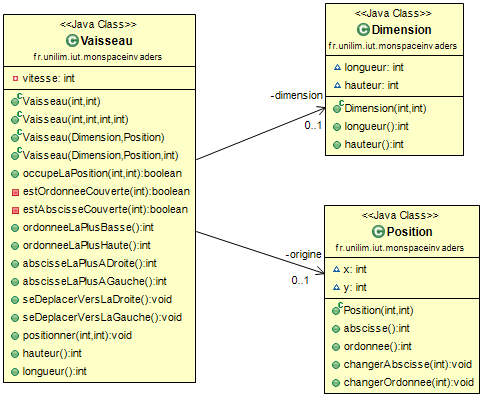
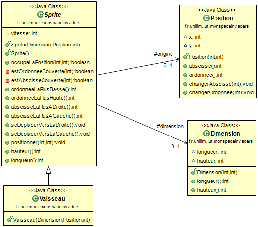
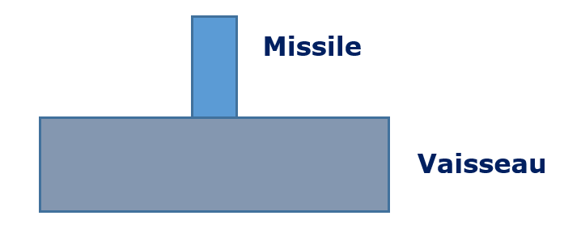
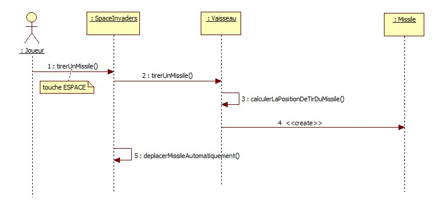

# Space Invaders - Sprint 4: Tirer un missile depuis le vaisseau 


**L'objectif** de ce sprint est de *pouvoir* **tirer un missile depuis le vaisseau** *afin de*  donner un peu plus d'interactivité au jeu.

<!--[Sprint Backlog](images/spaceinvaders_s4.png)-->


Pour réaliser cet objectif, il faut faire en sorte, qu'à chaque tir, un nouvel objet **missile** soit ajouté au jeu, en prenant soin de bien positionner ce missile au dessus du vaisseau au moment du tir. Une fois tiré, le missile devra se déplacer à la verticale de manière autonome et disparaître du jeu une fois le haut de l'écran de jeu atteint.

Pour ce sprint, nous considérerons que le jeu ne dispose que d'un seul missile à la fois (un nouveau missile ne pourra être tiré que s'il n'y a pas d'autre missile dans le jeu). Cette contrainte permet, pour ce sprint, de rester focaliser sur la *valeur métier* de la fonctionnalité : pouvoir tirer UN missile depuis le vaisseau. Ainsi le MVP (Minimum Viable Product) défini au [Sprint 0 : Rapide analyse du problème](SpaceInvaders_S0_QuickDesignSession.md) (un vaisseau, un missile et un envahisseur) pourra être livré plus rapidement :smile:   
Remarque :  
- La gestion des collisions entre un missile et un envahisseur fera l'objet d'un autre sprint :smile:  
- Permettre au vaisseau de tirer plusieurs missiles fera aussi l'objet d'un autre sprint : soyez patient :smile:

Pour implémenter la fonctionnalité *tirer un missile depuis le vaisseau*, vous allez suivre les étapes suivantes :  
- [Quick Design Session : Comprendre ce qu'est un *missile* et refactorer (diagramme de classes)](#choixConceptionMissile)  
- [Quick Design Session : Comprendre ce que signifie *tirer un missile depuis le vaisseau* (diagramme de séquence)](#choixConceptionTirerMissile)   
- [Tirer un missile en TDD](#tirerMissile)  
- [Et bien, jouons maintenant !](#testAcceptanceTirerMissile)         
- [Faire déplacer le missile à la verticale de manière autonome](#deplacerMissile)   
- [Et bien, réglons la vitesse du missile maintenant !](#testAcceptanceVitesse) 

sans oublier de ...  
- [Committer les changements liés à cette nouvelle fonctionnalité](#commit) 


## Quick Design Session : Comprendre ce qu'est un *missile* et refactorer (diagramme de classes) <a id="choixConceptionMissile"></a>

Comprendre ce qu'est un *missile* va nous permettre de refactorer un peu notre application.

### 1. Qu'est-ce qu'un missile ?

Dans le [Sprint 0 : Rapide analyse du problème](SpaceInvaders_S0_QuickDesignSession.md), une première définition de **missile** a été donnée de la manière suivante :

> ***Missile : projectile envoyé à la verticale par le vaisseau vers l'envahisseur dans le but de le détruire.***

Comme le vaisseau, le missile a été identifié comme un objet de l'application Space Invaders.  
Comme le vaisseau, il devra avoir une dimension, une position et une vitesse et il interagira avec d'autres objets de l'application.

Dans le contexte des jeux vidéos, un tel objet est appelé un **personnage** et est défini dans le [Vocabulaire du jeu vidéo (p.199)](https://www.oqlf.gouv.qc.ca/ressources/bibliotheque/dictionnaires/20120701_jeu_video.pdf) de la manière suivante :

> ***Personnage : Etre fictif et virtuel, contrôlé ou non par le joueur, qui apparaît dans un jeu vidéo.***

Le terme de **sprite** (ou **lutin**) peut également être employé. En effet, ce terme est utilisé pour [*désigner un élément graphique qui peut se déplacer sur l'écran (...) Le fond de l'écran constitue généralement le décor et les sprites sont les personnages et les objets qui se superposent au fond d'écran et qui se déplacent.* (Extrait de la rubrique Sprite de Wikipedia)](https://fr.wikipedia.org/wiki/Sprite_(jeu_vid%C3%A9o)).

De manière arbitraire, nous choisissons le terme métier de **sprite**. Désormais, c'est donc uniquement ce terme métier que nous employerons pour désigner de tels objets dans l'application Space Invaders.  
***Peut-être est-ce du coup le *bon* moment pour donner une définition de *sprite* dans votre glossaire*** :smile:

Un sprite a donc une dimension, une position et une vitesse.
Un vaisseau est actuellement un sprite qui se déplace horizontalement. Ce sprite va (bientôt) être capable de tirer un missile.
Un missile est, a priori, un sprite qui se déplace verticalement.  
Remarque : D'une manière générale, tout sprite devrait pouvoir se déplacer horizontalement ou verticalement ;-) 

Pour éviter la duplication du code et en faciliter sa ré-utilisation, il semble évident qu'une classe `Sprite` doit maintenant apparaître afin de regrouper tous les attributs et méthodes communs à tous les sprites de l'application, dont certaines ont déjà été écrites (et testées) lors de la mise en place de la classe `Vaisseau`.  

Avant d'écrire le premier test de ce sprint, il va donc falloir procéder à un peu de refactoring (et ça tombe bien puiqu'on est actuellement sur une barre VERTE !).  
Sans changer le comportement existant (et donc sans toucher aux tests), vous allez faire apparaître (à l'aide de l'IDE), une classe `Sprite` de manière à pouvoir dire qu'un `Vaisseau` EST-UN `Sprite`.

### 2. un `Vaisseau` EST-UN `Sprite` (un peu de refactoring via **`Extract Superclass`**)

Actuellement, la classe `Vaisseau` ressemble à :




Pouvoir dire qu'un `Vaisseau` EST-UN `Sprite` nécessite de mettre en place un **héritage** entre les classes `Sprite` et `Vaisseau`.      
Il va donc falloir **extraire des informations de la classe fille `Vaisseau`** pour les regrouper dans la **classe mère `Sprite`**.

Pour mettre en place ce refactoring, l'IDE va nous permettre d'interagir le moins possible avec le code grâce à son option de refactoring appelée  l'**`Extract Superclass`**.


### 2.1 Faire apparaître `Sprite` via un `Extract Superclass`

Pour mettre en place cet héritage via un **`Extract Superclass`**, vous devez :

* vous assurer que vos tests passent bien AU VERT avant de procéder à un quelconque refactoring :smile:
* vous placer dans la classe `Vaisseau`, puis à l'aide d'un clic droit choisir `Refactor -> Extract Superclass...`
* Remplir la fenêtre **Refactoring - Extract Superclass** de la manière suivante :
	* dans `Superclass name`, saisir : **`Sprite`**
	* décocher `Use the extracted class where possible` (si vous laissiez cette case cochée, toute déclaration de type `Vaisseau vaisseau` serait remplacée par une déclaration du type `Sprite vaisseau` : cette option ne nous intéresse pas pour le moment). 
	* Vérifier que dans `Types to extract a superclass from`, ce soit bien la classe **`Vaisseau`** 
	* Cliquer sur le bouton **`Select All`** puisque finalement, tout ce qu'on a écrit pour un `Vaisseau` est aussi valable pour un `Sprite`.
	* Puis cliquer sur **`Finish`**

Et laisser faire l'IDE :tada: :tada: :tada:  
Si l'IDE soulève un problème lié à la visibilité des méthodes `estOrdonneeCouverte` et `estAbscisseCouverte` pas de soucis, cliquez sur `Finish` ...

Une fois, le refactoring effectué par l'IDE, vous obtenez :

* une nouvelle classe `Sprite` qui contient les méthodes de `Vaisseau`
* une classe `Vaisseau` qui est maintenant une classe fille puisqu'elle `extends Sprite`.

Vous remarquez que les constructeurs de la classe `Vaisseau` n'ont pas été modifiés (ce qui tombe bien pour que nos tests continuent à passer :smile:)

Même si ce refactoring a été réalisé par l'IDE et donc n'a pas dû  modifier le comportement, par acquis de conscience ...

> **Vous venez de faire des modifications dans votre code...**  
> ***N'oubliez pas de relancer les tests pour vérifier que le comportement de votre code n'a pas changé !***


### 2.2 Un peu de refactoring : Quid des constructeurs de `Vaisseau` et `Sprite` ?

Le vaisseau, le missile et l'envahisseur seront les objets *concrets* manipulés par le jeu SpaceInvaders. La classe *Sprite* devra donc être une classe abstraite de l'application.

Modifiez donc l'entête de la classe `Sprite` avec **`abstract`** pour empêcher toute instanciation à partir de cette classe :

```JAVA

    public abstract class Sprite {
       \\...
    }

```

> **Vous venez de faire des modifications dans votre code...**  
> ***N'oubliez pas de relancer les tests pour vérifier que le comportement de votre code n'a pas changé !***


Même si la classe `Sprite` est abstraite, cela ne l'empêche pas de pouvoir exposer des constructeurs qui pourront être appelés dans les classes filles.

Quel(s) constructeur(s) pourrait-il être pertinent de définir dans la classe `Sprite` ?...  
Peut-être bien :  

* un constructeur à 3 paramètres permettant de personnaliser les 3 attributs de cette classe à partir de leurs types (`Dimension`, `Position` et `int` pour la vitesse)
* un constructeur par défaut (qui existe déjà).


### 2.2.1 Ajout dans la classe mère `Sprite` du constructeur à 3 paramètres 

Ce constructeur peut facilement être généré à partir de l'IDE :

* Placez-vous dans la classe `Sprite` juste en dessous de la déclaration des attributs.  
* A l'aide de l'IDE, appelez le menu `Source -> Generate Constructor using Field` :
	* vérifiez que les 3 constructeurs sont bien cochés et sont dans l'ordre suivant : `dimension`,  `origine` et `vitesse` : si ce n'est pas le cas, jouez avec les boutons `Up` et `Down`.
	* et cliquez sur `OK` 

Vous devriez obtenir le constructeur suivant :

```JAVA

	public Sprite(Dimension dimension, Position origine, int vitesse) {
		super();
		this.dimension = dimension;
		this.origine = origine;
		this.vitesse = vitesse;
	}

```


### 2.2.2 Appel dans la classe `Vaisseau` du constructeur de la classe mère (`super`) 

Le constructeur à 3 paramètres de la classe `Vaisseau` doit désormais faire appel au constructeur de la super classe. 
Les autres constructeurs de la classe `Vaisseau` n'ont pas besoin d'être modifiés puisqu'ils réutilisent déjà un constructeur existant de par leur appel à `this`.


La classe `Vaisseau` se réduit donc maintenant à une surcharge de ces constructeurs (avec un `super` et trois `this` :smile:)


```JAVA

    public class `Vaisseau` extends Sprite {


    public Vaisseau(int longueur, int hauteur) {
		this(longueur, hauteur, 0, 0);
	}

	public Vaisseau(int longueur, int hauteur, int x, int y) {
		this(new Dimension(longueur, hauteur), new Position(x, y));
	}

	public Vaisseau(Dimension dimension, Position positionOrigine) {
		this(dimension, positionOrigine, 1);
	}
	
	public Vaisseau(Dimension dimension, Position positionOrigine, int vitesse) {
		super(dimension, positionOrigine, vitesse);
	}
}

```


> **Vous venez de faire des modifications dans votre code...**  
> ***N'oubliez pas de relancer les tests pour vérifier que le comportement de votre code n'a pas changé !***

... Mais est-il encore possible de simplifier la classe `Vaisseau` ? Y-a-t-il du ***code mort*** dans cette classe (c-a-d du code jamais appelé : des constructeurs qui sont devenus obsolètes et inutiles) ?

Lancez la couverture de code. Vous constatez que seul le constructeur `Vaisseau(Dimension dimension, Position positionOrigine, int vitesse)` est couvert...  
ce qui voudrait dire que les autres constructeurs ne sont plus utilisés...

Les tests donnent *confiance* dans le code et nous permettent de *jouer* avec.
*Nettoyez* la classe `Vaisseau` afin de ne conserver dans cette classe que le constructeur `Vaisseau(Dimension dimension, Position positionOrigine, int vitesse)`.

> **Vous venez de faire des modifications dans votre code...**  
> ***N'oubliez pas de relancer les tests pour vérifier que le comportement de votre code n'a pas changé !***

Les tests passent AU VERT !!!
On vient donc de faire un peu de ménage (élimination du code mort en toute confiance) et à la fin de ce refactoring la classe `Vaisseau` ne se réduit donc plus qu'à :

```JAVA

    public class Vaisseau extends Sprite {

	    public Vaisseau(Dimension dimension, Position positionOrigine, int vitesse) {
		    super(dimension, positionOrigine, vitesse);
	    }
    }
```

A l'issue de ce refactoring, le diagramme de classes autour de la classe `Vaisseau` devrait d'aileurs ressembler à :




### 3. Tout cela mérite bien un petit commit avant de continuer ...

**Ce refactoring semble terminé : il est temps de committer ces changements dans votre gestionnaire de version !**   
N'oubliez pas d'ajouter à l'index la nouvelle classe créée **`Sprite`** !  
Le commit pourrait refléter les changements apportés au travers du message suivant par exemple : **refactoring Sprite**. 


## Quick Design Session : Comprendre ce que signifie *tirer un missile depuis le vaisseau* (diagramme de séquence) <a id="choixConceptionTirerMissile"></a>


### 1. Comprendre la fonctionnalité en imaginant un scénario (et son diagramme de séquence) 

Imaginer un petit scénario autour de la fonctionnalité *tirer un missile depuis le vaisseau* permettrait de mieux la comprendre et de décrire pas à pas son comportement.  
Un exemple de scénario pourrait être :

1. Le joueur demande au jeu Space Invaders de tirer un missile (en appuyant sur la touche ESPACE par exemple)
2. Le vaisseau tire un missile (en deux temps) :  
	2.1 Le vaisseau calcule d'abord la position du missile de manière, lors du tir, à pouvoir positionner le missile en son milieu.    
	2.2 Le vaisseau *émet* ensuite le missile à la position souhaitée de manière à se retrouver dans la configuration suivante :


3.  Le missile se déplace ensuite jusqu'en haut de l'espace jeu de manière autonome et automatique selon une trajectoire verticale.  
(Ce dernier point est en fait une extension *obligatoire* du scénario car une fois tiré, le missile ne doit pas rester immobile mais doit continuer sur sa lancée et donc avancer. De ce fait, nous avons décidé de traiter aussi ce point dans de ce sprint :smile:)


Comme un petit dessin vaut parfois mieux qu'un long discours, rien de tel qu'un petit diagramme de séquences simplifié (puisqu'on ne représente volontairement pas ici le moteur graphique qui est en charge l'affichage et de la gestion des événements...) pour modéliser tous ces traitements et comnencer à identifier les méthodes à implémenter :



Ce diagramme de séquences indique :

* que la méthode `tirerUnMissile` est déléguée au `Vaisseau` (le `Jeu` `SpaceInvaders` jouant ainsi en quelque sorte le rôle de *contrôleur*.
Remarque : on n'a volontairement pas représénté ici le moteur graphique)  
* la méthode `tirerUnMissile` est composé de deux étapes :  
	* `calculerLaPositionDeTirDuMissile`  
	* créer le missile pour le faire apparaître dans le jeu et à l'écran  
		
Reste maintenant à détailler ces premiers choix de conception en choisissant une signature pertinente pour chacune des méthodes.
Commençons par la méthode `tirerUnMissile` de la classe `SpaceInvaders` et pour cela rien de tel que d'écrire un premier test pour que l'approche TDD nous guide dans cette conception :smile:


## Tirer un missile en TDD <a id="tirerMissile"></a>


### 1. Ecrire un premier un test (cas *normal* de `tirerUnMissile`)

Ce premier test va permettre d'illustrer le comportement *normal* de `tirerUnMissile`, à savoir obtenir un missile bien positionné au milieu du vaisseau (avec par exemple un vaisseau de longueur impaire qui tire un missile de longueur impaire).
 
Nous allons examiner une à une les trois étapes du test (*Arrange*, *Act*, *Assert*) pour écrire correctement ce test et faire des choix de conceptions quant à la signature de cette méthode.

* **Etape Arrange** : Tout d'abord, comme tous les tests précédemment écrits, il est nécessaire de disposer d'un espace de jeu et d'un vaisseau. 
Comme *contexte* de ce test, nous reprendrons valeurs utilisées précédemment, avec un vaisseau un peu plus grand, cependant, pour permettre de *bien* positionner le missile, c-a-d :    
--> un espace de jeu de dimension (15,10)    
--> et un vaisseau de dimension (7,2) positionné en (5,9) et se déplaçant à la vitesse 2 (peu importe la valeur de la vitesse pour ce test). 

* **Etape Assert** : Illustrons à l'aide d'un exemple le résultat que l'on souhaiterait obtenir à partir de ce jeu de données :

```JAVA

    ............... 
    ...............
    ............... 
    ............... 
    ............... 
    ............... 
    .......MMM..... 
    .......MMM..... 
    .....VVVVVVV... 
    .....VVVVVVV... 

```

Cette représentation montre un missile de dimension (3,2) positionné en (7,7) et pouvant se déplacer à la vitesse de 2 (peu importe la valeur de la vitesse).

Pour atteindre ce résultat, il nous reste donc plus qu'à compléter l'étape **Act** :smile:

* **Etape Act** : Identifier l'(es) instruction(s) qui devra(ont) être exécutée(s) à cette étape revient à se questionner sur l'appel de la méthode `tirerUnMissile`, et donc à faire un choix de conception quant à la **signature de cette méthode**. L'étape **Act** devrait en effet contenir une instruction du genre :
	
	```JAVA
  
    	spaceInvaders.tirerUnMissile(???)

	```	

  	* **Un paramètre de retour pour cette méthode ?** A priori non, puisqu'on est en train d'écrire la méthode `tirerUnMissile` de la classe `SpaceInvaders` qui contient elle-même la déclaration des différents `Sprite` de l'application.

	* **Des paramètres d'entrée pour cette méthode ?** Comme un vaisseau, un missile est un `Sprite` particulier qui est défini par sa position, sa dimension et sa vitesse.
	La position de tir va être calculée en fonction de la position du vaisseau, reste donc à passer en paramètre la dimension et la vitesse pour personnaliser le missile.

	```JAVA
  
    	spaceinvaders.tirerUnMissile(new Dimension(3,2),2);

	```


Le test complet peut alors être écrit sous la forme :  

```JAVA

     @Test
     public void test_MissileBienTireDepuisVaisseau_VaisseauLongueurImpaireMissileLongueurImpaire() {

	   spaceinvaders.positionnerUnNouveauVaisseau(new Dimension(7,2),new Position(5,9), 2);
	   spaceinvaders.tirerUnMissile(new Dimension(3,2),2);

       assertEquals("" + 
       "...............\n" + 
       "...............\n" +
       "...............\n" + 
       "...............\n" + 
       "...............\n" + 
       "...............\n" + 
       ".......MMM.....\n" + 
       ".......MMM.....\n" + 
       ".....VVVVVVV...\n" + 
       ".....VVVVVVV...\n" , spaceinvaders.recupererEspaceJeuDansChaineASCII());
    }

```

Implémentez ce test dans la classe `SpaceInvadersTest`.


### 2. Faire compiler le test (RED)

Le test ne compile pas : c'est normal. 
Cliquez sur l'erreur de compilation pour créer automatiquement la méthode `tirerUnMissile` dans la classe `SpaceInvaders`.

Cette fois-ci le test compile, mais il est AU ROUGE !
				
### 3. Faire passer le Test le plus rapidement possible (GREEN)

Il faut donc essayer de faire passer le test et pour cela s'interroger sur le contenu de la méthode `tirerUnMissile`.
La Quick Design Session autour du diagramme de séquences nous a montré que la classe `SpaceInvaders` déléguait le traitement à la classe `Vaisseau` et que c'était de la responsabilité de la classe `Vaisseau` de créer un nouveau `Missile` :

* La méthode `tirerUnMissile` de la classe `Vaisseau` devra donc renvoyer un objet de type `Missile`
* Et comme c'est la classe `SpaceInvaders` qui a la responsabilité de déclarer des sprites, un tel objet (de type `Missile`) devra être déclaré dans cette classe.

Modifiez votre classe `SpaceInvaders` de la sorte en tenant compte de ces remarques :

```JAVA
  
    public class SpaceInvaders implements Jeu {

	   int longueur;
	   int hauteur;
	   Vaisseau vaisseau;
	   Missile missile;

      \\...

      public void tirerUnMissile(Dimension dimension, int vitesse) {
		this.missile = this.vaisseau.tirerUnMissile(dimension,vitesse);
	}

```

Et corrigez les erreurs de compilation en :

* créant une classe `Missile` qui hérite de `Sprite`

* créant automatiquement la méthode `tirerUnMissile` de la classe `Vaisseau`

* ... et tant que vous y êtes... en modifiant la méthode `recupererMarqueDeLaPosition` pour pouvoir afficher la `MARQUE_MISSILE` :

```JAVA

    private char recupererMarqueDeLaPosition(int x, int y) {
		char marque;
		if (this.aUnVaisseauQuiOccupeLaPosition(x, y))
			marque = Constante.MARQUE_VAISSEAU;
		else if (this.aUnMissileQuiOccupeLaPosition(x, y))
				marque = Constante.MARQUE_MISSILE;
		else marque = Constante.MARQUE_VIDE;
		return marque;
	}
```

...Ce qui implique la création :

* dans la classe `Constante` d'une nouvelle constante `MARQUE_MISSILE` 
* et dans la classe `SpaceInvaders` de deux nouvelles méthodes `aUnMissileQuiOccupeLaPosition` et `aUnMissile` sur le même principe que `aUnVaisseauQuiOccupeLaPosition` et `aUnVaisseau`. A vous de jouer ! :smile:

Cotre code compile, mais votre test ne passe toujours pas car la méthode `tirerUnMissile` de la classe `Vaisseau` est vide... Qu'à cela ne tienne la Quick Design Session autour du diagramme de séquences a suggéré que cette méthode devait :  
 
* calculer la position de tir du missile   
* puis créer l'objet missile.
    
Il ne reste donc plus qu'à l'implémenter le plus rapidement possible pour faire passer le test !


```JAVA
	
    public Missile tirerUnMissile(Dimension dimensionMissile, int vitesseMissile) {
		
		int abscisseMilieuVaisseau = this.abscisseLaPlusAGauche() + (this.longueur() / 2);
		int abscisseOrigineMissile = abscisseMilieuVaisseau - (dimensionMissile.longueur() / 2);

		int ordonneeeOrigineMissile = this.ordonneeLaPlusBasse() - 1;
		Position positionOrigineMissile = new Position(abscisseOrigineMissile, ordonneeeOrigineMissile);

		return new Missile(dimensionMissile, positionOrigineMissile, vitesseMissile);
	}
```

et pour faire compiler ce code, un constructeur dans la classe `Missile` est bien sûr nécessaire : smile:

Exécutez les tests... Ils doivent passer AU VERT !


### 4. Un petit refactoring ? ...

Pour améliorer la lisibilité, ne serait-il pas pertinent d'extraire les quatre premières instructions dans une méthode `calculerLaPositionDeTirDuMissile` qui renverrait une position ?    
Aidez-vous donc de l'`Extract Method` de l'IDE pour simplifier la méthode `tirerUnMissile` et créer la méthode  `calculerLaPositionDeTirDuMissile` :

```JAVA
	
	public Missile tirerUnMissile(Dimension dimensionMissile, int vitesseMissile) {
		Position positionOrigineMissile = calculerLaPositionDeTirDuMissile(dimensionMissile);
		return new Missile(dimensionMissile, positionOrigineMissile, vitesseMissile);
	}
```


Pour l'instant, seul le cas *normal* (avec un vaisseau et un missile de longueur impaires) est traité. Quel sera la prochain test ? 
Pour savoir, examinons les différents cas de tests possibles au travers d'exemples...

### 5. Des exemples pour aider à déterminer le(s) prochain(s) test(s)...

#### 5.1 Quid de la parité des longueurs ?

Nous venons de tester le cas *normal* d'un missile et un vaisseau de longueurs impaires. 
Illustrons à l'aide d'exemples le comportement de la règle de calcul implémentée en fonction des différentes parités des longueurs :


- **Exemple n°1 : si vaisseau de dimension impaire et missile de dimension impaire** (cas testé)

```JAVA

    .......MMM..... 
    .......MMM..... 
    .....VVVVVVV... 
    .....VVVVVVV...
    
```

- **Exemple n°2 : si vaisseau de dimension paire et missile de dimension impaire** (petit décaclage à droite)

```JAVA

    .......MMM..... 
    .......MMM..... 
    .....VVVVVV.... 
    .....VVVVVV....
    
```

- **Exemple n°3 :si vaisseau de dimension impaire et missile de dimension paire** (petit décalage à gauche)

```JAVA

    .......MM...... 
    .......MM...... 
    .....VVVVVVV... 
    .....VVVVVVV...
    
```


```JAVA

    .......MMMM.... 
    .......MMMM.... 
    .....VVVVVVVV.. 
    .....VVVVVVVV..
    
```

Est-il nécessaire d'écrire des tests pour les exemples 2, 3 et 4 ?
A priori non, si la règle de calcul vous convient (c-a-d si la position du missisile vous convient et que peu importe si le petit décalage se fasse à droite ou à gauche), car de toutes façons si vous implémentiez ces tests, ils passeraient au VERT.  
Par contre, si vous vouliez modifier la règle de calcul pour faire en sorte que le petit décalage se fasse toujours du même côté quelle que soit la parité, il serait intéressant de tester la configuration souhaitée car celle-ci ferait passer les tests AU ROUGE puisqu'elle nécessiterait d'apporter une petite modification dans la règle de calcul pour en modifier son comportement.

Nous décidons donc de ne garder dans le fichier de test uniquement l'exemple n°1 (`test_MissileBienTireDepuisVaisseau_VaisseauLongueurImpaireMissileLongueurImpaire`) et de ne pas implémenter les autres exemples, la règle de calcul nous convenant très bien pour le moment.

#### 5.2 Quid de la validité de la position de tir du Missile dans l'espace Jeu ? (longueur du missile)

Pour que la position du `Missile` soit valide, il faut que celle-ci se situe dans l'espace de jeu. A priori :  
- le vaisseau est déjà dans l'espace de jeu.  
- le vaisseau ne devrait pas pouvoir tirer un missile plus grand que lui : smile:  
Donc ...  
Si la longueur du missile reste inférieure ou égale à la longueur du vaisseau, le missile devrait bien rester dans l'espace de jeu, sinon le missile ne devrait pas pouvoir être tiré.     
Pour tester ce cas limite, utilisons, par exemple, une exception :

```JAVA

    @Test(expected = MissileException.class)
	public void test_LongueurMissileSuperieureALongueurVaisseau_UneExceptionEstLevee() throws Exception {
		Vaisseau vaisseau = new Vaisseau(new Dimension(5,2),new Position(5,9), 1);
		vaisseau.tirerUnMissile(new Dimension(7,2),1);
	}
    
```

Où allez-vous implémenter ce nouveau test ?  
L'étape *Act* porte sur une méthode de la classe `Vaisseau` : il serait donc judicieux d'écrire ce test dans une classe **`VaisseauTest`**.    
En effet, si vous jetez un petit coup d'oeil à la classe `SpaceInvadersTest` vous constaterez qu'elle ne teste les méthodes de la classe `SpaceInvaders`.  
*Remarque : Une bonnes pratiques pour améliorer la lisibilité des tests consiste à écrire les tests dans différentes classes en tenant compte des méthodes qu'ils sont censés vérifier :smile:*

**Créez donc une classe de tests `VaisseauTest` dans laquelle vous implémenterait le test précédent.**


Pour faire compiler ce code, ajoutez une nouvelle exception `MissileException` dans le package `utils` :

```JAVA
 
    @SuppressWarnings("serial")
    public class MissileException extends RuntimeException {
	
	    public MissileException(String message) {
		   super(message);
	    }
    }
```

Lancez-les tests. La barre est AU ROUGE ?    
Modifiez l'implémentation de la méthode `tirerUnMissile` de la classe `Vaisseau` pour qu'en début de méthode une exception de type `MissileException` puisse éventuellement être levée en indiquant que *la longueur du missile est supérieure à celle du vaisseau*.

Relancez les tests pour avoir une barre VERTE !


#### 5.3 Quid de la hauteur du missile ?

Après la longueur du missile, on a maintenant envie de s'interroger sur l'impact potentiel de la hauteur du missile ?  
Avant de permettre au vaisseau de tirer un missile, l'espace jeu doit s'assurer qu'il y a bien assez de place entre entre le vaisseau et le haut de l'écran de l'espace jeu pour positionner le missile.  

Dans un espace de jeu de dimensions (15,10), le test pourrait illustrer ce cas *limite* :

```JAVA

    @Test(expected = MissileException.class)
	public void test_PasAssezDePlacePourTirerUnMissile_UneExceptionEstLevee() throws Exception { 
	   spaceinvaders.positionnerUnNouveauVaisseau(new Dimension(7,2),new Position(5,9), 1);
	   spaceinvaders.tirerUnMissile(new Dimension(7,9),1);
	}
    
```

Implémentez ce test...   
Où ? Dans la classe `SpaceInvadersTest` puisque c'est une méthode de la classe `SpaceInvaders` qui est testée :smile:

Exécutez le test... Barre ROUGE !

Modifiez l'implémentation de la méthode `tirerUnMissile` de la classe `SpaceInvaders` pour qu'en début de méthode une exception de type `MissileException` puisse éventuellement être levée en indiquant qu'il n'y a *pas assez de hauteur libre entre le vaisseau et le haut de l'espace jeu pour tirer le missile*.

```JAVA

    public class SpaceInvaders implements Jeu {

       public void tirerUnMissile(Dimension dimensionMissile, int vitesseMissile) {
		
		   if ((vaisseau.hauteur()+ dimensionMissile.hauteur()) > this.hauteur )
			   throw new MissileException("Pas assez de hauteur libre entre le vaisseau et le haut de l'espace jeu pour tirer le missile");
							
		   this.missile = this.vaisseau.tirerUnMissile(dimensionMissile,vitesseMissile);
       }
    }
```

Relancez les tests et assurez-vous de bien être sur une barre VERTE !!

Il semblerait que tous les cas *limites* de tests aient été envisagés...
Il ne reste donc plus qu'à mettre en place le tir de missile dans le moteur graphique.


## Et bien, jouons maintenant ! <a id="testAcceptancestirerMissile"></a>

Nous allons maintenant paramétrer le moteur graphique et le jeu `SpaceInvaders` pour faire en sorte que le vaisseau tire un missile lorsque le joueur appuye sur la barre `ESPACE`.


### 1. Paramétrer la touche `ESPACE` dans le moteur graphique

Dans le [Spike : Prise en main et intégration d'un moteur graphique](SpaceInvaders_Spike_MoteurGraphique.md), vous aviez reprogrammé les touches correspondant aux flèches du clavier comme événements à traiter.


Revenir sur ce code et ajouter un nouveau cas pour traiter un événement lié à l'appui sur la touche `ESPACE` qui pourrait provoquer la mise à jour d'une `Commande` identifiant un `tir` (avec des instructions du genre `this.commandeEnCours.tir` et `this.commandeARetourner.tir`).  
 
Pour faire compiler votre code, vous aurez surement besoin de mettre à jour la classe `Commande` avec un attribut `tir` (N'oubliez pas le constructeur) :smile:

### 2. Récuperer l'événement dans le jeu

Le [Spike : Prise en main et intégration d'un moteur graphique](SpaceInvaders_Spike_MoteurGraphique.md) nous a montré que c'est la méthode `evoluer` de la classe `SpaceInvaders` qui permet de récupérer les événements.  
  
Si une commande de tir est demandée, faites appel à la méthode `tirerUnMissile` que vous paramétrerez (pour éviter les *nombres magique*) avec les constantes `MISSILE_LONGUEUR`, `MISSILE_HAUTEUR`, `MISSILE_VITESSE`...


Lancez l'application graphique et appuyez sur la touche `ESPACE`...
Que se passe-t-il ? Rien !  
Normal nous n'avons pas encore indiquer comment dessiner le missile :smile:

### 3. Dessiner le missile

Pour dessiner le missile, il vous faut intervenir dans la classe `DessinSpaceInvaders`. 

Créez une méthode `dessinerUnMissile` de la même manière que `dessinerUnVaisseau`, méthode qui sera appelée dans `dessiner` si besoin.  
Remarque :  
- Nous souhaitons que le missile apparaisse en bleu.    
- Vous aurez surement besoin d'une methode `recupererUnMissile` :smile: 

Enregistrez.
Relancez les tests pour vous rassurer :smile:

Lancez l'application graphique et tirer un missile.  
Relancez l'application plusieurs fois pour ajuster la longueur et la hauteur de votre missile.


### 4. Faire en sorte qu'on ne puisse avoir qu'un missile à la fois

Pour s'assurer qu'il n'y aura pas plus d'un missile dans le jeu, un contrôle peut-être mis en place pour permettre de lancer ou non le traitement de la commande de tir en fonction de l'état du jeu (et plus particulièrement de la présence ou non d'un missile dans le jeu).

```JAVA

    @Override
	public void evoluer(Commande commandeUser) {

	   \\...

       if (commandeUser.tir && !this.aUnMissile())
           tirerUnMissile(new Dimension(Constante.MISSILE_LONGUEUR, Constante.MISSILE_HAUTEUR),
					Constante.MISSILE_VITESSE);
	   }

```

Enregistrez.
Et Relancez les tests pour vous rassurer :smile:


### 3. Tout cela mérite bien un petit commit avant de continuer ...

**La fonctionnalité *Tirer un missile* est semble-t-elle terminée et fonctionnelle : il est temps de committer les derniers changements dans votre gestionnaire de version !**  
N'oubliez pas d'ajouter à l'index les nouvelles classes `VaisseauTest`, `Missile` et `MissileException`. 
Le commit pourrait refléter les changements apportés au travers du message suivant par exemple : **tirer un missile**.


*Bien évidémment, une fois le missile créé (c-a-d sorti du vaisseau) il doit se mettre en marche et continuer sur sa lancée c-a-d se déplacer verticalement de manière autonome et automatique jusqu'en haut de l'écran de l'espace jeu où il disparaîtra...*


## Faire déplacer le missile à la verticale de manière autonome <a id="deplacerMissile"></a>

### 1. Le `Missile` EST-UN `Sprite` qui peut se déplacer vers le haut

### 1.1 Quick Design Session => Apparaition d'une classe `Direction`

Pour permettre au missile de se déplacer vers le haut, on se dit que la classe `Sprite` va surement devoir disposer d'une méthode `deplacerVersLeHaut`, et que dans l'état actuel du code cette méthode pourrait s'écrire de la manière suivante :

```JAVA

	public void deplacerVersLeHaut() {
		this.origine.changerOrdonnee(this.origine.ordonnee() - vitesse);
	}
```

En relisant ce code, ne trouvez-vous pas la présence d'un moins **`-`** étonnante.... et même surprenante ?

D'où ce **`-`** peut-il bien venir ?  
Rappelez-vous, ce que nous avions décidé lors des premiers sprint : l'axe des ordonnées de l'espace jeu devait être orienté vers le bas...  alors qu'habituellement on raisonne avec un axe des ordonnées orientées vers le haut ... Mais du coup, cela ne facilite pas du tout la lisibilité et la compréhension du code ... 
Ce choix d'orienté des axes (peut-être imposé ?!?)  mérite ici un peu de refactoring pour continuer à travailler sur un code plus facile à lire.

En effet ne serait-il pas plus facile de lire le code d'une méthode qui prendrait en paramètre une direction et qui déplacerait le sprite suivant cette direction, quelque chose du genre :

```JAVA

	public void deplacerVerticalementVers(Direction direction) {
		this.origine.changerOrdonnee(this.origine.ordonnee() + direction.valeur()*vitesse);

```

Une telle méthode nécessite la déclaration d'un nouveau type `Direction` : une classe, ou mieux une énumération qui pourrait nous donner des indications sur le sens de déplacement à adopter en fonction du repère dans lequel on se déplace :smile:

L'énumération `Direction` pourrait, par exemple, ressembler à :

```JAVA
    
    public enum Direction {
	  
	     HAUT (1),
	     BAS (-1),
	     GAUCHE (-1),
	     DROITE (1),
	  
	     HAUT_ECRAN(-1),
	     BAS_ECRAN(1);
	   
	     private int valeur;
	  
	    private Direction(int valeur) {
		   this.valeur = valeur;
	   }
	
	   public int valeur() {
		  return this.valeur;
	  }

   }

```

où `HAUT`, `BAS`, `GAUCHE` et `DROITE` représente les directions habituellement utilisées :  
- **`HAUT`** : quand on se déplace dans un *repère normal* vers le haut les ordonnées sont habituellement incrémentées (**`+1`**)  
- **`BAS`** : quand on se déplace dans un *repère normal* vers le bas les ordonnées sont habituellement décrémentées de (**`-1`**)  
- **`GAUCHE`** : quand on se déplace *repère normal* vers le bas les abscisses sont habituellement décrémentées (**`-1`**)  
- **`DROITE`** : quand on se déplace *repère normal* vers le bas les abscisses sont habituellement incrémentées (**`+1`**)  

Et comme le repère de l'espace jeu a un axe des Y inversé c-a-d :  
- **`HAUT_ECRAN`** indique que les ordonnées doivent être décrémentées (**`-1`**) pour atteindre le haut de l'écran si on considère que l'on se déplace dans le *repère de l'espace jeu* (différence faite en haut de l'écran qui est bien en *haut* et haut de l'espace jeu qui est en *bas* puisque l'axe des Y est vers le bas).   
- **`BAS_ECRAN`** indique que les ordonnées doivent être incrémentées (**`+1`**) pour atteindre le bas de l'écran si on considère que l'on se déplace dans le *repère de l'espace jeu*.
La **`GAUCHE`** et la **`DROITE`** restent quant à elles inchangées.  

Remarque : Vous vous dites peut être qu'on aurait juste pu déclarer de nouvelles constantes constantes dans la classe `Constante`... mais dans ce cas là la signature de la méthode aurait comporté un paramètre d'entrée de type `int`. Pour rester le plus *orienté Objet* possible, un type `Direction` est plus approprié.


Implémentez la méthode `deplacerVerticalementVers(Direction direction)` dans la classe `Sprite` et créez l'énumération `Direction`...


> **Vous venez de faire des modifications dans votre code...**  
> ***N'oubliez pas de relancer les tests pour vérifier que le comportement de votre code n'a pas changé !***

Les tests devraient passer AU VERT, puisque ce code a été écrit (pour le moment) sans ajout d'un nouveau test (oups, on prépare en fait le test suivant)...

### 1.2 Un peu de refactoring avant de continuer ?

Les tests sont AU VERT, c'est donc le bon moment pour faire un peu de refactoring avant de se lancer dans le prochain test. 

Avec l'apparition de la classe `Direction` et en relisant le code de la classe `Sprite`, on ressent comme une lègère duplication entre les deux méthodes suivantes : 

```JAVA

	public void seDeplacerVersLaDroite() {
		this.origine.changerAbscisse(this.origine.abscisse() + vitesse);
	}

	public void seDeplacerVersLaGauche() {
		this.origine.changerAbscisse(this.origine.abscisse() - vitesse);
	}
```

Il semblerait donc pertinent de remplacer ces deux méthodes par une seule du genre :

```JAVA

    public void deplacerHorizontalementVers(Direction direction) {
		this.origine.changerAbscisse(this.origine.abscisse() + direction.valeur()*vitesse);
	}
```

Attention, à ne pas supprimer ces deux méthodes d'un coup, mais à bien refactorer pas à pas en suivant les recommandations suivantes :

1. **Commencez par ajouter la nouvelle méthode `deplacerHorizontalementVers(Direction direction)` dans la classe `Sprite`**

2. **Modifiez les appels aux méthodes existantes**  
Une petite astuce :smile: **Savez-vous comment voir où une méthode est appelée ?**  
Placez-vous sur la méthode `seDeplacerVersLaDroite` dans la classe `Sprite`.
Le raccourci `CTRL+SHIFT+G` vous permet alors de visualiser la liste des appels à la méthode `deplacerVersLaDroite` dans le projet. Cette option est également accessible via un clic droit et la sélection du menu `References -> Worskpace`.  

	2.a Le raccourci `CTRL+SHIFT+G` indique donc que la méthode `deplacerVersLaDroite` est appelée une seule fois dans le projet dans la méthode `deplacerVaisseauVersLaDroite` : cliquez sur son nom pour vous rendre dans son implémentation où vous modifierez manuellement l'appel à `vaisseau.seDeplacerVersLaDroite();` par un appel à `vaisseau.deplacerHorizontalementVers(Direction.DROITE);`

	> **Vous venez de faire des modifications dans votre code...**  
	> ***N'oubliez pas de relancer les tests pour vérifier que le comportement de votre code n'a pas changé !***

	2.b Les tests continuent à passer AU VERT... Supprimez alors la méthode `seDeplacerVersLaDroite` de la classe `Sprite`.

	> **Vous venez de faire des modifications dans votre code...**  
	> ***N'oubliez pas de relancer les tests pour vérifier que le comportement de votre code n'a pas changé !***

	2.c Les tests continuent à passer AU VERT... Au tour de la méthode `seDeplacerVersLaGauche` de la classe `Sprite`. Le `CTRL+SHIFT+G` indique que cette méthode est seulement appelée dans `deplacerVaisseauVersLaGauche`, rendez-vous y pour modifier l'appel à `vaisseau.seDeplacerVersLaGauche();` par un appel à `vaisseau.deplacerHorizontalementVers(Direction.GAUCHE);`

	> **Vous venez de faire des modifications dans votre code...**  
	> ***N'oubliez pas de relancer les tests pour vérifier que le comportement de votre code n'a pas changé !***

	2.d Les tests continuent à passer AU VERT... Supprimez alors la méthode `seDeplacerVersLaGauche` de la classe `Sprite`.

	> **Vous venez de faire des modifications dans votre code...**  
	> ***N'oubliez pas de relancer les tests pour vérifier que le comportement de votre code n'a pas changé !***


### 2. Le jeu `SpaceInvaders` doit gérer le déplacement du missile

Pour écrire le prochain test rapidement, repartez du code du test précédent (tir du missile) et complétez-le (étape *Act*) en demandant au spaceInvaders de faire avancer le missile. Ce nouveau test devrait donc resembler à :

```JAVA

    @Test
    public void test_MissileAvanceAutomatiquement_ApresTirDepuisLeVaisseau() {

	   spaceinvaders.positionnerUnNouveauVaisseau(new Dimension(7,2),new Position(5,9), 2);
	   spaceinvaders.tirerUnMissile(new Dimension(3,2),2);

	   spaceinvaders.deplacerMissile();
	   
       assertEquals("" + 
       "...............\n" + 
       "...............\n" +
       "...............\n" + 
       "...............\n" + 
       ".......MMM.....\n" + 
       ".......MMM.....\n" + 
       "...............\n" + 
       "...............\n" + 
       ".....VVVVVVV...\n" + 
       ".....VVVVVVV...\n" , spaceinvaders.recupererEspaceJeuDansChaineASCII());
   }

```

Implémentez ce test... Où ? ... Dans la classe `SpaceInvadersTest` puisque la méthode testée `deplacerMissile` est, a priori, une méthode de la classe `SpaceInvaders`.

A l'aide de l'IDE, créez la méthode `deplacerMissile` et implémentez-là le plus rapidement possible pour faire passer ce test avec `deplacerVerticalementVers` et `HAUT_ECRAN`.

Besoin d'un refactoring ? ... A priori, non :smile:

### 3. Le `Missile` doit disparaître du jeu lors qu'il atteint le haut de l'espace jeu

Pour tester ce nouveau comportement, il faut décider à quel moment on doit faire disparaître le missile c-a-d ce que l'on entend par *atteint le haut de l'écran de l'espace de jeu* :  
- **Cas n°1 : le missile disparait du jeu quand il commence juste à sortir de l'espace jeu :**     
- **Cas n°2 : le missile disparait du jeu quand il est complètement sorti de l'espace jeu :**   

**Nous décidons que le comportement que nous allons implémenter sera celui du cas n°1**...
Si, par la suite, ce comportement ne nous convenait pas (notamment au niveau du rendu visuel) nous pourrions toujours modifier les tests relatifs à cette fonctionnalité pour implémenter le comportement lié au cas n°2.

Pour bien comprendre ce comportement, illustrons-le à l'aide d'exemples :smile:  

Considérons un espace de jeu de dimensions (15,10) et positionnons en (5,9) un vaisseau de dimension (7,2) qui pourra se déplacer à la vitesse de 1, contexte qui peut être illustré de la manière suivante :

```JAVA 
  
    ............... 
    ...............
    ............... 
    ............... 
    ............... 
    ............... 
    .......MMM.....
    .......MMM..... 
    .....VVVVVVV... 
    .....VVVVVVV...

```

Ensuite, au vu de la vitesse du vaisseau, nous devons effectuer 6 appels à la méthode `deplacerMissile` pour positionner le vaisseau en haut de l'écran de l'espace jeu (...mais toujours dans l'espace jeu)...


```JAVA 
  
    .......MMM.....
    .......MMM..... 
    ............... 
    ...............
    ............... 
    ............... 
    ............... 
    ............... 
    .....VVVVVVV... 
    .....VVVVVVV...

```

Le prochain appel à la méthode `deplacerMissile` (le 7ème) devrait, selon le comportement souhaité, faire disparaître le vaisseau de l'espace jeu qui ressemblerait alors à


```JAVA 
  
    ............... 
    ...............  
    ............... 
    ...............
    ............... 
    ............... 
    ............... 
    ............... 
    .....VVVVVVV... 
    .....VVVVVVV...

```

Cet exemple peut être implémenté dans le test suivant :

```JAVA

    @Test
    public void test_MissileDisparait_QuandIlCommenceASortirDeEspaceJeu() {

	   spaceinvaders.positionnerUnNouveauVaisseau(new Dimension(7,2),new Position(5,9), 1);
	   spaceinvaders.tirerUnMissile(new Dimension(3,2),1);

	   spaceinvaders.deplacerMissile();
	   spaceinvaders.deplacerMissile();
	   spaceinvaders.deplacerMissile();
	   spaceinvaders.deplacerMissile();
	   spaceinvaders.deplacerMissile();
	   spaceinvaders.deplacerMissile();

	   spaceinvaders.deplacerMissile();
	   
       assertEquals("" +
       "...............\n" + 
       "...............\n" +
       "...............\n" + 
       "...............\n" +
       "...............\n" +
       "...............\n" + 
       "...............\n" +
       "...............\n" + 
       ".....VVVVVVV...\n" + 
       ".....VVVVVVV...\n" , spaceinvaders.recupererEspaceJeuDansChaineASCII());
   }

```

Test qui peut être simplifié de la manière suivante :  

```
   
   @Test
   public void test_MissileDisparait_QuandIlCommenceASortirDeEspaceJeu() {

	   spaceinvaders.positionnerUnNouveauVaisseau(new Dimension(7,2),new Position(5,9), 1);
	   spaceinvaders.tirerUnMissile(new Dimension(3,2),1);
	   for (int i = 1; i <=6 ; i++) {
		   spaceinvaders.deplacerMissile();
	   }
	   
	   spaceinvaders.deplacerMissile();
	   
       assertEquals("" +
       "...............\n" + 
       "...............\n" +
       "...............\n" + 
       "...............\n" +
       "...............\n" +
       "...............\n" + 
       "...............\n" +
       "...............\n" + 
       ".....VVVVVVV...\n" + 
       ".....VVVVVVV...\n" , spaceinvaders.recupererEspaceJeuDansChaineASCII());
   }

```

Dans cette implémentation :  
- l'étape *Arrange* consiste alors à positionner le missile en haut de l'écran de l'espace jeu    
- l'étape *Act* (appel isolé à `deplacerMissile`) consiste à provoquer le disparaition du missile selon le comportement souhaité  


**Implémentez ce test dans la classe `SpaceInvadersTest` et faites-en sorte qu'il passe au vert !**

<!-- public void deplacerMissile() {
		missile.deplacerVerticalementVers(Direction.HAUT_ECRAN);
		
		if (missile.ordonneeLaPlusBasse() < 0)
			missile = null;
	}
-->

### 4. Le côté *automatique* du déplacement

Pour l'instant, le jeu sait gérer le déplacement du missile, par contre il ne le déplace pas encore de manière automatique. 
*Automatiquement* signifie que le jeu doit déplacer le missile à chaque unité de temps.  
 
Les événements (au travers des commandes) sont traités dans la méthode `evoluer` de la classe `SpaceInvaders`.
C'est cette dernière qui sera responsable d'appeler la méthode `deplacerMissile` dès qu'un missile sera présent dans le jeu et ce quelle que soit la commande du joueur. :smile:

Complétez l'implémentation de la méthode `deplacerMissile` pour que le missile puisse se déplacer de manière automatique dans le jeu :smile: 

<!-- 	public void evoluer(Commande commandeUser) {

		if (commandeUser.gauche) {
			deplacerVaisseauVersLaGauche();
		}

		if (commandeUser.droite) {
			deplacerVaisseauVersLaDroite();
		}

		if (commandeUser.tir && !this.aUnMissile())
			tirerUnMissile(new Dimension(Constante.MISSILE_LONGUEUR, Constante.MISSILE_HAUTEUR),
					Constante.MISSILE_VITESSE);

		if (this.aUnMissile())
			this.deplacerMissile();
	}
--> 

Et pour vérifier le *bon* comportement de cette fonctionnalité, rien de tel que de jouer un peu  :smile:

## Et bien, réglons la vitesse du missile maintenant  <a id="#testAcceptanceVitesse"></a>

Lancez l'application graphique.

Effectuez quelques tests d'acceptance :
    
* Tirez un missile.  
* Vérifiez qu'il se déplace automatique et qu'il disparaît en haut de l'écran.
* Vérifiez que vous ne pouvez tirer qu'un missile à la fois sur l'écran
* Vérifiez que vous pouvez tirer un nouveau missile dès que le missile a disparu de l'écran


... et faites quelques essais de paramétrage pour trouver la *bonne* valeur de vitesse pour le missile !

## Committer les changements liés à cette nouvelle fonctionnalité <a id="commit"></a>

**Ce sprint est désormais terminé et la dernière fonctionnalité implémentée a consisté à  faire en sorte que le jeu puisse *déplacer automatiquement le missile*  il est temps de committer les derniers changements dans votre gestionnaire de version !**  
Ne pas oublier d'ajouter à l'index l'énumération `Direction`.   
Le commit pourrait refléter les changements apportés au travers du message suivant par exemple : **déplacer automatiquement le missile**.

<!--Remarque : Si vous le souhaitez, vous pouvez tagger ce dernier commit `XX` avec un message de tag du genre `xxxxx`.-->
<!--Refactorer Sprite de manière à avoir une seule méthode deplacer (qui regroupe les 2 instructions : modification des abscisses et des ordonnees qui pourraient être paramétrées avec une Direction à deux attributs : sensX et sensY-->

### Continuez par le [Sprint 5 : Ajouter un envahisseur dans le jeu](SpaceInvaders_S5_Envahisseur.md)

