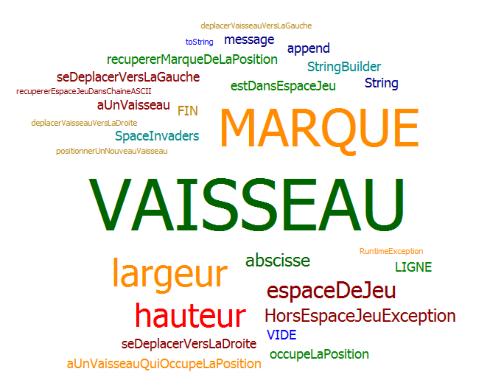

# Space Invaders 

*Si vous le souhaitez, vous pouvez introduire le projet space Invaders en quelques mots*

*Si vous le souhaitez, vous pouvez faire un petit sommaire pour atteindre plus facilement une semaine donnée.*  
*Il est à noter que le le glossaire devra être compléter au fil des séances*  
- [Semaine n°2 : du xx au xx avril](#semaine2)  
- [Semaine n°1 : du xx au xx avril](#semaine1)  
- [Glossaire](#glossaire)

## Semaine n°2 : du xx au xx avril 

Reprendre les rubriques de la semaine précédente et les compléter avec le travail réalisé cette semaine

### Sprints et fonctionnalités réalisées 

#### Fonctionnalité n°x : Nommer la fonctionnalité

- Story développée pour réaliser cette implémentation  
critère d'acceptance pour cette story  
autre critère d'acceptance pour cette story

#### Fonctionnalité n°y : Nommer la fonctionnalité

- Story développée pour réaliser cette implémentation  
critère d'acceptance pour cette story  
encore un autre critère d'acceptance pour cette story

*Remarque : La liste des fonctionnalités peut varier d’une séance à l’autre, d’une personne à l'autre puisque chacun avance à son rythme pendant une séance de TP*

### Fonctionnalité en cours d'implémentation 
Si une fonctionnalité est en cours de développement, **citer cette fonctionnalité** et ses critères d'acceptance, sinon mentionner **aucune**.

### Diagramme de classes 

Insérez ici une image du diagramme de classes que vous aurez au préalable déposer dans le répertoire images.  
Seul le diagramme de classes des classes **metier** vous est demandé ici.   
Vous ne représenterez pas sur ce diagramme les classes du **moteurJeu**.  
Si vous êtes sous Eclipse, vous pouvez générer ce diagramme de classes à partir de votre code à l’aide du plug-in Object Aid UML Explorer dont le tutoriel est disponible [ici](https://github.com/iblasquez/tuto_ModelisationUML/tree/master/ObjectAid)  
Rappel : pour sauvegarder le diagramme, appelez `Save As Image ` à l’aide d’un clic droit.

### Nuage de mots 

Insérez ici une image du nuage de mots que vous aurez au préalable déposer dans le répertoire images. 
 
(généré à l’aide de Source Code Word Cloud Generator avec la liste JavaBlacklist.txt fournie en annexe)

Le nuage de mots sera réalisé à l’aide de Source Code Word Cloud Generator et du contenu du fichier `JavaBlacklist.txt` disponible [ici](https://github.com/iblasquez/enseignement-iut-m2104-conception/tree/master/ressources).  
Si vous utilisez un autre outil que celui-là pour générer ce nuage de mots, précisez-le.
Le nuage de mots sera généré sur les classes métier ne pas prendre en compte les classes du moteur graphique quand celui-ci sera mis en place.

 

### Difficultés rencontrées 
Aucune

### Remarques diverses
A vous de compléter si vous en éprouvez le besoin

-------------

## Semaine n°1 : du xx au xx avril 

### Sprints et fonctionnalités réalisées 

#### Fonctionnalité n°1 : Déplacer un vaisseau dans l'espace de jeu (fini)

- Story n°1 : Créer un espace de jeu  
Un espace de jeu est créé aux dimensions données (2D) 
Cet espace de jeu est vide

-  Story n°2 : Positionner un nouveau vaisseau dans l’espace de jeu  
Un nouveau vaisseau est créé
Le vaisseau est positionné aux coordonnées transmises
Si un nouveau vaisseau essaye d’être positionné en dehors des limites de l’espace jeu, alors une exception devra être levée.
 Contraintes :
La position souhaitée est transmise par ses coordonnées x et y.
Le coin supérieur gauche de l’espace jeu (point en haut à gauche) a pour coordonnées (0,0)
La taille du vaisseau est réduite pour l'instant à son minimum (1 seul point)    

- Story n°3 : Déplacer le vaisseau vers la droite dans l'espace de jeu  
Le vaisseau se déplace d'un pas vers la droite 
Si le vaisseau se trouve sur la bordure droite de l'espace de jeu, le vaisseau doit rester immobile (aucun déplacement, aucune exception levée : le vaisseau reste juste à sa position actuelle).

- Story n°4 : Déplacer le vaisseau vers la gauche dans l'espace de jeu  
Le vaisseau se déplace d'un pas vers la gauche 
Si le vaisseau se trouve sur la bordure gauche de l'espace de jeu, le vaisseau doit rester immobile (aucun déplacement, aucune exception levée : le vaisseau reste juste à sa position actuelle).

### Fonctionnalité en cours d’implémentation : 
Aucune

### Diagramme de classes 

### Nuage de mots du projet spaceinvaders (séance n°1)  
(généré à l’aide de Source Code Word Cloud Generator avec la liste JavaBlacklist.txt fournie en annexe)
 

### Difficultés rencontrées 
Aucune

### Remarques diverses
 Pour pouvoir, mettre en place les tests, il a été nécessaire d’ajouter une fonctionnalité supplémentaire qui permet de représenter l’espace de jeu dans une chaîne ASCII.

-------------

## Glossaire 

* **Vaisseau** :  véhicule commandé par le joueur, pouvant se déplacer de droite à gauche et ayant la possibilité de lancer des missiles destinés à détruire le(s) envahisseurs.

* **Envahisseur**  :  ennemi qui apparaît à l'écran, se déplace automatiquement et qui doit être détruit par un missile lancé depuis le vaisseau du joueur.

* **Missile** :  projectile envoyé à la verticale par le vaisseau vers l'envahisseur dans le but de le détruire.

La définition des termes métiers relatifs au projet doit se trouver dans le glossaire 
Ce glossaire doit être compléter au fil des séances...

------------- 

